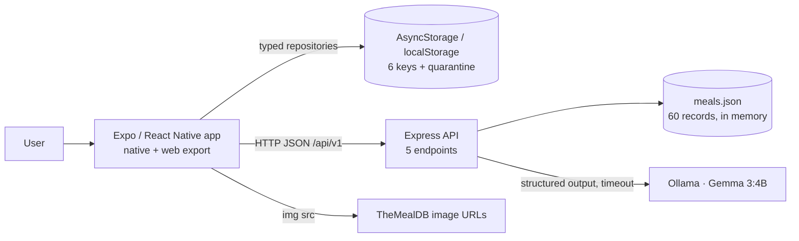
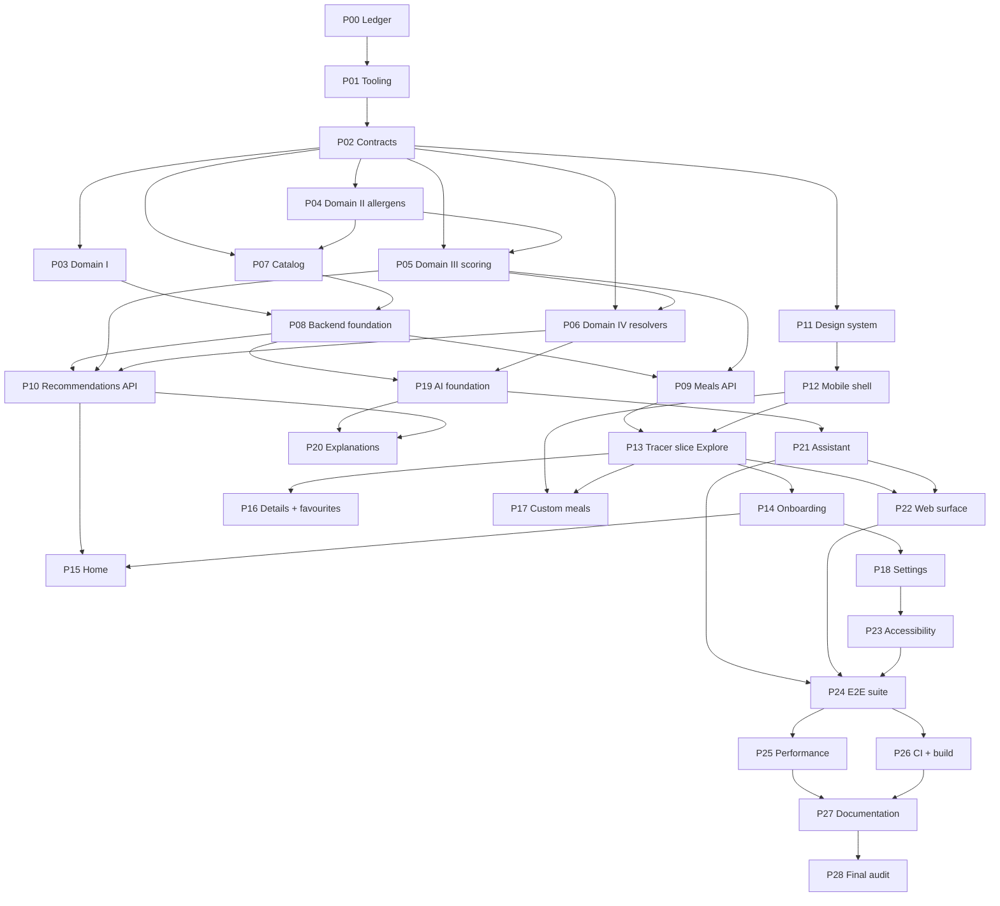

# NutriTime AI — Construction Plan

- **Version:** 1.0.0
- **Date:** 2026-09-13
- **Author:** Mohammad Ra'uf Naser Albatayneh
- **Status:** Approved for phased execution
- **Governs:** `PRD.md` v2.0.0, `SDD.md` v2.0.0, `TSD.md` v1.0.0
- **Deliverable type:** Plan only. No application code exists or was written.

---

## 1. Purpose and Planning-Only Boundary

This document is the phase-by-phase construction plan for NutriTime AI. It exists so that a future
session can execute exactly one phase at a time, with no unauthorized decisions, and stop with
evidence.

**What this document is:** an ordered decomposition of the three authoritative specifications into
29 phases and 226 tasks, each with dependencies, acceptance criteria, evidence requirements, and stop
conditions, plus the gates that decide whether a phase is done.

**What this document is not:** it is not a specification. It invents no requirement, endpoint,
dependency, screen, or content. Where the specifications are silent or contradict each other, this
plan records a blocker (§7) and marks the dependent phases `Blocked` rather than choosing for you.

**Planning-only boundary — what was and was not done in producing this file:**

| Action | Status |
|---|---|
| Read `PRD.md`, `SDD.md`, `TSD.md`, repository state, agent instructions | Done, read-only |
| Repair and update the UI UX Pro Max integration globally | Done — tool maintenance, not application work (§13) |
| Run UI UX Pro Max searches and the design-system generator | Done, output recorded in §13–§14 |
| Write `Plan.md` | Done — this file |
| Create any application source file, config, manifest, or test | **Not done** |
| Initialise a git repository, install project dependencies, scaffold a workspace | **Not done** |
| Modify `PRD.md`, `SDD.md`, or `TSD.md` | **Not done** |
| Begin Phase P01 | **Not done** |

Execution of P01 requires a separate, explicit instruction.

---

## 2. Executive Summary

NutriTime AI recommends a meal appropriate to the time of day from a validated 60-record local
catalog, filtered deterministically by the user's allergies, diet, and disliked ingredients, and
answers free-text questions about those same meals. A local Gemma 3:4B model phrases answers the
domain has already computed; it decides nothing.

**The build in one paragraph.** One npm workspace holds two applications and three pure packages. The
domain package carries every rule that must be correct — allergen inference, diet compatibility,
scoring, relevance ranking, retrieval, and the answer resolvers — and imports nothing that does I/O,
so it is unit-testable in isolation and is built first. The Express service loads and validates the
catalog at boot, serves five endpoints, and owns the only outbound call in the system (to Ollama on
localhost). The Expo application consumes those endpoints, persists the user's own records on device
through versioned repositories, and ships to two surfaces: a native build and an
`expo export --platform web` build that is a first-class delivery target, not only a test harness.

**Sequencing rationale.** TSD §10 fixes five phases and states the domain comes first; this plan
honours that and expands it. Phases P01–P10 build inward-out with no UI at all, because every rule
the product's safety depends on is a pure function and can be proven before a screen exists. P11–P12
establish the design system and the application shell. P13 is a tracer slice — Explore, end to end —
which proves the whole stack works on one narrow path before five more features are laid on it.
P14–P21 are feature slices, each carrying its own full vertical flow. P22–P27 harden the web surface,
accessibility, tests, performance, CI, and documentation. P28 is an independent whole-repository
audit whose final task is the last implementation-plan task in this document.

**Scale.** 29 phases, 226 tasks, 15 functional requirements, 5 endpoints, 10 screens, 6 storage keys,
9 domain modules, 16 shared components. The critical path is the one
given in §16, which is authoritative: P00 → P01 → P02 → P04 → P05 → P06 → P19 → P21 → P24 → P25/P26
→ P27 → P28.

**Highest-risk work, in order.** (1) P04, allergen inference — the only module where a defect is a
safety issue, and the only one whose failure mode is silent. (2) P19/P21, the assistant's containment
layer — four checks and a grammar constraint standing between a 4B model and a user-visible false
statement. (3) P07, hand-authoring 60 nutrition records — a single mistyped digit wins every
superlative question and passes every automated check except the range bound.

---

## 3. Documents and Sources Inspected

| # | Source | Location | State at inspection |
|---|---|---|---|
| 1 | Product Requirements Document | `PRD.md` | v2.0.0, 17,732 bytes, 15 functional requirements, 10 screens |
| 2 | Software Design Document | `SDD.md` | v2.0.0, 34,232 bytes, 19 sections |
| 3 | Technical Specification Document | `TSD.md` | v1.0.0, 77,250 bytes, 10 sections |
| 4 | Project directory | `NEW_VERSION/` | Three `.md` files and `.claude/settings.local.json`. **No git, no manifests, no source, no tests, no CI** |
| 5 | Project settings | `.claude/settings.local.json` | 111 bytes; a single Read permission for the parent tree |
| 6 | Repository agent instructions | — | **None exist.** No `CLAUDE.md`, `AGENTS.md`, or equivalent under the project |
| 7 | User-level agent instructions | `~/.claude/CLAUDE.md` | 231 bytes; a graphify pointer only. No project-relevant constraints |
| 8 | Project memory | `~/.claude/projects/…-NEW-VERSION/memory/` | Directory exists, **empty** |
| 9 | Architecture Decision Records | — | **None as separate files.** SDD §17 carries a 12-row Decisions table that serves this role |
| 10 | API contracts and shared schemas | `TSD.md` §3, §5.4 | Present and complete — 5 endpoints, 5 error codes, all Zod schemas |
| 11 | Package manifests / lockfiles | — | **None exist.** Pinned versions live in TSD §2.1 |
| 12 | TS / lint / format / test / build / CI / env config | — | **None exist.** Specified in TSD §2.2, §2.4, §5.2, §8.1 |
| 13 | Existing source and tests | — | **None exist** |
| 14 | UI UX Pro Max integration | `~/.claude/skills/ui-ux-pro-max/` | Broken on inspection; repaired and validated — see §13 |

**Consequence.** Items 4, 6, 8, 9, 11, 12 and 13 are absent. This is a greenfield build, not a
modification. No task in this plan is a refactor, and no task depends on reading code that does not
exist. Absences 11 and 12 are resolved by P01; absence 9 is resolved by treating SDD §17 as the
decision record.

---

## 4. Source-of-Truth Hierarchy

Applied throughout. On any disagreement, the higher row wins and the disagreement is recorded in §7
rather than silently resolved.

| Rank | Source | Authoritative for |
|---|---|---|
| 0 | **A direct user directive in the session that commissioned this plan** | Decisions the documents do not contain and cannot settle, recorded as D-01…D-06 in §7.1 with their consequences. A rank-0 decision that would contradict ranks 1–3 is recorded as a conflict in §7.3 instead of being applied |
| 1 | `PRD.md` | What the product must do; user-visible behaviour; acceptance criteria; non-goals |
| 2 | `SDD.md` | System shape; component boundaries; why a design is what it is; §17 decisions |
| 3 | `TSD.md` | Exact signatures, constants, schemas, algorithms, error codes, versions, file paths |
| 4 | This `Plan.md` | Sequencing, task decomposition, gates, evidence, ownership |
| 5 | UI UX Pro Max output | **Advisory only.** Design intelligence, reconciled against 1–3 before use |
| 6 | Ambient convention | Last resort, only where 1–5 are silent, and recorded as an assumption |

Two refinements the documents themselves state, carried here:

- TSD §1 fixes the split precisely: on an implementation detail the TSD wins; on *why*, the SDD wins; on what the user experiences, the PRD wins. A value appears in exactly one of the three.
- There is no source below rank 6. If a decision cannot be derived from 0–6, it is a blocker, not a judgement
call. Rank 0 exists because four decisions in §7.1 rest on it — D-01 alone creates P22, all of §20 and
SQG-15, none of which is derivable from the documents, which treat the web export only as a test target.
Without that rank the plan would be claiming an authority it does not have.

---

## 5. Confirmed Scope

Derived from PRD §7 and the platform decision recorded in §7 D-01.

### 5.1 Feature areas

| Area | Content | Requirements |
|---|---|---|
| A — Recommendations and preferences | Meal-period detection, deterministic allergen/diet/availability filtering, eight-policy scoring, top three, optional model-phrased explanation with deterministic fallback, onboarding and settings | FR-002, FR-003, FR-004, FR-007, FR-008, FR-009 |
| B — Saved and custom meals | Favourites, full custom-meal CRUD, persistence across restarts, selective and full data reset | FR-012, FR-013, FR-014 |
| C — Grounded assistant | 1–500-character question, deterministic retrieval, **domain-resolved answer phrased by the model**, citations, explicit unavailability | FR-015 |
| Cross-cutting | Startup hydration, catalog retrieval, nutrition contract, explore/search, meal details | FR-001, FR-005, FR-006, FR-010, FR-011 |

### 5.2 Surfaces

| Surface | Build | Status |
|---|---|---|
| Native mobile | Expo / React Native 0.86.3 | Primary |
| Mobile web | `expo export --platform web` (react-native-web 0.21.2) | **First-class delivery surface** (D-01). Carries the obligations in §20 |

### 5.3 Fixed inventories

- **Screens (10):** Splash · Onboarding · Dietary Setup · Home · Explore · Meal Details · Saved · Create/Edit Meal · Assistant · Settings (PRD §11)
- **Tabs (5):** Home · Explore · Assistant · Saved · Settings
- **Endpoints (5):** `GET /health` · `GET /api/v1/meals` · `GET /api/v1/meals/:mealId` · `POST /api/v1/recommendations` · `POST /api/v1/chat` (TSD §5.4)
- **Storage keys (6):** meta · onboarding · preferences · favorites · customMeals · ui, plus a quarantine ledger (TSD §6.4)
- **Domain modules (9):** text · money · meal-period · allergens · diet · scoring · relevance · chat-retrieval · answer (TSD §4)
- **Shared components (16):** TSD §6.7
- **Error codes (5):** `invalid_request` · `meal_not_found` · `ai_disabled` · `ai_unavailable` · `ai_busy` (TSD §3.5)
- **Catalog:** 60 records, `catalogVersion 1.0.0`, `source: "local"` (TSD §7.1)

---

## 6. Explicit Out-of-Scope

Anything here that appears in a future task is unauthorized scope expansion and fails the gate.

### 6.1 Out of scope by PRD §4 (binding non-goals)

Medical, clinical, or dietary advice · any allergen-safety guarantee · real payment · real ordering or
delivery · accounts, authentication, or cloud sync · model training or fine-tuning · free-form AI
generation of meals, ingredients, nutrition values, prices, or safety claims.

### 6.2 Out of scope by SDD §17 decisions

Server database of any kind · server-side migrations · `{data, meta}` response envelope · rate
limiting · circuit breakers · provider adapters · LRU or answer caching · readiness probe ·
observability metrics, traces, and alerts · queue with depth.

### 6.3 Removed from the product at PRD v2.0.0

Cart · checkout · orders · order history · simulated delivery · USDA FoodData Central integration ·
nutrition enrichment at runtime.

### 6.4 Out of scope for this plan, with reasons

| Item | Reason |
|---|---|
| Database, migrations, rollback, seeding policy | No database exists (SDD §17). Mapped to real persistence in §10 — deviation X-02 |
| Duplicate-submission handling / idempotency keys | No endpoint mutates server state: three reads and two computations. Deviation X-03 |
| PWA, service worker, offline caching, installability | Required by no document; explicitly excluded per the planning brief |
| Sorting and pagination beyond `GET /api/v1/meals` | TSD §5.4 gives them to that endpoint only |
| Coverage thresholds | TSD §8.1: "Coverage is reported and read, not enforced" |
| ADR files under `docs/adr/` | SDD §17 is the decision record. Creating a parallel one would give one fact two homes |
| Multi-device sync, backup, export | Not in any document |
| `~/.agents/skills/ui-ux-pro-max` repair | Not read by Claude Code. Reported in §13, awaiting your decision |

---

## 7. Planning Ledger — Assumptions, Decisions, Conflicts, Blockers

Per the planning brief §1.3: no approved project-memory mechanism exists (§3 item 8), so the mission
ledger lives here rather than in an invented structure. This section is the authoritative record; no
undocumented internal memory is relied on anywhere in this plan.

### 7.1 Decisions taken (with authority)

| ID | Decision | Authority | Consequence |
|---|---|---|---|
| D-01 | Platform is Expo + React Native; the web export is a **first-class delivery surface** | User, this session | §20 obligations apply to the web build; P22 exists; PRD/SDD/TSD unchanged |
| D-02 | No database. "Data model and database strategy" maps to catalog + device storage | User, this session; SDD §17 | §10 rewritten as persistence; Database Architect role → Persistence Architect |
| D-03 | UI UX Pro Max repaired and updated **globally** via the official CLI | User, this session | §13; completed and validated before §14 was written |
| D-04 | No prior build is referenced | User, this session | Every task derives from PRD/SDD/TSD alone |
| D-05 | Mission ledger lives in this file | Planning brief §1.3; §3 item 8 | This section |
| D-06 | SDD §17 is the decision record; no separate ADR files | SDD §17; §6.4 | No ADR tasks |
| D-07 | Both proposed amendments accepted: PRD §10.5 touch targets, and a fixed typeface in TSD §6.6 | User, this session | PRD → 2.1.0, TSD → 1.1.0. X-05 and X-07 closed; Q-02 and Q-03 answered; R-09 closed |
| D-08 | Nutrition comes from the USDA FoodData Central **supporting-data** archive (`fndds_ingredient_nutrient_value.csv`), consumed at build time. Both Foundation archives rejected | User supplied the datasets; choice measured this session | PRD → 2.2.0, SDD → 2.1.0, TSD → 1.2.0 (new §7.4). X-11 closed. P07 grows from 7 tasks to 11 |

### 7.2 Assumptions (each must be confirmed or it becomes a blocker)

| ID | Assumption | Basis | Confirm by | If wrong |
|---|---|---|---|---|
| A-01 | Node 22.13+ and npm are the runtime and package manager; npm workspaces, not pnpm or yarn | TSD §2.1 `engines`, §2.4 scripts use `npm` | P01 | P01 tasks change; lockfile policy changes |
| A-02 | The repository will be initialised with git in P01 | No `.git` exists; TSD §2.4 assumes CI on push | P01 T-01-01 | P26 CI tasks blocked |
| A-03 | Ollama runs on the developer machine with `gemma3:4b` pulled | PRD §15; verified: Ollama is on PATH | P19 | P19–P21 use `AI_FAKE` only; real-model acceptance deferred |
| A-04 | `python3` is available for UI UX Pro Max scripts | Verified this session: 3.13.14 | Done | Frontend tool workflow blocked |
| A-05 | The 60 catalog records are authored by the developer, not sourced automatically | TSD §7.2 steps 3–5 say "by hand" | P07 | P07 effort and risk change materially |
| A-06 | Deployment target is the developer's own machine; no hosting provider | SDD §2.2, §12; PRD scope line | P26 | P26 gains provider tasks |
| A-07 | Single developer; no branch protection or review gate is enforceable | PRD document control; SDD §1 | P26 | P26 gains review-gate tasks |
| A-08 | API versioning is additive within v1; a breaking change would require `/api/v2` | **No document states this.** Plan-introduced in §11.1 | P09 | Harmless — no v2 is planned. Recorded so it is not mistaken for a specification |
| A-09 | Some implementation symbols are named by this plan, not by the documents: a default-preferences constant, an assistant copy module, the `ui` store's `lastTab` and disclaimer flag, the Expo scheme `nutritime`, `userInterfaceStyle: automatic`, and portrait-primary orientation | **No document names them.** Plan-introduced | P12, P14, P18, P21, P22 | Rename freely. None changes behaviour the documents specify; they exist so a task can name a file instead of gesturing at one |
| A-10 | **`@expo-google-fonts/inter@0.4.2` is pinned, amending TSD §2.1's dependency table.** X-07 fixes the typeface as Inter and the app had no Inter to fix it to: `expo-font` was declared with no importer, no font asset existed, and `typeFamily.sans` was a CSS fallback list React Native's native `fontFamily` does not parse | **Direct user decision, 2026-09-13** — rank 0 of §4, above every document. Presented as a choice between pinning the font package, dropping Inter for the platform face (a §14.1/X-07 amendment), or committing the `.ttf` files by hand | Confirmed at P12 | Closes R-32. The four faces the scale names are loaded and gated in `App.tsx`; `theme/typography.test.ts` pins the token and the loader against each other |
| A-11 | **`@expo/vector-icons@15.1.1` and `react-native-svg@15.15.4` are pinned, amending TSD §2.1's dependency table.** §6.7 specifies an `Icon` component and §2.1 pinned no icon library, so P12 built a 17-character Unicode glyph map — correct for the constraint, and unable to supply a dependable `home`, `chat` or `gear`, which left the five tabs with no icons at all and put a probable tofu box in `SearchField` | **Direct user decision, 2026-09-13** — rank 0 of §4. Presented as a choice between pinning the icon set, keeping the glyph map as an accepted risk, or hand-committing SVG paths (which still needs `react-native-svg`, so it is not dependency-free) | Confirmed at P12 | Closes R-33. `Icon` keeps the same `IconName` / `ICON_NAMES` API, so no consumer changes |

### 7.3 Conflicts and deviations (recorded, not silently resolved)

| ID | Conflict | Sources | Impact | Resolution | Blocks |
|---|---|---|---|---|---|
| X-01 | Planning brief says "mobile web application"; PRD/SDD/TSD specify Expo + React Native | Brief vs PRD §1 | Determines the entire frontend plan | **Resolved by D-01.** Documents stand; web export becomes a delivery surface | — |
| X-02 | Brief mandates a Database Architect, DB foundation phase, and migration/rollback process; SDD §17 decides no database exists | Brief vs SDD §17 | A whole phase would be fabricated | **Resolved by D-02.** No DB invented. §10 covers catalog + device storage; rollback maps to quarantine | — |
| X-03 | Brief requires duplicate-submission behaviour per endpoint; no endpoint mutates state | Brief vs TSD §5.4 | Would invent idempotency keys | Recorded as not applicable, with reasoning, per endpoint in §11 | — |
| X-04 | Brief requires `to` paths matching router configuration; React Navigation uses typed route names, not `to` | Brief vs TSD §6.2 | Gate wording | Gate item restated as "every navigation target exists in `RootParamList` and every screen route is registered" | — |
| X-05 | UI UX Pro Max UX catalog states touch targets are 44pt iOS / 48dp Android / 24 CSS px web; PRD §10.5 stated a universal 44×44 points | Tool vs PRD §10.5 | Accessibility acceptance criteria | **CLOSED — amendment accepted (D-07).** PRD amended to 2.1.0: 44 pt iOS / 48 dp Android / 24 px web, with 48 dp as the single build-to value satisfying all three. The tool refined the requirement; it did not override it, because you approved the change | — |
| X-06 | UI UX Pro Max design-system generator returned a landing-page pattern (Hero → Testimonials → CTA) and web idioms (`cursor-pointer`, hover) for a five-tab touch app | Tool vs PRD §11, SDD §14 | Would misdirect the whole UI | **Documents win.** Pattern and CTA guidance discarded with reason; palette, style family, anti-patterns and checklist retained. Recorded in §14.2 | — |
| X-07 | Generator proposed Playfair Display as **body** type; TSD §6.6 fixed a token architecture but no typeface | Tool vs TSD §6.6 | Readability and token ownership | **CLOSED — amendment accepted (D-07), but not the generator's pairing.** The generator's "Inter heading / Playfair body" was a mismatched cross-product of two catalog rows. The coherent row for the adopted style family is **Flat Design Mobile (System Bold): Inter for both, falling back to system SF/Roboto**, and that is what TSD 1.1.0 §6.6 now fixes. The token architecture was never in question | — |

| X-08 | The planning brief mandates `npm audit` as a gate; TSD §2.4 says "`npm run check` is the single gate. Nothing else is required" and SDD §16 declines extra gates | Brief vs TSD §2.4, SDD §16 | An advisory in a pinned Expo tree could otherwise block every phase gate | **Kept as an explicitly recorded deviation**, not an invention: `npm audit --audit-level=high` runs at P26 and P28 and is reported. It does **not** block a phase gate; findings are triaged and recorded as risks | — |
| X-09 | PRD §12 requires five states on *every* data-driven screen; TSD §6.8's per-screen table lists fewer for Explore and Saved | PRD §12 vs TSD §6.8 | Each screen's acceptance criteria | **PRD wins** (rank 1 > rank 3). §14.5 and §19.2 are the per-screen *minimum*; PRD §12's five remain mandatory wherever the state is reachable. A state that cannot occur on a screen is recorded as not applicable with a reason, never silently dropped | — |
| X-10 | §12.2 rule 6 and T-01-05 require a dependency-cycle check; SDD §16 explicitly declines a cycle checker | Brief vs SDD §16 | Tooling scope | **CORRECTED at P01 on new evidence.** The original resolution — "an import rule inside the existing lint config adds no new tooling" — rested on a factual error: ESLint has no built-in cycle detection, and every mechanism (`eslint-plugin-import`, `madge`, `dpdm`) is a dependency TSD §2.1 does not pin. **Rule 6 is therefore unenforced by tooling**, consistent with SDD §16, and is checked by review at P28 T-28-03. The five enforceable rules are proven by the T-01-05 probe | — |

| X-11 | PRD FR-006 required per-serving nutrition; TheMealDB publishes none at any access tier, and the plan's own T-07-05 stop condition forbade estimating | PRD FR-006 vs the recipe source | P07 could not be completed as written — either nutrition was invented or the product shipped hollow | **CLOSED.** USDA FoodData Central adopted as a **build-time dataset** (D-08): 1,882 ingredients, all four macros, per 100 g. PRD 2.2.0, SDD 2.1.0 and TSD 1.2.0 amended; TSD §7.4 defines the derivation contract. No runtime dependency is added, so SDD §2.1 is unchanged | — |
| X-12 | TheMealDB requires attribution and the preservation of source, image-source and licence metadata; `Meal` had nowhere to put any of it, and no document mentioned attribution | Upstream licence vs TSD §3.2 | Shipping without attribution breaches the terms we rely on | **CLOSED.** `Meal` gains `provenance` (TSD 1.2.0 §3.2); PRD 2.2.0 FR-011 displays attribution; §15 records both sources' licence terms | — |

| X-13 | Plan.md §12.2 rule 2 ("contracts is the only package with a third-party runtime dependency") cannot be expressed in ESLint `no-restricted-imports`: a deny-all-then-allow pattern also swallows the package's own relative imports | Plan §12.2 vs the linter | Rule 2 was unenforced in source after P02 replaced P01's broken allowlist | **Split enforcement.** ESLint keeps an I/O denylist; the manifest half is asserted in `packages/contracts/src/package.test.ts`, which reads `package.json` and requires `dependencies === { zod: '4.5.4' }`. Stronger about what ships, weaker against an arbitrary source import. Recorded at P02 | — |
| X-19 | TSD §2.3 and Plan §12.2 both state `server -> contracts, domain`; `catalog` is the `mobile` row. But TSD §5.1 step 2 requires the server to load and validate `meals.json` at boot, and §7.1 exports it from `@nutritime/catalog` | TSD §2.3 vs TSD §5.1 + §7.1 | SQG-04 is one of P08's gate criteria and the six §12.2 rules do not hold as written | **Resolved toward §5.1/§7.1, the more specific instruction**, exactly as X-16 was. `apps/server` declares `@nutritime/catalog` and `index.ts` imports `seededCatalog`. TSD §2.3's graph should gain a `server -> catalog` edge. Recorded rather than left silent, which is what the P08 verification found | P08 → TSD |
| X-20 | `internal_error` is a SIXTH wire code. TSD §3.5 says "five codes, no more" and `ApiErrorBody.code` is typed `ApiErrorCode`, but §5.3 step 6 demands a 500 body and none of the five describes an unexpected throw | TSD §3.5 vs TSD §5.3 step 6 | The emitted 500 body does not satisfy the declared wire contract, and the mobile client (TSD §6.5) will parse `code` against the union | `INTERNAL_ERROR_BODY` is declared separately from `ApiErrorBody` so the five-code union is not widened, and the 500 shape is structurally identical. **TSD §3.5 should name the sixth code or §5.3 should reuse one of the five.** P12's client must tolerate an unknown code either way | P08 → TSD, client at P12 |
| X-21 | **TSD §6.7 contradicts itself on `Toast`.** The prose says "Every state component takes `stillAvailable`"; the table's `Toast` row omits it | TSD §6.7 prose vs TSD §6.7 table | Plan §17's T-12-05 row says "(all with `stillAvailable`)" and the acceptance row is "Every state component accepts `stillAvailable`", so two of three sources say it belongs | **OPEN — a document fix, not a code one.** `Toast` takes it as an OPTIONAL prop, which satisfies the prose, the Plan and the acceptance criterion while breaking no caller written against the table. One of the two halves of §6.7 needs correcting by the user | P12 |
| X-22 | **Plan §14.1 says `stillAvailable` is a *required* prop; TSD §6.7 types it `stillAvailable?`** | Plan §14.1 vs TSD §6.7 | TSD outranks Plan, so the type is optional | **OPEN.** My reading: Plan's "required" is an editorial obligation on the SCREENS (T-13-05, T-15-05, T-16-06, T-21-07) — every state a user can reach must say what still works — and not a constraint on the type. Needs a ruling; the screens are where it bites | P13–P21 |
| X-23 | **Plan §14.2 adopted a guideline React Native cannot express.** "Inline errors bound by `aria-describedby`" — RN 0.86.3 declares `aria-label`, `aria-labelledby`, `aria-live` and the state aliases, and **no** `aria-describedby`, `aria-invalid` or `aria-required` (`ViewAccessibility.d.ts`). react-native-web 0.21 forwards all three, so it is an RN gap rather than a web one, and reaching it needs a cast | Plan §14.2 vs React Native 0.86.3 | Accessibility of every form in P14, P17 and P18 | **OPEN.** `FormField` folds label + required + error + hint into the accessible NAME — which is what iOS and Android actually read — and gives the error node `role="alert"` plus both live-region spellings. Recorded as S-33 rather than papered over with a cast | P14 |
| X-24 | **`NutritionBadge` has no macro discriminator.** TSD §6.7 fixes its props as `{ label; amount; unit }`, so `badge.proteinText` / `carbText` / `fatText` cannot be selected from anything the component is given | TSD §6.7 signature vs TSD §6.6 token set | The three macro accents have no consumer; choosing by string-matching the user-facing `label` would break the first time copy changed | **OPEN.** No prop was added that the document does not name. Proposal: either `macro?: 'protein' \| 'carb' \| 'fat'` joins the §6.7 signature, or the three tokens are recorded as chart-only. Needs a ruling | P16 |
| X-25 | **RN 0.86 has no `dialog` accessibility role** — `AccessibilityRole` stops at `alert` | TSD §6.7's `Sheet` vs React Native 0.86.3 | A bottom sheet cannot announce itself as a dialog on native through the documented prop | Contained, not open: `Sheet` is a `Modal`, so the web export gets `role="dialog"` and a focus trap for free, and native gets `accessibilityViewIsModal` + `aria-modal` + `onAccessibilityEscape`. Recorded because the mechanism is not the one §6.7 implies | P22 |
| X-26 | **PRD §10.4 says files stay "under 350 lines"; SQG-09 and T-28-05 say "≤ 350".** `apps/mobile/src/infrastructure/storage/definitions.ts` is exactly 350, so it is a violation under one document and compliant under the other | PRD §10.4 vs Plan SQG-09 / T-28-05 | Whether T-28-05's automated re-check fails the build at P28 | **OPEN.** PRD outranks Plan, which would make it a violation needing a §17.1 row — but a one-word difference across two documents is more likely an editorial slip than an intent, and it affects every file the project will ever write. A one-line edit to whichever is wrong settles it | P28 |
| X-27 | **The project-wide `.js` import rule breaks the Metro bundler.** Every relative import ends in `.js` while the sources are `.ts`/`.tsx` — required by `verbatimModuleSyntax` and by Node's ESM resolution. tsc and Vitest substitute the extension; **Metro appends its `sourceExts`**, so `./App.js` was looked for as `App.js.ts`, `App.js.tsx`, and the real file was never tried | Project rule (Plan §2) vs Metro's resolver | **The app could not be bundled at all.** Discovered by P13's first `expo export`, after 1450 passing tests and six green typecheck projects | **Resolved in favour of the document.** `metro.config.js` gains a `resolveRequest` that substitutes `.js` → `.tsx`/`.ts` for relative specifiers only, and only when the literal file is absent. Abandoning the convention inside `apps/mobile` was the alternative and would have split the repository's import style at one directory boundary. `apps/mobile/src/imports.test.ts` re-derives the invariant from the tree in ~50 ms | P13 |
| X-28 | **`app.json` set `web.output: "static"`, which requires `expo-router`.** This app uses React Navigation, so the export failed inside `@expo/router-server` | P12 choice vs the toolchain — **no document specifies `web.output`** | The web export, and therefore every Playwright spec from P13 onward | **Corrected to `"single"`**, which is what a React Navigation app on web is. Recorded because a P12 agent used the `"static"` value to justify passing `useSyncExternalStore`'s server-snapshot argument — the code is still right, the reason given for it was not |
| X-29 | **`MealCardProps.imageUrl` was `string`; `Meal.imageUrl` is `string \| null`** (`contracts/core.ts`, validated as `httpUrl.nullable()`) | TSD §3.2's entity vs TSD §6.7's component | A meal with no photograph could not be rendered at all | **Widened to `string \| null`.** The component already had the affordance — the image box is floored with `card.skeleton`, which exists for exactly this — so `null` now renders that floor and no `Image`. **Invisible to every P12 component test because each hand-written fixture chose a URL**; only a screen fed real records surfaces it, which is what the tracer slice is for | P13 |
| X-30 | **`DietarySetup` exists in BOTH the `onboarding` and the `app` phase**, so React Navigation kept the route in the stack across the phase change: completing onboarding advanced the phase, wrote `{completed: true}`, swapped the screen set — **and left the user looking at the form they had just finished** | TSD §6.1's "the phase determines which screens exist — not a redirect on top of a mounted tree" vs the navigator's state | The last step of first launch did nothing visible. Found by P14's first end-to-end run; **no dom test covered it**, because the screen suites mount a screen directly and never render the phase | **Resolved in code, not by amendment.** The two `DietarySetup` declarations now carry distinct `navigationKey`s (`onboarding` and `app`), which makes them different screens to React Navigation so the onboarding route is dropped when the phase advances. `state/bootPhase.dom.test.tsx` was added as the fast half of the guard — it mounts the same three layers `App.tsx` does and asserts the phase they produce | P14 |
| X-31 | **The meal-time ordering rule forbids a configuration the domain supports.** `validateMealTimes` requires breakfast < lunch < dinner, and **no document asks for that** — PRD, SDD, TSD and Plan are all silent. TSD §4.3's signed-offset design exists precisely so windows wrap midnight "with no special case at all", so a night-shift profile (breakfast 20:00, lunch 01:00, dinner 06:00) classifies correctly and cannot be saved | `dietaryValidation.ts` vs TSD §4.3's intent | A shift worker cannot describe their day | **OPEN, and kept for now.** The rule prevents a real failure — two anchors out of order silently make one period unreachable, because the nearest anchor wins and a tie goes to the earlier entry — so removing it trades a blocked configuration for a broken one. The honest fix is probably to warn rather than block, which is a §14.2 decision. **Raised for the user** | P18 |
| X-32 | **Three documents name directory paths the tree does not have.** TSD 9 gives FR-011's module as `mobile/features/catalog/MealDetailsScreen` and FR-013's as `features/saved-meals/MealForm`; `Plan.md` 18 agrees twice more, in P16's and P17's "Expected files". The code is at `features/details/` and `features/saved/` | TSD 9 and Plan 18 vs the tree | T-28-01's file inventory will match **zero** of these rows | **OPEN.** Documents outrank code, so the authority-compliant action is to rename the directories — but that column is **already divergent in landed, verified code**: FR-001's row names `mobile/state/hydration`, which does not exist, the real modules being `state/StorageProvider.tsx` and `infrastructure/storage/hydrate.ts` from P12. The table's stated purpose is coverage ("a module that does not appear is either dead scope or a missing requirement"), and the authority that actually governs structure — TSD 6.8's route table — is satisfied. So the choice is between moving ~20 files and amending three documents, and it is not mine: **raised for the user** | **User decision** |
| X-33 | **`favorites` de-duplicates in `create` where TSD 6.3 prints `create: (persisted) => ({ ids: persisted })`**, and `customMeals` deliberately does not — so one store diverges from a verbatim document block, and the two are inconsistent with each other | `favoritesState.ts` vs TSD 6.3's printed example | A stored list with a repeated id behaves differently per store | **Resolved in code for `customMeals`, recorded as a divergence for `favorites`.** The distinction is real: `favorites` holds **ids**, where `['a','a']` and `['a']` denote the same set and the duplicate carries no information — `customMeals` holds **records**, where two entries under one id are two distinct authored meals. De-duplicating records in `create` would silently delete a meal the user wrote, at hydration: P14's defect class. The React-key cost is a display defect, paid by `SavedScreen` keying on `index:id`; data loss is not payable at all. `favorites`' divergence from the printed block stands recorded rather than propagated — copying it would turn one defect into two | **User decision** |
| X-34 | **The middleware order is not TSD 5.3's.** `app.ts` runs cors, then the request log, then `express.json`; the document gives cors, json, log. T-08-05 quotes the TSD order and reads Completed, and the divergence appears in no register | `apps/server/src/app.ts` vs TSD 5.3 | None observed: the 64 KB cap still precedes every route and the 65 KB rejection is pinned, so the property the order exists to protect holds. What differs is whether a request that fails to parse is logged | **OPEN.** The phase report justifies the swap (a body the parser rejects still produces a log line), which is a defensible reading — but the document says otherwise and the code followed the code. Either TSD 5.3 gains the reasoning or `app.ts` follows it. **Raised for the user** | **User decision** |
| X-35 | **Plan 18's "Expected files" column diverges from the tree across the whole window, and X-32 is one instance of a pattern.** Nine of 64 paths do not resolve: `packages/domain/src/__tests__` (named by P03, P04, P05 and P06, never created, and TSD 8.1 mandates co-located tests instead), `apps/server/src/app/*` and `routes/health.ts` (the code is `app.ts`, with `/health` implemented and tested inside it), `usecases/recommend.ts` (the route delegates straight to the domain, which is what 5 actually requires), plus X-32's two | Plan 18 and TSD 9 vs the tree | T-28-01's file inventory matches none of these rows | **OPEN, and it is one decision rather than nine.** In every case the behaviour the named file was to carry exists and is tested; only the layout differs. The choice is to rename the code to the documents or to correct the columns, and it is not the orchestrator's: **raised for the user** together with X-32 | **User decision** |
| X-36 | **TSD 5.5 disagrees with TSD 5.2 about the configuration field names.** 5.5's request-body snippet reads `config.ollamaModel` and `config.aiKeepAlive` (TSD.md:1156, 1160); 5.2's table — the section that specifies configuration — declares `OLLAMA_MODEL` and `AI_KEEP_ALIVE`, which is what the shipped `ServerConfig` uses | TSD 5.5 vs TSD 5.2 | None. The code follows 5.2 and the request body is asserted field for field | **Recorded.** Two sections of one document disagree, and the configuration section is the one that governs configuration. Found independently by three readers. One section needs a one-line correction and **which one is the user's call** — but neither was edited |
| X-37 | **SDD 12.1 says the fencing helper "caps length"; TSD 5.6's published surface has no cap and no document gives a figure.** SDD outranks TSD, so strictly the helper should cap and does not | SDD 12.1 vs TSD 5.6 | None observed, and the failure direction is safe. The bound is met upstream in two places — `chatRequestSchema` caps a question at 500 characters and the body limit is 64 KB — but neither bounds **meal text**, and `mealSchema` caps `description` at 400 while putting no per-string cap on `instructions`. If an over-long prompt ever occurs, `numCtx: 4096` truncates, Ollama reports `done_reason: 'length'`, and TSD 5.5 makes that a **failure** rather than a partial success — so it degrades to a 503, never to a false answer | **Recorded, no figure invented.** Adding a cap requires a number no document supplies, and inventing one is forbidden. Raised so the user can either put a figure in TSD 5.6 or strike SDD 12.1's clause |
| X-38 | **Containment check 4 exempts a forbidden meal name that a permitted name's span wholly covers, and TSD 5.7's literal clause forbids the answers that exemption permits.** Without it, `Full English Breakfast` is **permanently unanswerable** — `English Breakfast` occurs on a word boundary inside it, so every answer about that dish fails `ungrounded-meal` and returns 503, deterministically at temperature 0. The exemption's authority is TSD 4.9's longest-first claiming rule, which 4.9 states for the **classifier over the question** and not for containment over the **answer** | `containment.ts` vs TSD 5.7 check 4; authority borrowed from TSD 4.9 | Exactly **one** collision in 60 records, verified. The exemption provably cannot admit a genuine out-of-context reference: for a forbidden name to hide, a claimed span must wholly cover it, which means the text emitted IS the permitted name. Four separate parts of the mechanism were each found unpinned in turn and each now has its own fixture | **OPEN, and the behaviour ships meanwhile** because the alternative is one meal in sixty being unanswerable. Two options: amend TSD 5.7 check 4 to carry the claiming rule, or **rename one catalog record** — the module's author recommends the rename, because it removes the divergence instead of legitimising it and would make the exemption dead code. **Raised for the user** |
| X-39 | **`DENIED_CLAIMS` ships 22 phrases where TSD 5.7 lists 16.** Six extensions were added under **PRD 7.3** ("may not give medical or dietary advice"), which outranks 5.7: `you should`, `medical`, `unhealthy`, `safer`, `safest`, `safely`. Each is traceable to a rule 5.7 states itself — "with their inflections" and "negation is not an exemption" | `claimDenylist.ts` vs TSD 5.7 | Strictly stricter, and the failure direction is a discarded good reply — a 503 — never a shown bad one. `"You should not eat the fish"` and `"the safest choice for you"` both passed check 2 before this phase | **Recorded, and the structure keeps the document pinned separately**: `DOCUMENTED_CLAIMS` holds a literal transcription of 5.7's sixteen and `PRD_EXTENSIONS` holds the six, so a drift in either is caught on its own. The authority is cited in code and in this row rather than living only in a comment. See R-64 for the durable fix |
| X-40 | **Containment's `evidence` field has no destination in TSD 5.8.** 5.7 declares `evidence` in `ContainmentVerdict`, so the field is specified — but 5.8's AI log line is fixed at `lane`, `durationMs` and `outcome`, with no `rule` and no `evidence`, and `logging.ts` has no parameter for either | TSD 5.7 vs TSD 5.8 | It was worse than a gap: the module's docstring **cited 5.8 for a field 5.8 does not have**, which read as an instruction to P21 to build an unauthorised log field — and `evidence` could carry up to 200 characters of model-authored prose, because a cited id is typed `z.string().max(200)` and a count question constrains it with no `enum` at all. A model's answer derives from the user's question, so that is a logged question at one remove | **Fixed in code and recorded as a divergence.** `evidence` is bounded at `EVIDENCE_MAX = 120` — `mealObjectSchema`'s own ceiling for a name, asserted executably rather than chosen — applied at the single construction site so it cannot be missed at one check. The docstring now says its consumer is a developer reading a test failure, that **5.8 provides no field for it**, and that P21 must not log it. The document divergence itself stands recorded |
| X-41 | **TSD 5.8's AI log line lists three fields; the implementation emits five.** `timestamp` and `level` are inherited from the request-line shape, and neither is user data | `logging.ts` vs TSD 5.8 | None. Measured: 30 AI lines across both lanes have exactly **one** distinct key set, and zero planted question/answer/allergy tokens appear across 76 captured lines | **Recorded.** 5.8 reads as additions to a line that already carries a timestamp and a level, so the implementation is a defensible reading — but the section lists three and the code writes five. One sentence in 5.8 settles it; the sentence is the user's to write |
| X-42 | **TSD 5.5 declares six failure reasons and TSD 5.8 declares five outcomes, and four of the six have no exact home.** `http-status`, `envelope`, `empty-reply` and `truncated` map by the only rule the five outcomes support — *did a usable response come back?* | TSD 5.5 vs TSD 5.8 | An operator seeing `schema` cannot separate a malformed envelope from a token-capped reply from a Zod rejection, and the three have different fixes: an Ollama version, `GENERATION.numPredict`, and the prompt or `format`. `truncated` is the least comfortable — 5.5 itself notes a truncated reply "can still be parseable JSON", so `schema` names a symptom it may not have | **Recorded, and the mapping lives in exactly one place** (`ai/outcome.ts`) after existing in three files, two of which had already diverged on `OllamaAbortError`. Keyed as a `Record<OllamaFailureReason, AiOutcome>`, so a seventh reason is a compile error. No sixth `AiOutcome` invented: 5.8's set is closed and `logging.ts` is spine |
| X-43 | **TSD 5.3 says the 404 handler gives "a plain 404 otherwise"; the shipped handler answers `meal_not_found` on every unmatched path**, including a chat sub-path | `app.ts` vs TSD 5.3 | None, and the reasoning is in the file: a sixth wire code carried no `retryable` although `ApiErrorBody` requires one, so the branch every unmatched path lands on would have answered with a shape the client cannot parse. 3.5 has five codes and `meal_not_found` is the one meaning "the thing you asked for is not here" | **Recorded at P21, which is late** — the divergence landed at P08 and appeared in no register until an integration auditor found it by reading the code. That is the defect behind the defect: a deliberate, well-reasoned departure that a reader could only discover by chance |
| X-44 | **Plan 18's P21 "Expected files" column omits `apps/server/src/ai/chatCopy.ts`**, which the phase shipped | Plan 18 vs the tree | None. It is the **inverse** of X-35's nine unresolved paths: there, a document names a file that does not exist; here, a file exists that the document does not name | **Recorded.** One column entry, and it belongs with X-35's single decision about that column rather than being fixed separately |
| X-45 | **Plan 15.3's "General application fallback | Any other failure | 503" reads against TSD 5.3 step 6**, which sends anything that is not an `ApiError` to a 500 with a fixed message | Plan 15.3 vs TSD 5.3 | An unrecognised throw on the chat lane becomes a **500 `internal_error`** (non-retryable) rather than a retryable `ai_unavailable`. TSD outranks Plan, so the code follows 5.3 — and that is the better behaviour anyway: a programming error is not a temporary condition and telling a user to retry it would be false | **Recorded.** The authority order settles the code; what remains is a Plan row that says something the build does not do |
| X-46 | **TSD 2.4 specifies the root `package.json` scripts block verbatim, and the shipped block differs in four places.** Three predate this window: `typecheck` lists **four** projects where the tree runs **seven** (e2e included since the P18 re-audit); there is no `build:server` at all, though P26 T-26-02 requires it; and there is no `format` script, though the tree has one. The fourth is **mine, made deliberately at P26**: `"dev"` was `npm run dev:server & npm run dev:mobile` and is now `node scripts/dev.mjs` | TSD 2.4 vs the tree, and **SDD 2.3 vs TSD 2.4** | `npm run dev` is the first command a returning reader runs, and T-26-06 requires a clean machine to follow the procedure start to finish | **Resolved in favour of the higher document, and disclosed here rather than absorbed.** SDD 2.3 documents the procedure as `npm run dev  # starts the API and the Expo dev server` — a claim about behaviour. TSD 2.4 specifies a literal that **does not deliver it on this project's own platform**: `&` is a SEQUENTIAL separator under Windows `cmd.exe`, which is the shell npm uses (`script-shell` is unset), so the Expo server never started. Measured at P26 in an out-of-tree replica with a byte-identical copy of the new script: the old shape printed only `server up at …` and `dev:mobile` never ran; the new one printed both, 11 ms apart. **Authority order settles it — PRD > SDD > TSD > Plan — so SDD 2.3's promise holds and TSD 2.4's literal is the defect.** No document was edited and no dependency was added (`concurrently` and `npm-run-all` both exist for this and both would be a TSD 2.1 stop condition); `scripts/dev.mjs` uses Node's own `spawn`, mirroring `e2e/serveExport.mjs`'s precedent for a dependency-free root tool. **Note the reason this survived nine phases:** under Git Bash `&` backgrounds correctly and the documented command worked, so anyone verifying §2.3 from a POSIX shell on this machine would have seen it pass — the same shape as BRIEF 6.1k, a line that cannot execute in the environment you measured it in. **What the user decides:** whether TSD 2.4 is amended for all four, or whether any of the four code differences should be reverted to match it | Release Engineer | **User decision** |
| X-47 | **An error summary that TAKES FOCUS on a failed submit is both permitted and forbidden by the same line.** `Plan.md:2794` sets the policy: *"Focus management | Preserved on validation failure; moved deliberately, never on every blur"*. A top-of-form summary receiving focus after an invalid Save is a **deliberate** move (permitted by clause 2) that happens **on validation failure** (where clause 1 says focus is preserved). `design-system/DECISIONS.md`'s `dietary-setup` row **adopts** the summary and the focus move together, and `apps/mobile/src/features/saved/MealFormScreen.tsx:124-131` already implements the pair on the other form | `Plan.md:2794` vs `design-system/DECISIONS.md`'s adopted recommendation — and note `DECISIONS.md` is **not** in the PRD > SDD > TSD > Plan hierarchy, so the Plan governs by rank; the difficulty is that the Plan row is internally ambiguous for this exact case | The announced-invalid experience on the two forms, which currently differ: `MealFormScreen` has summary + focus move, `DietarySetupScreen` has neither | **NOT BUILT — a stop condition was raised and honoured.** The agent owning both forms declined to implement the focus move rather than pick a reading, which is correct: the alternative was choosing product behaviour on an ambiguous line. **Two agents reached compatible-sounding but different conclusions and both are right on their own axis** — one ruled that "nothing forbids it" (architecturally true: unlike the `assistant` row's streaming animations, no document makes this impossible), the other that it "contradicts `Plan.md:2794`" (policy true: clause 1 says preserved). Recorded rather than reconciled. **What the user decides:** whether clause 1 means "do not yank focus away from the field the user was in" (in which case a summary-focus IS the deliberate exception clause 2 allows, and `DietarySetupScreen` should gain it) or "focus stays put on a failed submit, full stop" (in which case `MealFormScreen.tsx:124-131` is the divergence and should lose it). **The two forms cannot both be right as they stand.** | Accessibility Engineer | **User decision** |
| X-48 | **Two rows of `PRD.md` §10.1 cannot both hold under the shipped default, and the figure that looks like a PASS was measured with no model.** §10.1 asks for "App start to usable Home | **≤ 2.5 s** after first launch" and "Recommendation explanation, warm model | **~5 s**, hard timeout 12 s". `apps/server/src/routes/recommendations.ts:281-286` **awaits `explain()` for each of the three selected meals, sequentially, before `response.json(body)`** — so the three cards cannot reach the device until every explanation has finished or the shared 12 s deadline has expired — and `apps/mobile/src/infrastructure/storage/definitions.ts:276` ships `aiEnabled: true`, so that is the DEFAULT path, not an opt-in | **Certain with a real model; invisible without one.** P25 measured app-start-to-three-cards at **204.1 ms median** and recorded it as a PASS — correct for this machine, where no model exists and the explanation lane fails fast into fallback text. With a warm model at §10.1's own ~5 s each, three sequential explanations exceed both the 2.5 s row and the 12 s deadline | The first screen every user sees on first launch | **Recorded, not resolved, and the target is NOT relaxed** — P25 Part 5: "a missed target is recorded as a known limitation, never by relaxing the target". **The ambiguity is what "usable Home" means**, and the two readings give opposite verdicts: if it means the screen is interactive and showing its computed meal period — which P15 renders **before any request**, deliberately, so the screen is never blank while it waits — then ≤ 2.5 s holds and the cards arriving later is the design. If it means the three recommendations are readable, the default configuration cannot meet it with a model running. **What the user decides:** which reading §10.1 intends, and if the stricter one, whether the fix is a streamed/two-stage response (cards with fallback text first, upgraded when the model answers), parallel explanation calls, or a different default for `aiEnabled`. Note the P25 figure should be read as "with AI unavailable" whichever way this is ruled | Performance Engineer | **User decision** |
| X-17 | Plan §18's P11 expected-files row and TSD §6.6 both place the theme modules at `apps/mobile/src/shared/theme/`, but P11 built them as `packages/design-system` — a package, which is where my own execution brief put them | Plan §18 + TSD §6.6 vs the P11 brief | The tokens exist somewhere the documents do not name | **The documents win.** The modules are re-homed into `apps/mobile/src/shared/theme/` at **P12**, when `apps/mobile` first exists. The package form was not wrong engineering — it lets the contrast tests run without Expo — but it is not what the documents say, and a brief I wrote does not outrank them | P12 |
| X-18 | TSD §6.6 uses `ColorScheme` and declares it nowhere — `grep -n ColorScheme TSD.md` returns exactly one line | TSD §6.6 internal | A type the document depends on has no definition | Declared locally as `'light' \| 'dark'`, which is the only reading §6.6 admits. TSD should declare it | P12 |
| X-15 | TSD §7.4 declares `NutrientRow.fdcId: string`. The archive does not honour it: **44 of its 1,882 ingredients publish no FDC ID on any macro** — olive oil, unsalted butter and the canola, corn, peanut and soybean oils among them, which a recipe catalog cannot avoid. A further ingredient is missing one on a single macro, and 2 draw their macros from different FDC records | TSD §7.4 vs the published data | Either the type is wrong or every oil is unusable | **Implemented as `fdcId: string \| null`.** An empty string would be a fabricated identifier wearing the shape of a real one, which this project refuses everywhere else; `usdaCode` keeps such a row traceable and `sourceLabel` keeps its provenance. Where macros come from different records the collapse is deterministic and emits a `traceabilityNotes` entry — never silent. **TSD §7.4 should be amended to match the data**; recorded rather than amended unilaterally | P07 → TSD |
| X-16 | TSD §2.3 and Plan §12.2 both state `catalog -> (nothing)`, but TSD §7.4 step 1 mandates deriving ingredient keys with §4.1's `normalizeText` and `singularize`, which live in `@nutritime/domain` | TSD §2.3 vs TSD §7.4 | The two instructions cannot both be followed | **Resolved toward §7.4, the more specific instruction.** `packages/catalog` declares `@nutritime/contracts` and `@nutritime/domain`, and `eslint.config.mjs` carves out `packages/catalog/seed.ts` + `src/seed/**` for the file-system access the build-time script needs. **The edge is build-time only**: `src/index.ts` exports `seededCatalog` and imports nothing from the seed modules, so nothing that ships to a device or a request path carries it. TSD §2.3's graph should gain a build-time edge | P07 → TSD |
| X-14 | TSD §3.2 describes `CustomMeal` as "same shape as Meal, with nutrition optional", but neither the TSD type nor the implementation makes it optional, and `ValueSchema<CustomMeal> = mealSchema` does not compile | TSD §3.2 prose vs TSD §3.2 type | P12 T-12-07 requires a schema per stored value and there is none for custom meals | **RESOLVED at P12, by authoring `customMealSchema` and changing no document.** `ValueSchema<CustomMeal> = mealSchema` genuinely cannot compile: `mealSchema` demands a `catalogVersion` a `CustomMeal` has not got and, being a `strictObject`, rejects `createdAt`/`updatedAt`. The new schema lifts those three fields off, injects `CUSTOM_MEAL_CATALOG_VERSION = 'user-authored'`, **delegates the rest to `mealSchema`** so the `superRefine` carrying the real invariants (all-or-nothing nutrition, range bounds, `source: 'user'` ⇒ `nutritionProvenance.origin: 'user'`) applies unchanged, and reassembles — restating those rules would be the duplication §12.3 calls a gate failure. It also rejects `source: 'local'` before delegating, so a catalog record cannot be stored as a custom meal. **On the prose half: the TSD is loosely worded, not wrong** — `NutritionSummary`'s fields are already `number | null` and `mealSchema`'s `user` branch accepts an all-null set with no `servings`, so "nutrition optional" is already true in the sense of "may be wholly null". Recommend the TSD say that, since the current phrasing is what invited the impossible assignment. **No TSD edit was made** | P12 |

**No unresolved conflict currently blocks any phase, and none remains open.** X-14 is open but
blocks only P12. X-05 and X-07 were the
last two; both were accepted and applied to the source documents (D-07), taking PRD to 2.1.0 and TSD
to 1.1.0. Every X row above now carries a closed resolution.

### 7.4 Open questions

| ID | Question | Needed by | Default if unanswered |
|---|---|---|---|
| Q-01 | ~~Repair the broken `~/.agents/skills/ui-ux-pro-max` copy?~~ | — | **ANSWERED: repaired.** See §13.6 |
| Q-02 | ~~Accept the X-05 touch-target amendment into PRD §10.5?~~ | — | **ANSWERED: accepted.** PRD 2.1.0 |
| Q-03 | ~~Accept a tool-recommended font pairing, or keep TSD §6.6's scale?~~ | — | **ANSWERED: accepted.** TSD 1.1.0 fixes Inter with a system fallback |
| Q-04 | Is a `README.md` required as a deliverable? | P27 | Yes — planned; it is the only entry point a future reader has |
| Q-05 | Should the web build be deployed anywhere, or run locally only? | P26 | Local only, per A-06 |

### 7.5 Blockers

| ID | Blocker | Raised | Status | Blocked phases |
|---|---|---|---|---|
| B-01 | UI UX Pro Max non-functional: `data`/`scripts` were dangling symlink stubs; no `search.py`, no catalogs | Reconnaissance | **CLEARED** — §13 | P11, P12, P22, P23 (were blocked) |
| B-02 | Installed UI UX Pro Max version unidentifiable: no version field, manifest, git, or lock entry | Reconnaissance | **CLEARED** — now `ui-ux-pro-max-cli@2.15.0`, SKILL.md SHA `98a17c91…` | Same as B-01 |
| B-03 | No git repository exists | Reconnaissance | **OPEN** — resolved by T-01-01 | P26 |
| B-04 | No package manifest, lockfile, or tooling config exists | Reconnaissance | **OPEN** — resolved by P01 | P02 onward |

B-03 and B-04 are expected greenfield conditions with planned remedies, not unresolved contradictions.

### 7.6 Traceability ledger pointers

Requirement-to-task coverage: §22. Phase dependencies: §16. Risk register: §23. Test obligations:
§19. UI/UX obligations: §14. Mobile-web obligations: §20. AI/Ollama obligations: §15.

---

## 8. Architecture Summary

Restated from SDD §2–§3 for execution context. The SDD is authoritative; nothing here adds to it.



**Dependency direction** (SDD §3.2) — inward, and enforced as a gate item in every phase:

```text
Screens / HTTP routes  ->  Application use cases  ->  Domain  <-  Infrastructure adapters
```

**The five invariants every phase is checked against:**

1. The domain imports nothing that performs I/O, reads a clock, or renders. It is pure.
2. Allergen and diet decisions are made before the model is reachable, and no model outcome can widen the eligible meal set.
3. The domain resolves the assistant's answer; the model only phrases it.
4. Unknown nutrition is `null` and renders as "Not available" — never `0`, never a guess.
5. Every value crossing a trust boundary is parsed with Zod, never cast.

**Server holds no clock.** Per TSD §5.4, the client sends `mealPeriod`; the server never derives it.

---

## 9. Modular Repository and Folder Strategy

Structure from SDD §4 and TSD §4/§2.3. No existing code is restructured, because none exists.

```text
nutritime-ai/
├── apps/
│   ├── mobile/          Expo application (native + web export)
│   └── server/          Express service
├── packages/
│   ├── contracts/       Zod schemas + shared types
│   ├── domain/          Pure rules
│   └── catalog/         meals.json + seed script
├── design-system/       Generated design artifacts (P11)
├── e2e/                 Playwright specs, own package.json
├── .github/workflows/   One CI job
├── PRD.md  SDD.md  TSD.md  Plan.md  README.md
```

| Directory | Responsibility | Allowed | Prohibited | Depends on | Owner |
|---|---|---|---|---|---|
| `packages/contracts` | Shared types, Zod schemas, enumerations, error codes | Pure TS, `zod` | Any I/O; React; Express; business rules | zod only | Contracts owner |
| `packages/domain` | Every rule that must be correct | Pure functions, pure data tables | React Native, Express, AsyncStorage, `fetch`, Ollama clients, `Date.now()` | contracts | Domain owner |
| `packages/catalog` | `meals.json` + seed script | The catalog, the seed script | Runtime logic, validation logic (that is contracts') | none at runtime | Catalog owner |
| `apps/server` | HTTP surface, config, AI lane, containment | Routes, middleware, use cases, `ai/` | Domain rules (import them), UI, persistence of user data | contracts, domain | Backend owner |
| `apps/mobile` | Screens, state, storage, API client, theme | Features, shared components, navigation, infrastructure | Domain rules duplicated; direct AsyncStorage outside the driver; colour literals | contracts, domain, catalog | Frontend owner |
| `design-system/` | Generated design artifacts + decision record | `MASTER.md`, page overrides, `DECISIONS.md` | Application code | — | Frontend owner |
| `e2e/` | Playwright specs | Specs, fixtures, config | Application code; workspace membership | — | QA owns the harness, config and fixtures. Feature phases contribute **one spec file each** under `e2e/specs/`, so no two phases write the same file |

**Conflict-prevention rules.** One owner per directory; no two phases write the same file
concurrently (§16 enforces this); `apps/*` never imports from another app; `packages/*` never imports
from `apps/*`; no cyclic imports; `@react-native-async-storage/async-storage` is imported by exactly
one file (`asyncStorageDriver.ts`).

**Restructuring:** none planned. Every directory above is created new in P01–P02.

---

## 10. Data Model and Persistence Strategy

Per D-02, there is no database. This section covers the two real stores.

### 10.1 Store 1 — the meal catalog (read-only)

| Property | Value |
|---|---|
| Location | `packages/catalog/meals.json` |
| Size | 60 records, `catalogVersion "1.0.0"`, `source: "local"` |
| Producer | `packages/catalog/seed.ts`, run by hand — never in CI, never at boot (TSD §7.2) |
| Validator | `mealSchema` (TSD §3.3), applied by both the seed script and boot |
| Load | Once at server boot into an array plus a `Map<string, Meal>` by id |
| Failure | Server **exits non-zero** naming the record index and failing field path |
| Mutability | None at runtime. No endpoint writes to it |

**Nutrition invariant.** Four nullable integers, per serving, units implied by field name. Because
TSD §3.2 removed the type-level `basis`/`unit` guard, the invariant is enforced by schema range
bounds instead: calories 0–2000 kcal, protein 0–200 g, carbohydrate 0–300 g, fat 0–200 g. This is the
only defence against a hand-authoring typo that would otherwise win every superlative question and
pass containment, because the domain would genuinely have resolved that number.

### 10.2 Store 2 — device storage (read/write)

Six keys plus a quarantine ledger (TSD §6.4). Every value is wrapped:

```ts
interface StorageEnvelope { schemaVersion: number; updatedAt: string; value: unknown }
```

| Concern | Mechanism |
|---|---|
| Schema evolution | `schemaVersion` per key; **only `schemaVersion - 1` migrates**, and only when a migration function for the current version exists |
| Anything older | Quarantined, never guessed at |
| Corruption | Decode/migrate/validate failure quarantines the raw value, removes the live key, returns the fallback with status `recovered` |
| Isolation | One key's corruption never touches another's |
| **Rollback equivalent** | The quarantine ledger. A bad migration leaves the original bytes recoverable rather than overwritten — this is what replaces database rollback (D-02) |
| Bounds | Favourites and custom meals cap at 200. Past the cap the **write is refused** (`StorageWriteError('bound-exceeded')`), never silently trimmed. Reads truncate and report `recovered` |
| Driver isolation | Exactly one file imports the AsyncStorage package |

**Web-surface note (D-01).** On the web export, react-native-web backs AsyncStorage with
`localStorage`. Quota and eviction behaviour differ from native; P22 T-22-06 verifies bound refusal
and quarantine on the web build specifically rather than assuming parity.

### 10.3 What is deliberately absent

No server database, no ORM, no connection pool, no server-side migration runner, no seed-on-boot, no
backup or export. Each is out of scope by SDD §17 or §6.4 above.

---

## 11. API Architecture and Endpoint Inventory

Derived from TSD §5.4 and §3.5. **No endpoint is invented.** The inventory is exactly five.

### 11.1 Cross-cutting rules

| Concern | Rule | Source |
|---|---|---|
| Base path | `/api/v1` for domain endpoints; `/health` is unversioned | TSD §5.4 |
| Versioning | Additive within v1. A required-field removal or type change requires `/api/v2` | **Plan-introduced (A-08)** — no document states a versioning policy, so this is an assumption, not an attribution |
| Transport | JSON in, JSON out, stateless | SDD §7.1 |
| Success shape | The payload directly. **No envelope** — one client, which does not need `meta.requestId` to correlate anything | SDD §7.1 |
| Error shape | `{ error: { code, message, retryable, details? } }` | TSD §3.4 |
| Validation | Every body parsed with `z.strictObject` at the edge. An unexpected field is a 400, not a silent ignore | TSD §3.3 |
| Body cap | 64 KB (`express.json({ limit: '64kb' })`) | TSD §5.3 |
| Messages | Fixed local strings. No upstream error text ever reaches a response body or log line | TSD §3.5 |
| Headers | Request: `Accept`, and `Content-Type` on POST. **No custom header** — one would make every GET preflighted | TSD §6.5 |
| Timeouts | Client deadlines exceed server budgets so the client never gives up first | TSD §6.5 |
| Retry | No automatic client retry. `retryable` tells the UI whether to offer a retry control | TSD §3.5 |
| **Duplicate submission** | **Not applicable to any endpoint** (X-03). Three reads and two pure computations; nothing mutates server state, so a repeated request is indistinguishable from the first and equally harmless. No idempotency key is invented | TSD §5.4 |
| Data ownership | The server owns the catalog and owns nothing else. All user data lives on the device and is never transmitted except the narrow preference projections below | SDD §2.1 |

### 11.2 C-01 — `GET /health`

| Field | Value |
|---|---|
| Method / Path | `GET /health` |
| Purpose | Process liveness plus catalog identity |
| Path params | None |
| Query params | None |
| Request headers | `Accept: application/json` |
| Request schema | None |
| Validation | None |
| Success | `200` |
| Success schema | `{ status: "ok", catalogVersion: string, mealCount: number }` |
| Error statuses | None by design. A server that cannot answer this is not running |
| Error schemas | — |
| Pagination/filter/sort | N/A |
| Duplicate submission | N/A — read-only |
| Tests | `health.integration.test.ts`: 200 and shape; `mealCount === 60`; **no dependency probing** (Ollama down must not affect it) |

### 11.3 C-02 — `GET /api/v1/meals`

| Field | Value |
|---|---|
| Method / Path | `GET /api/v1/meals` |
| Purpose | Paged, filtered, searchable catalog listing |
| Path params | None |
| Query params | `page`, `pageSize`, `period`, `diet`, `maxPriceCents`, `query` — all optional, all allowlisted |
| Request headers | `Accept: application/json` |
| Request schema | Query object; `page` int ≥ 1 (default 1); `pageSize` int 1–50 (default 20); `period` ∈ `MealPeriod`; `diet` ∈ `DietTag`; `maxPriceCents` int ≥ 0; `query` string 1–100 |
| Validation | Out-of-range or wrong-type → `400 invalid_request` with `details` naming the parameter. **An unknown query parameter is ignored, not an error** — the allowlist is the contract |
| Success | `200` |
| Success schema | `MealListResponse { meals: Meal[], page, pageSize, total }` |
| Error statuses | `400` |
| Error schemas | `ApiErrorBody` |
| Pagination | Offset by `page`/`pageSize`; `total` is the count **after** filtering, before paging |
| Filtering | Conjunctive across the four filters |
| Sorting | Relevance (§4.7) when `query` is present; name ascending otherwise |
| Duplicate submission | N/A — read-only |
| Tests | Happy path; each filter alone and combined; boundary `pageSize` 1/50/51; `page` 0; unknown param ignored; `query` ranking order; `total` correctness under filtering; empty result is `200` with `meals: []`, never 404 |

### 11.4 C-03 — `GET /api/v1/meals/{mealId}`

| Field | Value |
|---|---|
| Method / Path | `GET /api/v1/meals/{mealId}` |
| Purpose | One meal by stable id |
| Path params | `mealId` — kebab-case string |
| Query params | None |
| Request headers | `Accept: application/json` |
| Request schema | Path param only |
| Validation | Unknown id → `404 meal_not_found`, **not** an empty success |
| Success | `200` |
| Success schema | `Meal` |
| Error statuses | `404` |
| Error schemas | `ApiErrorBody`, `retryable: false` |
| Pagination/filter/sort | N/A |
| Duplicate submission | N/A — read-only |
| Tests | Known id returns the full record; unknown id 404; URL-encoded id round-trips; nutrition `null` fields survive serialisation as `null`, never `0` |

### 11.5 C-04 — `POST /api/v1/recommendations`

| Field | Value |
|---|---|
| Method / Path | `POST /api/v1/recommendations` |
| Purpose | Top three meals for a meal period, deterministically scored, optionally explained |
| Path params | None |
| Query params | None |
| Request headers | `Accept`, `Content-Type: application/json` |
| Request schema | `recommendationRequestSchema` — `{ mealPeriod, aiEnabled, preferences: { diet, allergies, goal, budget, dislikedIngredients }, favoriteMealIds }` |
| Validation | `z.strictObject`. **`mealPeriod` is supplied by the client; the server derives no time and holds no clock** (TSD §5.4). `allergies` uses canonical taxonomy values. Any extra field → `400 invalid_request` with `details` |
| Success | `200` |
| Success schema | `RecommendationResponse { mealPeriod, recommendations: Recommendation[] }`, each with `score`, `scoreReasons`, `explanation`, `explanationSource` |
| Error statuses | `400` only. **No 503 on this endpoint.** An explanation that times out, fails schema validation, fails containment, or cannot reach the model degrades to `explanationSource: "fallback"` and the request still succeeds (PRD FR-009, PRD §13, TSD §5.4) |
| Error schemas | `ApiErrorBody` |
| Pagination/filter/sort | N/A — fixed at three, ordered by score desc then id asc |
| Duplicate submission | N/A — pure computation over immutable inputs |
| Tests | Allergen hard-rejection (a declared peanut allergy returns no peanut-tagged meal); determinism (identical input → identical scores and order); tie-break by id; `aiEnabled: false` → every `explanationSource: "fallback"`; Ollama stopped → still `200` with fallbacks; a `null` nutrient scores 0 on goal with the "not available" detail; extra field → 400 |

### 11.6 C-05 — `POST /api/v1/chat`

| Field | Value |
|---|---|
| Method / Path | `POST /api/v1/chat` |
| Purpose | Answer a free-text question **from the user's eligible meals only** |
| Path params | None |
| Query params | None |
| Request headers | `Accept`, `Content-Type: application/json` |
| Request schema | `chatRequestSchema` — `{ question: string(1–500, trimmed), preferences: { diet, allergies, dislikedIngredients } }` |
| Validation | `z.strictObject`, deliberately narrower than `UserPreferences`. **`goal` and `budget` are rejected**: retrieval does not read them, and a required field that changes nothing is a field that will eventually be believed. Client narrows before posting |
| Success | `200` |
| Success schema | `ChatResponse { answered, answer, citations: Citation[], source: "gemma" \| "local" }` |
| Error statuses | `400 invalid_request`; `503 ai_disabled` (non-retryable); `503 ai_unavailable` (retryable); `503 ai_busy` (retryable) |
| Error schemas | `ApiErrorBody`. **No answer text on any failure path** — there is no fallback prose |
| Pagination/filter/sort | N/A. Context capped at 5 meals; citations capped at 5 |
| Duplicate submission | N/A — stateless; no history is retained between requests |
| Tests | Allergen exclusion from context **and** citations; `answered: false` + `200` + `source: "local"` when filters exclude everything, **with no model call**; same when no resolver matches; `goal`/`budget` → 400; a reply citing an unretrieved id discarded; a reply quoting an unresolved figure discarded; a safety claim discarded; a meal named but not in the prompt discarded; `AI_ENABLED=false` → `ai_disabled`; second concurrent request → `ai_busy` |

### 11.7 Missing or inconsistent definitions

None. All five endpoints are fully specified by TSD §5.4 and §3.3–§3.5. No blocker is raised in this
section.

---

## 12. Shared Contracts and Dependency Boundaries

### 12.1 Contract ownership

| Artifact | Home | Consumed by | Changeable by |
|---|---|---|---|
| Enumerations, entities | `packages/contracts/src/core.ts` | domain, server, mobile | Contracts owner, via a TSD §3 amendment |
| Zod schemas | `packages/contracts/src/schemas.ts` | server (edge), mobile (storage + responses) | Contracts owner |
| Wire types | `packages/contracts/src/api.ts` | server, mobile | Contracts owner |
| Error codes | `packages/contracts/src/errors.ts` | server, mobile | Contracts owner |
| Rules and algorithms | `packages/domain/src/**` | server, mobile | Domain owner, via a TSD §4 amendment |
| Prompt text + version | `apps/server/src/ai/prompt.ts` | server only | Backend owner, versioned by `CHAT_PROMPT_VERSION` |
| Storage definitions | `apps/mobile/src/infrastructure/storage/definitions.ts` | mobile only | Frontend owner |

### 12.2 Dependency direction — enforced, not aspirational

```text
contracts  ->  (zod only)
domain     ->  contracts
server     ->  contracts, domain
mobile     ->  contracts, domain, catalog
catalog    ->  (nothing)
```

Six rules checked at every phase gate:

1. `packages/domain` imports no `express`, `react`, `react-native`, AsyncStorage, `fetch`, Ollama client, or clock.
2. `packages/contracts` is the only package with a third-party runtime dependency (`zod`).
3. No package imports from `apps/*`.
4. `apps/mobile` and `apps/server` never import each other.
5. AsyncStorage is imported by exactly one file.
6. No cyclic imports.

### 12.3 Why a single contracts package

One definition of `Meal` is parsed at the server edge and at the storage edge by the same schema. That
is what makes it structurally impossible for the two to disagree — the failure mode PRD v1.x had when
nutrition lived in two places. Duplicating a type into either app is a gate failure, not a style
preference.

---

## 13. UI UX Pro Max — Inspection, Update, and Capability Report

Performed before any frontend section of this plan was written, as the planning brief §2.5 requires.

### 13.1 Inspection

| Item | Value |
|---|---|
| Official repository | `https://github.com/nextlevelbuilder/ui-ux-pro-max-skill` |
| Inspected | 2026-09-13 |
| Reachable / public | Yes. Default branch `main`, 255 commits |
| Description | "An AI skill that provides design intelligence for building professional UI/UX across multiple platforms and frameworks" |
| Top level | `.claude-plugin/`, `.claude/skills/`, `cli/`, `docs/`, `gallery/`, `preview/`, `projects/`, `scripts/`, `src/ui-ux-pro-max/`, `stack/`, `skill.json`, `CLAUDE.md`, five localized READMEs |
| Documented install routes | (a) Claude marketplace: `/plugin marketplace add …` + `/plugin install …`; (b) **CLI, marked "Recommended"**: `npm install -g ui-ux-pro-max-cli` then `uipro init --ai claude` |
| Documented global route | `uipro init --ai claude --global` → `~/.claude/skills/` |
| Documented update route | `uipro update` / `uipro update --global`; `uipro versions` |
| Upstream package | `ui-ux-pro-max-cli@2.15.0`, released 8/13/2026, bin `uipro`, npm publisher `mrgoonie` |

**Route chosen: the CLI, globally.** The marketplace route requires `/plugin`, which opens an
interactive terminal panel this session does not have; the CLI is the README's own recommendation and
is the only route executable here. It also directly addresses the failure below, because it
*generates* files rather than relying on symlinks.

### 13.2 Pre-update state

| Property | Finding |
|---|---|
| Location | `~/.claude/skills/ui-ux-pro-max/` — a plain user-level skill folder |
| Install method | **Unknown.** Not a plugin, not in `installed_plugins.json`, not in any marketplace catalog, absent from `~/.agents/.skill-lock.json` |
| Version | **Unidentifiable.** No frontmatter `version`, no `VERSION`, no manifest, no `.git` |
| Contents | `SKILL.md` 45,434 B (SHA256 `4d89e171a3edc393…`), plus `data` (31 B) and `scripts` (34 B) |
| **Defect** | `data` and `scripts` were **regular text files**, not directories and not symlinks — unmaterialized Git symlink placeholders reading `../../../src/ui-ux-pro-max/data` and `…/scripts`. The target `%USERPROFILE%\src\ui-ux-pro-max` **does not exist** |
| Consequence | `search.py`, every CSV catalog, and the design-system generator were **absent**. Every workflow documented in the skill was unexecutable |
| Second copy | `~/.agents/skills/ui-ux-pro-max/` — byte-identical, same defect. Not read by Claude Code |
| Staleness proof | Installed SKILL.md claimed 50+ styles / 161 palettes / 99 UX rules / 1 stack; upstream claims 79 / 192 / 119 / 22 |

Two of the planning brief's §16 stop conditions were therefore met on arrival — the installed version
could not be identified, and the integration could not be used. Both were recorded as blockers B-01
and B-02 and cleared by the update below.

### 13.3 Commands executed

```bash
npm install -g ui-ux-pro-max-cli@latest     # added 23 packages
uipro --version                             # 2.15.0
uipro --help ; uipro init --help            # flag discovery
uipro versions                              # 30 versions; v2.15.0 (8/13/2026) [latest]
uipro init --ai claude --global             # skipped: SKILL.md existed; installed 0 folders
uipro init --ai claude --global --force     # installed: + .claude
```

**Discrepancy recorded:** the README documents `uipro init --dry-run`; **CLI 2.15.0 does not
implement it**. `init` accepts only `--ai`, `--force`, `--offline`, `--global`, `--token`. The
brief's preference for a dry run could not be satisfied, so the non-destructive run was attempted
first; it changed nothing, and `--force` was used only after confirming the target directory
contained no user-authored file.

### 13.4 Post-update state and validation

| # | Gate | Result |
|---|---|---|
| 1 | Global directory exists | `~/.claude/skills/ui-ux-pro-max/` — `SKILL.md`, `data/`, `scripts/` |
| 2 | SKILL.md paths resolve | `data/` and `scripts/` are **real directories**. `SKILL.md` 45,434 → 55,507 B, SHA256 `98a17c9139cf9c4b…` |
| 3 | `search.py` exists and runs | 9,123 B; executed against domains `style`, `product`, `ux` and stack `react-native` — all returned results |
| 4 | Catalogs present and readable | 192 colors · 192 products · 192 ui-reasoning · 119 ux-guidelines · 105 icons · 88 styles · 74 typography · 44 react-performance · 34 landing · 32 app-interface · 25 charts · 17 motion · 1,934 google-fonts · 22 stack files (incl. `react-native.csv`) |
| 5 | Design-system generator works | `--design-system -p "NutriTime AI" -f markdown` returned a complete system |
| 6 | Claude Code discovers it | Confirmed — the session's skill listing refreshed to the new description |
| 7 | Version matches upstream | `uipro --version` = 2.15.0 = npm `latest`. Capability counts now match the README exactly |
| 8 | No shadowing | Project has no `.claude/skills/` directory |
| 9 | Full capability set reachable | Scripts: `search.py`, `core.py`, `design_system.py`, `validate_data.py`, `reasoning_contract.py`, `tests/`. Domains: style, color, chart, landing, product, ux, typography, icons, gsap, react, web, google-fonts. Stacks: 22. Flags: `--domain`, `--stack`, `--max-results`, `--json`, `--full`, `--design-system`, `--project-name`, `--format`, `--persist`, `--page`, `--output-dir`, `--force`, `--variance`, `--motion`, `--density` |

**All nine pass. B-01 and B-02 are cleared.** Frontend planning proceeded.

### 13.5 Capabilities unavailable, optional, or unsupported

| Capability | Status |
|---|---|
| `uipro init --dry-run` | Documented in README, **not implemented** in CLI 2.15.0 |
| Marketplace plugin route | Officially supported; **not usable in this session** (`/plugin` needs an interactive terminal) |
| `--token` (GitHub PAT for rate limits) | Available, not needed — no rate limiting was encountered |
| Paid or private capability | **None claimed.** Everything reported above was executed and observed |

### 13.6 Outstanding item

`~/.agents/skills/ui-ux-pro-max/` was broken in the same way (byte-identical `SKILL.md`, SHA256
`4d89e171…`, the same two dangling stubs). It is a cross-agent skills root that Claude Code does not
read, so it neither shadowed nor degraded this project — but it was equally unusable for any other
tool reading that root.

**Repaired on your instruction** with `uipro init --ai universal --global --force`. Post-state:
`SKILL.md` 28,066 B (SHA256 `798785fa…` — the universal template differs from the Claude one, which is
expected), `data/` with 18 entries and `scripts/` with all five Python modules, both now real
directories. `search.py` was executed there and returned results. `~/.agents/.skill-lock.json` is
**untouched** — still version 3, still tracking only `design-taste-frontend` and `humanizer`, because
`uipro` does not register itself in that lock file. No user-authored file was modified.

---

## 14. Frontend Design-System and UI/UX Strategy

Two columns throughout. The left is authoritative and binding; the right is tool intelligence which
is advisory until reconciled. Where they disagree, §4's hierarchy applies and the disagreement is
logged in §7.3 — it is never merged away.

### 14.1 What the documents already fix (binding, not negotiable)

| Concern | Requirement | Source |
|---|---|---|
| Token architecture | Three layers: `primitive.ts` (private to the theme directory) → `semantic.ts` (roles, one interface, two maps so a missing dark token is a compile error) → `component.ts` | TSD §6.6 |
| Dark mode | **Authored, not inverted** — own accent brightness, own status family, own scrim strength | TSD §6.6 |
| Theme selection | `mode` is a **prop**, not internal state; the stored preference lives in `preferences.themeMode` | TSD §6.6 |
| Type scale | Responds to OS font scale via `useWindowDimensions().fontScale` | TSD §6.6 |
| Typeface | **Inter for headings and body**, falling back to system SF/Roboto. Hierarchy through weight, never a second family. No display serif as body text | TSD §6.6 (1.1.0) |
| Colour literals | **Forbidden** in feature code | SDD §14, TSD §6.6 |
| Screens / tabs | 10 screens, 5 tabs, fixed | PRD §11 |
| Component inventory | 16 shared components with fixed prop signatures | TSD §6.7 |
| Mandatory states | Loading · empty · local-only · validation error · AI unavailable, on **every** data-driven screen | PRD §12 |
| State copy | Every message says what happened, what still works, what to do next. `stillAvailable` is a required prop on state components | PRD §12, TSD §6.7 |
| Accessibility | Role + label on every control; **44 pt iOS / 48 dp Android / 24 px web** targets, build to 48 dp; font scaling without clipping; colour never the sole status carrier; WCAG AA in both themes | PRD §10.5 (2.1.0) |
| Unknown nutrition | `NutritionBadge` renders "Not available", never `0` | PRD §6, FR-006; TSD §3.2 |

### 14.2 Tool output, and its reconciliation

| Tool recommendation | Verdict | Reason |
|---|---|---|
| Product type **"Calorie & Nutrition Counter"** (keywords: calorie, nutrition, macro, protein, carb, fat) | **Adopted** as the design frame | Correct match; no document conflict |
| Style family **Flat Design** (+ Vibrant & Block-based; accessibility risk "low"; both modes supported) | **Adopted** | Compatible with TSD §6.6; imposes no token change |
| Palette direction "healthy green + macro colours (protein blue, carb orange, fat yellow)" | **Adopted as input to P11**, expressed through §6.6's semantic roles | The *direction* is advisory; the *architecture* is fixed |
| Anti-patterns: complex shadows, 3D effects, muted colours, low energy | **Adopted** as P11 review criteria | No conflict |
| Pre-delivery checklist (contrast, focus, reduced motion, no emoji icons, responsive breakpoints) | **Adopted** as a named gate item in every frontend phase | Reinforces PRD §10.5 |
| Pattern **"Hero + Testimonials + CTA"**, conversion focus, CTA placement, section order | **Rejected** — X-06 | A landing-page pattern for a five-tab touch application. PRD §11 fixes the information architecture |
| Web idioms: `cursor-pointer`, hover states | **Rejected for native; partially applicable to the web export** | RN has no hover. On the web surface, hover is an enhancement only — PRD §10.5's "no hover-only interaction" governs |
| ~~Playfair Display as body type~~ → **Flat Design Mobile (System Bold): Inter + system fallback** | **Adopted** — X-07 closed | The generator's Playfair-as-body line was a mismatched cross-product of two catalog rows. The typography catalog's coherent row for the adopted style family is Inter for both, falling back to SF/Roboto. Fixed in TSD 1.1.0 §6.6 |
| Touch targets 44pt iOS / 48dp Android / 24 px web | **Adopted** — X-05 closed | PRD 2.1.0 §10.5 amended to the platform-specific rule; 48 dp is the single build-to value |
| `--stack react-native`: React Navigation, typed params, `accessibilityLabel` on every interactive element, accessibility roles — verified against **RN 0.86.x** | **Adopted; already required** | Independently corroborates TSD §6.2 and §6.7. Zero conflict |
| `--domain ux`: `role="alert"` for errors, inline errors bound by `aria-describedby`, validation on blur, empty states with an action, loading feedback matched to expected wait | **Adopted** | Sharpens PRD §12's five states into testable criteria |

### 14.3 Mandatory workflow per frontend phase

Binding on P11, P12, P13–P18, P21, P22, P23.

| Step | Action |
|---|---|
| Capability | `search.py` — design-system generator, domain search, or stack guidelines |
| Command | Exact invocation recorded in the phase's Part 1 (examples in §14.4) |
| Inputs | The screen or component under construction, plus its PRD requirement id |
| Expected output | Style/colour/typography guidance, UX guidelines, or stack rules |
| Validation | Compare against §14.1. Conflict → §4 hierarchy → log in `design-system/DECISIONS.md` |
| Recording | Approved decisions in `design-system/DECISIONS.md`; generated artifacts in `design-system/MASTER.md` and `design-system/pages/<page>.md` |
| Blocker | `search.py` fails to run, a catalog is unreadable, or a tool recommendation would require changing PRD/SDD/TSD and you have not approved the amendment |

### 14.4 Exact commands future phases must use

```bash
SKILL=~/.claude/skills/ui-ux-pro-max/scripts/search.py

# P11 — generate and persist the design system
python3 $SKILL "meal recommendation nutrition assistant mobile app" \
  --design-system -p "NutriTime AI" -f markdown --persist \
  --output-dir <repo-root>

# P11 — per-screen overrides (repeat per screen in PRD §11)
python3 $SKILL "<screen purpose>" --design-system -p "NutriTime AI" \
  --page "<home|explore|meal-details|saved|meal-form|assistant|settings|onboarding|dietary-setup>" \
  --persist --output-dir <repo-root>

# P12, P13–P18 — stack rules before writing any component
python3 $SKILL "<component or screen concern>" --stack react-native -n 5

# P12, P23 — state and accessibility guidance
python3 $SKILL "loading empty error state skeleton retry" --domain ux -n 5
python3 $SKILL "form validation inline error touch target" --domain ux -n 5

# P11 — palette and type, reconciled against TSD §6.6 before adoption
python3 $SKILL "healthy nutrition green macro colors" --domain color -n 3
python3 $SKILL "mobile app readable body text" --domain typography -n 3
```

### 14.5 Page and journey inventory

| Screen | Route | Journey | States required |
|---|---|---|---|
| Splash | `Splash` | First launch → hydration | loading |
| Onboarding | `Onboarding` | PRD §8.1 | — |
| Dietary Setup | `DietarySetup` | PRD §8.1 | validation error |
| Home | `Home` | PRD §8.2 | loading, empty, local-only, AI-fallback notice |
| Explore | `Explore` | PRD §8.2 | loading, empty, local-only |
| Meal Details | `MealDetails` | PRD §8.2 | loading, not-found, local-only |
| Saved | `Saved` | PRD §8.3 | empty per section |
| Create/Edit Meal | `MealForm` | PRD §8.3 | validation error, bound-exceeded |
| Assistant | `Assistant` | PRD §8.4 | loading, unavailable, answered-false |
| Settings | `Settings` | — | confirm-destructive |

---

## 15. AI / Ollama Behaviour and Prompt Architecture

From PRD FR-009 and FR-015, SDD §9, TSD §5.5–§5.7. Nothing here is invented.

### 15.1 Responsibilities

| The model **may** | The model **may not** |
|---|---|
| Phrase an answer the domain already resolved, in ≤3 sentences | Decide which meal wins anything |
| Restate a meal name exactly as the prompt spells it | Compare, rank, count, sort, or calculate |
| Emit `citedMealIds` from the prompt's own id set | Invent a meal, ingredient, price, or nutrient |
| *(nothing beyond the rows above — an unresolved question never reaches the model at all)* | Assert a meal is allergen-free, safe, or healthy |
| Produce one short `reason` for a ranked meal (explanation lane) | Give medical or dietary advice; override any filter or score |

**Measured basis** (SDD §9.1): 35 probes found `gemma3:4b` answering four of six comparison questions
wrongly *with the correct data in context* — each a wrong number in fluent prose. The architecture
exists because of that measurement, not as a precaution.

### 15.2 What the model may receive

| # | Category | Source of truth | Required? | Validation | Placement | Freshness | Never |
|---|---|---|---|---|---|---|---|
| 1 | Role and rules | `prompt.ts`, versioned by `CHAT_PROMPT_VERSION` | Required | Static, reviewed at P19 | `ROLE` + `RULES` | Per prompt version | — |
| 2 | The resolved answer | `resolveAnswer()` (TSD §4.9) | Required | Domain-computed | `ANSWER`, neutralised, **not** fenced | Per request | Must not be recomputed or second-guessed by the model |
| 3 | Permitted figures | `resolved.figures`, from **formatted** strings | Required (may be empty) | Domain-computed | `FIGURES` | Per request | Empty means **no** figure is permitted, not "skip the check" |
| 4 | Meal blocks | `resolved.namedMeals` — id, name, description, meal periods, diet tags, ingredient names, prep minutes, price, calories, protein | Required unless the intent names no meal | `mealSchema` at boot | `MEALS`, fenced | Per request | **All five retrieved meals** — only the ones the answer names |
| 5 | The user's question | Client request | Required | `chatRequestSchema`, 1–500 chars | `QUESTION`, fenced | Per request | Unfenced or unneutralised |
| 6 | **User allergies** | — | **Never sent** | — | — | — | Retrieval consumes them. The model cannot see an unsafe meal, so it is never asked to reason about one |
| 7 | **User identity, name, diet, goal, budget, dislikes** | — | **Never sent** | — | — | — | No user record exists server-side; none is transmitted |
| 8 | **Errors and fallback copy** | A client/server copy module — file name is plan-introduced (A-09) | **Never sent** | — | Client/server only | — | The model never phrases a failure message |

`null` nutrients render as the literal word `unknown`, never `0`.

### 15.3 Message categories

| Category | Condition | HTTP | Payload | Model called? |
|---|---|---|---|---|
| Success | Answer resolved and phrased | 200 | `answered: true`, `source: "gemma"` | Yes |
| Missing user data | Not applicable — a repository always returns its `fallback` (TSD §6.4), so preferences are never absent. The constant holding those defaults is named by this plan (A-09) | — | — | — |
| Invalid/incomplete input | Body fails schema | 400 | `invalid_request` + `details` | No |
| No suitable result — filters exclude everything | `eligible` empty | 200 | `answered: false`, `source: "local"` | **No** |
| No suitable result — no resolver matches | `UnresolvedAnswer` | 200 | `answered: false`, `source: "local"` | **No** |
| Model timeout | Deadline exceeded | 503 | `ai_unavailable`, retryable, **no answer text** | Attempted |
| Model unavailable | `AI_ENABLED=false` / unreachable | 503 | `ai_disabled` (non-retryable) / `ai_unavailable` (retryable) | No / attempted |
| Invalid structured output | Schema or containment failure | 503 | `ai_unavailable`, retryable | Yes, discarded |
| General application fallback | Any other failure | 503 + client error state | Fixed local copy | — |

**No failure path ever returns generated prose.** Saying the assistant is unavailable is correct;
substituting invented text is the outcome the architecture prevents.

### 15.4 Containment — four checks plus a grammar constraint

| Layer | Mechanism |
|---|---|
| 0 — generation | `citedMealIds.items` is an `enum` of exactly the prompt's ids, built per request. Ollama compiles `format` to a grammar, so an uncited id **cannot be sampled** |
| 1 | Citations ⊆ prompt ids |
| 2 | No denied claim — the FR-015 terms with inflections; whole-word matching on a flattened string; **negation is not an exemption** |
| 3 | No unresolved figure — digits *and* spelled cardinals; string identity after normalisation; empty permitted set forbids every figure |
| 4 | No unnamed meal — the answer must not name a meal absent from the prompt |

Layer 0 does not replace layer 1: the grammar path is upstream behaviour across two unpinned
projects, and a constraint that silently stopped being enforced would remove the guarantee with no
signal. One opt-in integration test (`RUN_MODEL_TESTS=1`) records which world the build is in.

Checks 2 and 3 also run over the explanation lane's `reason`. A failure there falls back to template
text; a failure on the chat lane is 503.

### 15.5 Execution, configuration, and testing

| Concern | Rule |
|---|---|
| Concurrency | One AI call at a time, process-wide. A second returns `ai_busy` immediately. No queue |
| Budgets | Chat 30 s; explanation 12 s. Not unified — a slow model must degrade recommendations promptly |
| Cold start | ~60 s load will exceed the budget; the first request after a restart may legitimately 503 and then recover |
| Generation params | Constants, not env: `numCtx 4096`, `numPredict 300`, `temperature 0`, `seed 7`. They change *what the model writes*, so they live beside the prompt |
| Keep-alive | `AI_KEEP_ALIVE`, duration string, validated `/^\d+(ms\|s\|m\|h)$/`. A bare integer is **rejected at boot** — Ollama reads it as seconds |
| Retry / repair | **None** on either lane. A schema violation is a failure |
| Logging | Lane, duration, outcome (`ok`/`timeout`/`schema`/`contained`/`unreachable`). **Never** prompts, questions, answers, allergies, or names |
| Fixtures | Recorded replies for: valid, malformed JSON, extra field, uncited id, denied claim, wrong figure, unnamed meal, truncated (`done_reason: "length"`), empty |
| `AI_FAKE` | A real server code path, not a test mock: route, retrieval, resolution, prompt build and containment all execute; only the HTTP call is replaced by an echo of the resolved statement |
| Acceptance | §19 evidence table; the six E2E flows; and a manual pass against a real `gemma3:4b` before P28 signs off |

---

## 16. Phase Dependency Map



**Critical path:** P00 → P01 → P02 → P04 → P05 → P06 → P19 → P21 → P24 → P25/P26 → P27 → P28.

**Safely parallel** (disjoint file ownership, verified against §9):

| Set | Phases | Why no conflict |
|---|---|---|
| 1 | ~~P03 · P07~~ **withdrawn** | Listed as parallel in the first draft. It is not: P07 depends on P04, which depends on P03. Withdrawn during the §26 self-audit rather than quietly deleted |
| 2 | P09 · P10 | Different route files; both read-only against domain |
| 3 | P11 · P03–P07 | `design-system/` vs `packages/` |
| 4 | P16 · P17 | Different feature directories; both depend only on P12/P13 |
| 5 | P22 · P23 | Web-surface config vs accessibility metadata — overlapping *review*, disjoint *writes*; P23 runs second where they touch a component |

**Serialisation rule.** Two phases may run in parallel only if their "expected files" lists are
disjoint. Every pairing above has been checked. P13 is deliberately a single-threaded checkpoint: no
feature slice starts until the tracer proves the full stack.

---

## 17. Master Todo List

**226 tasks across 29 phases.** This section is the status board; §18 carries each task's inputs,
expected changes, acceptance criteria, and evidence.

**Todo integrity rules.** Task IDs are stable and never reused. This list is never shortened,
collapsed, or rewritten during execution — only the Status column changes. A task that becomes
unnecessary is retained with status `Deferred with Approval` and a one-line reason; it is never
deleted. Completed and obsolete tasks stay for traceability.

**Status values:** `Not Started` · `In Progress` · `Blocked` · `Completed` · `Deferred with Approval`.

**Default stop condition** (applies to every task unless §18 overrides it for that task): *stop and
record a blocker if the work requires a decision not derivable from PRD/SDD/TSD, requires a
dependency not listed in TSD §2.1, requires changing a published contract, or cannot satisfy its
acceptance criteria without weakening a test, suppressing a type error, or reducing a requirement.*

### P00 — Planning ledger and conflict resolution

| ID | Task | Depends | Status |
|---|---|---|---|
| T-00-01 | Establish the source-of-truth hierarchy (§4) | — | Completed |
| T-00-02 | Record decisions, assumptions, open questions (§7.1, §7.2, §7.4) | T-00-01 | Completed |
| T-00-03 | Record conflicts X-01…X-07 with impact and resolution (§7.3) | T-00-01 | Completed |
| T-00-04 | Record blockers B-01…B-04 and their blocked phases (§7.5) | T-00-03 | Completed |

### P01 — Repository and tooling foundation

| ID | Task | Depends | Status |
|---|---|---|---|
| T-01-01 | `git init`; create `.gitignore` (node_modules, dist, coverage, .env, .expo) | — | Completed |
| T-01-02 | Root `package.json`: name, private, `engines` Node `>=22.13.0 <25`, `workspaces: ["apps/*","packages/*"]` | T-01-01 | Completed |
| T-01-03 | `tsconfig.base.json` exactly per TSD §2.2 | T-01-02 | Completed |
| T-01-04 | Per-package `tsconfig.json` files; `@/*` alias in `apps/mobile` only | T-01-03 | **Deferred with Approval** — a `tsconfig.json` whose `include` matches no file fails `tsc` with TS18003, and `packages/`/`apps/` do not exist until P02/P03/P07/P08/P12. Each per-package tsconfig is created by the phase that creates its package; P01 ships `tsconfig.base.json` and a root `tsconfig.json`. Reopened as a checklist item on T-02-01, T-03-01, T-07-01 |
| T-01-05 | ESLint flat config with the **five enforceable** import-boundary rules of §12.2. Rule 6 (dependency cycles) is **not enforced by tooling** — ESLint has no built-in cycle detection and every mechanism is a dependency TSD §2.1 does not pin (X-10). It is checked by review at T-28-03 | T-01-03 | Completed (5 of 6 enforced, X-10) |
| T-01-06 | Prettier config and ignore file | T-01-02 | Completed |
| T-01-07 | `vitest.config.mts` with three projects (unit, integration, dom); the react-native-web alias lives **inside** the dom project, not as a fourth. E2E is Playwright, not Vitest | T-01-03 | Completed |
| T-01-08 | Root scripts per TSD §2.4, plus three recorded additions: **`build:server`** (required by §19.5, §21.3 and DoD item 4; not in TSD §2.4), **`format`** (the write counterpart of `format:check`), and **`tsx` declared at the root** rather than in `apps/server`, because `dev:server` and `seed` are root scripts. **`typecheck` deviates**: TSD §2.4 chains four per-project invocations, which cannot run before those projects exist, so P01 ships `tsc --noEmit -p tsconfig.json` over a root project. It must return to TSD §2.4's per-project form at P12, because `apps/mobile` needs its own Expo base and `@/*` paths that a single root project cannot supply — carried as a checklist item on T-12-02. **Discharged at P12, and it found three files the gate had never type-checked.** `typecheck` is now TSD §2.4's chain plus two recorded additions — `packages/catalog` (which §2.4 omits although §7 defines the package) and a final pass over the root project for `vitest.config.mts` and `vitest.setup.dom.mts`. Fixing the per-project configs to make that possible exposed the real gap: `apps/mobile/tsconfig.json` did not compile at all (`TS6059` on `rootDir: "src"` with `index.ts` outside it; `TS5101` on a `baseUrl` deprecated in TypeScript 6.0, serving `@/*` paths with **no users** — every relative import in this workspace ends in `.js`), so `App.tsx`, `index.ts` and `packages/catalog/seed.ts` were invisible to the gate. `packages/contracts` and `packages/catalog` also needed an explicit `types: ["node"]`: **TypeScript's automatic type inclusion stops at the FIRST `node_modules/@types` it finds walking up**, and both packages have a local one, so the root's `@types/node` was never reached. `apps/server` and `packages/domain` need no such line because they have no local `@types` — which is exactly why the hole was invisible | T-01-02 | Completed |
| T-01-09 | `.env.example` with the eight **server** variables of §21.1 plus the build-time **`USDA_DATASET_PATH`** (TSD §7.4, added by D-08) — nine in total, with the build-time one marked as not read by the running server. Documents the `AI_KEEP_ALIVE` unit-suffix hazard **and** the `OLLAMA_KEEP_ALIVE` name collision | T-01-02 | Completed |
| T-01-10 | Install pinned dependencies per TSD §2.1; commit the lockfile | T-01-02 | Completed |

### P02 — Shared contracts

| ID | Task | Depends | Status |
|---|---|---|---|
| T-02-01 | `packages/contracts` package skeleton (`private`, `main: src/index.ts`, dep `zod@4.5.4`) | T-01-10 | Completed |
| T-02-02 | Enumerations per TSD §3.1 incl. `CANONICAL_ALLERGENS` (10) and `SCORE_REASON_KINDS` (8) | T-02-01 | Completed |
| T-02-03 | Entity interfaces per TSD §3.2 | T-02-02 | Completed |
| T-02-04 | `nutritionSummarySchema` with range bounds (2000/200/300/200) and `mealSchema` | T-02-03 | Completed |
| T-02-05 | `userPreferencesSchema`, `clockTimeSchema`, `retrievalPreferencesSchema` | T-02-03 | Completed |
| T-02-06 | `chatRequestSchema`, `recommendationRequestSchema` (both `strictObject`) | T-02-05 | Completed |
| T-02-07 | `chatModelReplySchema`, `explanationReplySchema` | T-02-03 | Completed |
| T-02-08 | Error codes, `ApiErrorBody`, wire response types, barrel export | T-02-03 | Completed |

### P03 — Domain I: text, money, meal-period

| ID | Task | Depends | Status |
|---|---|---|---|
| T-03-01 | `packages/domain` skeleton; ESLint boundary rule proving purity | T-02-08 | Completed |
| T-03-02 | `text.ts`: `normalizeText`, `tokenize`, `tokenizeSegments`, `singularize`, `kebabCase`, `singularKebabCase`, `compareIds`, `containsTokenSequence` | T-03-01 | Completed |
| T-03-03 | `text.test.ts` per the §19.3 vector list | T-03-02 | Completed |
| T-03-04 | `money.ts`: `money`, `addMoney`, `sumMoney`, `formatMoney` — integer cents only | T-03-01 | Completed |
| T-03-05 | `money.test.ts` incl. a no-floating-point assertion | T-03-04 | Completed |
| T-03-06 | `meal-period.ts`: window constants, `parseClockTime`, signed-offset wrap, `mealPeriodForMinutes`, `mealPeriodForDate` | T-03-02 | Completed |
| T-03-07 | `meal-period.test.ts` — the seven boundary vectors of §19.3 | T-03-06 | Completed |

### P04 — Domain II: allergens and diet (safety-critical)

| ID | Task | Depends | Status |
|---|---|---|---|
| T-04-01 | `allergen-lexicon.ts`: `ALLERGEN_IMPLICATIONS`, `ALLERGEN_PHRASES` (longest-first, suppressors), `ALLERGEN_TOKENS` | T-03-03 | Completed |
| T-04-02 | `isCanonicalAllergen`, `normalizeAllergen` | T-04-01 | Completed |
| T-04-03 | Phrase-then-token inference with token claiming | T-04-02 | Completed |
| T-04-04 | `closeAllergenImplications` — fixpoint closure | T-04-02 | Completed |
| T-04-05 | `effectiveAllergenTags` — declared ∪ inferred, then closed | T-04-03, T-04-04 | Completed |
| T-04-06 | `conflictingAllergens` / `hasAllergenConflict` — the three independent match paths | T-04-05 | Completed |
| T-04-07 | `allergens.test.ts` — suppressors, phrase-beats-token, closure, unknown allergy by ingredient name, ambiguous term, non-canonical declared tag | T-04-06 | Completed |
| T-04-08 | `diet.ts`: `SATISFIED_BY` matrix, `isDietCompatible`, `unmetDietRequirement` | T-03-01 | Completed |
| T-04-09 | `diet.test.ts` — all 25 pairs plus both asymmetries named explicitly | T-04-08 | Completed |

### P05 — Domain III: scoring and relevance

| ID | Task | Depends | Status |
|---|---|---|---|
| T-05-01 | Weights, `SCORE_BOUNDS`, `GOAL_BANDS`, `BUDGET_BAND_MAX_CENTS`, `BUDGET_TOLERANCE`, `PREPARATION_TIME_BANDS`, `MAX_RECOMMENDATIONS` | T-04-09 | Completed |
| T-05-02 | The eight policies per the §4.6 rule table | T-05-01 | Completed |
| T-05-03 | `scoreMeal` with 0–100 clamp and `-0` normalisation | T-05-02 | Completed |
| T-05-04 | `recommend` pipeline: three hard rejects with reasons → score → stable sort → top 3 | T-05-03, T-04-06 | Completed |
| T-05-05 | `scoring.test.ts` — each band edge, `null` nutrient, 125% budget boundary, clamp, tie-break, every rejection reason | T-05-04 | Completed |
| T-05-06 | Relevance weights, `MIN_PREFIX_LENGTH`, `STOP_WORDS` | T-03-03 | Completed |
| T-05-07 | `queryMeals` — memoised index, token-vs-prefix exclusivity, phrase bonus, score-0 omission | T-05-06 | Completed |
| T-05-08 | `relevance.test.ts` per §19.3 | T-05-07 | Completed |

### P06 — Domain IV: chat retrieval and answer resolvers

| ID | Task | Depends | Status |
|---|---|---|---|
| T-06-01 | `chat-retrieval.ts` — the seven-step pipeline returning `{ eligible, context }` | T-05-08, T-04-06 | Completed |
| T-06-02 | `chat-retrieval.test.ts` — safety before ranking, dislike demotion, no-lexical-match fallback, 5-cap, empty eligible | T-06-01 | Completed |
| T-06-03 | `ANSWER_FIELDS` (6), field readers, `formatAnswerValue` | T-03-04 | Completed |
| T-06-04 | `answer-lexicon.ts` — sense, shape, greeting, criterion tables | T-06-03 | Completed |
| T-06-05 | Classifier: longest-phrase-first with token claiming; ambiguity and incompleteness reasons | T-06-04 | Completed |
| T-06-06 | `gather` with the all-candidates-or-refuse rule; the five resolvers | T-06-05 | Completed |
| T-06-07 | `figures` from formatted strings; `namedMeals` per intent; the eligible-vs-context scope rule | T-06-06 | Completed |
| T-06-08 | `answer.test.ts` — every intent, ambiguity, partial-`null` refusal, scope rule, empty `namedMeals` for count | T-06-07 | Completed |

### P07 — Catalog authoring, seed script, boot validation

| ID | Task | Depends | Status |
|---|---|---|---|
| T-07-01 | `packages/catalog` skeleton; `seededCatalog: unknown` export | T-02-04 | Completed |
| T-07-02 | TheMealDB client: `filter.php` to select, `lookup.php` per meal, and the polymorphic-`meals` guard (array \| string \| object \| null) | T-07-01 | Completed |
| T-07-03 | Map to the `Meal` shape and **capture `provenance`** — upstream id, source URL, image source, licence flag (X-12) | T-07-02 | Completed |
| T-07-04 | Derive `allergenTags` via §4.4, then **hand-review every one of 60** | T-07-03, T-04-06 | Completed |
| T-07-05 | Assign `dietTags`, `mealPeriods`, `price`, `preparationMinutes` for 60 records | T-07-04 | Completed |
| T-07-06 | USDA dataset parser: read `fndds_ingredient_nutrient_value.csv` by path, emit the committed `nutrition-source.json` subset with `fdcId` and dataset vintage | T-07-01 | Completed |
| T-07-07 | Ingredient resolver: `normalizeText` + `singularize` + alias map (British→US, compound-phrase reductions) → `NutrientRow` | T-07-06, T-03-02 | Completed |
| T-07-08 | Measure→grams parser: unit table, fractions and mixed numbers, per-ingredient gram weights for countable and vague units | T-07-06 | Completed |
| T-07-09 | Derive `nutrition` per TSD §7.4 and set `nutritionProvenance`; **all-or-nothing** — any unresolved ingredient yields four `null`s and a reason | T-07-07, T-07-08, T-07-05 | Completed |
| T-07-10 | Validate all 60 against `mealSchema` including the `superRefine` rule; abort the write on any failure | T-07-09 | Completed |
| T-07-11 | `catalog.test.ts` — 60 records, unique kebab-case ids, schema-valid, no `0` for unknown, every derived figure traceable to an `fdcId`, three meals checked by hand | T-07-10 | Completed |

### 17.1 SQG-09 — approved file-length exceptions

SQG-09 caps a new file at 350 lines. **Fifty-six files exceed it.** Each is approved here with its
reason, because an undocumented exception is indistinguishable from an unnoticed violation — and
five of these passed through a green gate in P02, P04, P05 and P06 unremarked, which is exactly the
failure this table closes.

The test an exception has to pass: **splitting the file would scatter something a reviewer needs to
read whole.** A long file of unrelated functions fails that test and gets split.

**Rebuilt at the P12 verification, which found the table had rotted in three ways at once.** Every
`packages/design-system/...` path was dead — the theme modules moved to `apps/mobile/src/shared/theme/`
at P12 (X-17) — so T-28-05, whose job is to "re-check this table against the tree and fail on any
file that grew into the list without being added to it", would have matched none of them by path.
Three recorded counts were stale by 40 to 82 lines. Three files exceeded the cap with no row at all,
two of them since P08. And `contrast.test.ts` had grown to **696 lines against the 459 its exception
was granted at** — 42% past a cap it was already exempt from, which is how an exception becomes a
blanket. It was split rather than re-approved at the new size: `component-contrast.test.ts` (234
lines) took the component-token pairings, which is a real seam — one file asks whether a colour pair
is readable, the other whether `buildComponentTokens` composed a readable pair.

**Counts are from `wc -l` at the end of P12.** A figure here that disagrees with the tree is the
defect, not the tree.

**Seven rows were added at P19, and two of them crossed the cap without their author noticing** —
`figures.test.ts` and `promptSafety.test.ts` were both under 350 when their agents last measured and
over it after a later fix round. **Eight drafted counts in that window were stale before they were
written**, by 19 to 124 lines, which is exactly the rot this table's P12 rebuild existed to stop. So
every count here is taken with `wc -l` at the moment the row is written and re-measured at the gate.

| File | Lines | Why it is approved |
|---|---|---|
| `packages/catalog/src/seed/ingredient-bindings.ts` | 1307 | One data table: ~119 canonical names, each bound to one verified USDA code with its verbatim description. A reviewer checking one binding needs its neighbours for contrast |
| `packages/catalog/src/seed/measure.ts` | 613 | Unit tables plus one conversion function. The tables are the reason the function is correct; separating them would leave neither legible |
| `packages/catalog/src/seed/authoring.ts` | 584 | One data table: the 60 authored records. A reviewer checking a serving count needs the whole table |
| `packages/domain/src/answer.ts` | 554 | One exhaustive `switch` over the five answer kinds plus the classifier it depends on. The scope rule is only legible when all five are together |
| `packages/catalog/src/seed/usda-dataset.ts` | 543 | CSV reader, nutrient-code verification and subset builder for one dataset. Its correctness argument is the file |
| `apps/mobile/src/shared/theme/contrast.test.ts` | 743 | Test file: every semantic foreground/background pairing in both schemes. Splitting it by scheme would hide the pairings that differ between them — which is the whole point of asserting both. Split once already, at the seam between semantic and component tokens |
| `packages/domain/src/scoring.test.ts` | 499 | Test file: one band-edge table per policy |
| `packages/domain/src/answer.test.ts` | 490 | Test file: the scope rule is asserted across all five kinds together |
| `apps/server/src/routes/recommendations.integration.test.ts` | 507 | **Added at P12; it had no row since P10.** Test file. The allergen hard-rejection suite carries a synthetic catalog and its control, and the `fallbackExplanation` suite has to sit beside the route it explains |
| `apps/mobile/src/shared/theme/semantic.ts` | 449 | Two complete colour maps, light and dark, plus the interface they both satisfy. The dark map is authored rather than derived, so the two must be read against each other |
| `packages/domain/src/allergen-lexicon.ts` | 423 | One safety-critical word list. Splitting it is how a token goes missing |
| `packages/contracts/src/schemas.test.ts` | 403 | Test file: one schema per block |
| `apps/server/src/boot.integration.test.ts` | 613 | **Added at P12; it had no row since P08.** Test file: every boot-refusal path, and each is only meaningful next to the ones that must still succeed |
| `apps/mobile/src/shared/theme/component.ts` | 398 | One table: nine component groups built from the semantic tokens. A reviewer checking a control's tokens needs the neighbouring groups |
| `apps/mobile/src/features/home/Home.dom.test.tsx` | 1235 | **Added at P14/P15.** Test file, and the two assertions PRD §13 names as the product's safety evidence live here — the peanut exclusion and FR-003's discard. Both answer through the REAL `recommend()` on the real catalog, so they share one harness and one control set; splitting them would duplicate the harness and let the two drift apart. Grew when verification showed the first version of the peanut test could not fail |
| `apps/mobile/src/features/onboarding/DietarySetupScreen.tsx` | 423 | **Added at P14.** One form: six preference fields, three save-state surfaces, and the draft/validation wiring that keeps an unstorable value out of the store. `ChipRow` was extracted to its own file when this passed the cap; what is left is a form a reviewer needs to read whole, which is exactly the test §17.1 sets |
| `apps/mobile/src/state/preferences/preferencesState.ts` | 445 | **Added at P14.** One reducer over ten actions plus its selectors. Every branch carries the same obligation — reference-preserving, and never admitting a value `userPreferencesSchema` rejects — and a reviewer checking one branch needs the others for contrast. It is the module every safety decision reads |
| `apps/mobile/src/features/saved/Saved.dom.test.tsx` | 1358 | **Added at P17.** Test file. One harness serving 36 dom tests across two independent sections, their four empty/non-empty combinations, the orphaned-favourite lane and the allergen conflict marker — and every conflict fixture reaches the conflict by **inference from an ingredient name with the tag stripped**, which is what makes the set discriminating at all. Splitting duplicates the harness and lets the two sections' assertions drift apart |
| `apps/mobile/src/features/saved/MealForm.dom.test.tsx` | 1120 | **Added at P17.** Test file. Thirteen fields, four refusal causes each carrying an unreachability assertion, both delete paths, the conflict notice and the announced-invalid summary — all driven through one draft harness |
| `apps/mobile/src/features/saved/MealFormScreen.tsx` | 923 | **Added at P17, and the one production file in this window a reviewer should still want smaller.** Thirteen `FormField` call sites at ~18 prettier-formatted lines each, plus the four things that must not be separated: the draft state, the `validateMealForm` call, S-43's visited-field filter, and the create-confirmation lane. P14's CRITICAL is what happens when part of that mechanism lives somewhere else. One extraction already happened (`MealFormControls.tsx`, 892 from 850+); what is left is the mechanism. **Flagged for a dedicated pass rather than accepted as final** |
| `apps/mobile/src/features/details/MealDetails.dom.test.tsx` | 999 | **Added at P16.** Test file. One ~140-line harness shared by 31 tests, including the allergen control set whose stripped-tag fixture is the only thing in the repository that catches a screen re-implementing allergen matching — 24 of 25 tests survived that mutation before it existed |
| `apps/mobile/src/features/settings/Settings.dom.test.tsx` | 873 | **Added at P18.** Test file. Four destructive actions x confirm and cancel with every cancel asserted against the driver rather than the sheet, plus the per-store save-failure surfaces, the theme switch in both directions, the AI toggle, and PRD 15's required attribution |
| `apps/mobile/src/features/saved/mealFormValidation.test.ts` | 658 | **Added at P17.** Test file. All sixteen nutrition blank/filled combinations and twelve schema-agreement rows, each proving the validator catches a case **and** that `customMealSchema` would have refused it. The count is the evidence |
| `e2e/specs/custom-meal-crud.spec.ts` | 758 | **Added at P17.** Spec file: PRD 8.3's whole journey, plus the delete cancel path, field-bound validation and the all-or-nothing rule, each reading the record back out of `localStorage`. Seven storage readers could move to `e2e/support/`; recorded rather than done, because `support/**` is shared and this agent's allowlist was one file |
| `apps/server/src/ai/ollamaClient.test.ts` | 874 | **Added at P19.** Test file. Six failure reasons, and the assertions that matter cross the request/response seam: `fetchImpl` called exactly once on **all six** failure paths and on success, `bodyUsed` asserted false on a non-2xx and true on success, and the no-upstream-text token tests spanning a status and a schema failure. Splitting duplicates the fake-fetch harness into both halves and lets the privacy assertions drift apart |
| `apps/server/src/ai/containment.test.ts` | 856 | **Added at P19.** Test file, and the largest because it is the safety boundary. The four checks **plus their ordering**, where each ordering test asserts a relationship *between* checks, so a split by check leaves them homeless. Also carries the four fixtures that pin check 4's exemption, each of which was built after a different reader found a different part of it unpinned |
| `apps/server/src/ai/provider.test.ts` | 449 | **Added at P19.** Test file, already trimmed from 413 by merging each claim with its control. Splitting by branch separates every claim from the control that makes it non-vacuous, which is the whole point of a differential assertion between the fake and the real path |
| `apps/server/src/ai/containment.ts` | 445 | **Added at P19. The only P19 production file over the cap.** The four checks are one argument: check 4's coverage predicate is only legible beside the claiming pass that produces the spans, and the check ORDER is a property of all four together. Grew 301 -> 384 -> 367 -> 406 -> 425 -> 445 across four rulings, each adding a docstring that records a part of the exemption a reader found unpinned. A split seam was named by its author and **not** recommended |
| `apps/server/src/ai/prompt.test.ts` | 374 | **Added at P19.** Test file. The six sections and their order asserted from the BUILT prompt rather than from the constant, the ten meal-block fields, the four-site fencing split, and the allergen-absence pair whose hostile fixture carries real `allergenTags` while its name and ingredients are asserted present |
| `apps/server/src/ai/figures.test.ts` | 367 | **Added at P19.** Test file: one table of (input, expected figures) rows, written from TSD 5.7 before the implementation existed. The count is the evidence, and three of its negative rows were replaced after being found vacuous - two of them supplied by the orchestrator's own brief |
| `apps/server/src/ai/promptSafety.test.ts` | 356 | **Added at P19.** Test file. Twelve fence-marker spellings, every invisible character family TSD 5.6 names, and a constructible input for **each of the two joints** in the three-stage pipeline - the second joint added after a mutation showed swapping strip and collapse changed nothing in 58 inputs |
| `apps/server/src/routes/chat.test.ts` | 850 | **Added at P20/P21.** Test file: the chat route driven directly with stubs, across all five of TSD 5.4's ordered steps. Its unit layer and the integration layer answer different questions — this one can hold a stub provider and assert the provider was NOT invoked, which is the assertion that caught a model being called on the empty-eligible path while the response body matched exactly. Also carries the wire-code table for a failed AI call, whose control (an unrecognised throw stays a 500) sits in the same table so the codes cannot collapse to one constant |
| `apps/server/src/routes/chat.integration.test.ts` | 667 | **Added at P21.** Test file: all ten of Plan 11.6's C-05 cases through `createApp`, so the real middleware stack answers — cors, the 64 KB cap, the request log line, the 404 handler and the error handler. Split once already (the middleware half moved out, and a shared harness after that); what remains is one contract suite whose allergen block is a single `describe` holding the fixture, the dearer partners that prove reachability, the no-allergy control and the discard case together |
| `apps/server/src/routes/recommendations.explanation.integration.test.ts` | 803 | **Added at P20.** Test file, split out of the recommendations contract suite at 1136 lines. The explanation lane end to end: the two-condition gate with all four combinations, the shared budget asserted as a budget rather than a number, and the exact AI log line per outcome against a stepping clock. The `[ok, timeout]` sequence assertion lives here and is the only thing that caught a partial mutation finishing in 1626 ms |
| `apps/server/src/ai/explanation.test.ts` | 906 | **Added at P20.** Test file: totality proved one failure mode at a time — timeout, busy, unreachable, http-status, envelope, empty-reply, truncated, schema, both containment rules and a mismatched `mealId` — each asserting the fallback and that nothing throws. Plus eleven RULES obligations and two ROLE obligations, each with its document citation and a literal `mustContain`, and a count read off the RENDERED prompt so a clause deleted from the middle cannot hide behind generated numbering |
| `apps/mobile/src/features/settings/DataResetProvider.dom.test.tsx` | 550 | **Added at P18.** Test file: one harness for the reset lane, including the deliberate `it.fails` that pins R-53 and the probe pair which distinguishes clearing `onboarding` **last** from clearing it **only if everything else cleared** — one edit failing both would have proved neither |
| `apps/mobile/src/features/details/useMealDetails.dom.test.tsx` | 493 | **Added at P16.** Test file: five states, the stale-response-arrives-after-its-abort case, and a dependency-array test that re-renders the **same root** — P15's frozen-clock test was decoration because it built a fresh tree instead |
| `apps/mobile/src/features/settings/resetData.test.ts` | 384 | **Added at P18.** Test file: exhaustive over `STORAGE_KEY_NAMES` rather than a hard-coded six, so a seventh key added later fails here instead of surviving a reset, plus per-key failure injection |
| `apps/mobile/src/features/saved/MealFormControls.tsx` | 368 | **Added at P17.** Presentational only, and the rule is stated in it: nothing here knows a draft, a store or a validation rule exists. It is the extraction that brought `MealFormScreen.tsx` down; splitting it again would separate the row components from the specs that drive them |
| `apps/mobile/src/features/catalog/Explore.dom.test.tsx` | 669 | **Added at the P08-P18 re-audit.** Test file. Explore's five states plus the pins T-13-04's acceptance turned out to lack entirely: the stable key asserted through DOM node identity across a reversal, the bounded initial render, and the debounce constant. Grew by 141 lines because none of those three was observable before |
| `apps/mobile/src/features/onboarding/DietarySetup.dom.test.tsx` | 808 | **Added at the P08-P18 re-audit.** Test file. Six preference fields, S-43's visited-field filter, the dislikes rule that could not previously fire, and the quarantined-profile notice that had zero references |
| `apps/mobile/src/infrastructure/storage/hydrate.test.ts` | 393 | **Added at the P08-P18 re-audit.** Test file, and the subject is FR-001's guarantee: every path by which hydration could reject. Four cases were added when `pairs.map` and `runtime.now()` were found sitting outside the try — a driver resolving a non-array, one resolving wrongly-shaped pairs, a throwing clock, and a well-formed control |
| `apps/mobile/src/infrastructure/storage/repository.test.ts` | 391 | **Added at the P08-P18 re-audit.** Test file: the read path, the migration gate proved at a version-3 test definition, all five quarantine reasons one per case, and the bound refused on write / truncated on read. Two cases added for a throwing `bound` |
| `apps/mobile/src/infrastructure/storage/repository.ts` | 355 | **Added at the P08-P18 re-audit.** One storage contract: decode, migrate, validate, bound, quarantine. Splitting it would separate the five failure classes from the quarantine ledger that records them, which is the one place a reader must hold both at once. Crossed 350 when `bound`'s throw was brought inside the try |
| `apps/mobile/src/shared/theme/component-contrast.test.ts` | 639 | **Added at the P08-P18 re-audit.** Test file: the nine component groups in both schemes, plus the navigation chrome now read from source — the tab bar's active tint was in neither existing suite, which is how it shipped at 3.77:1 |
| `apps/mobile/src/state/preferences/preferencesState.test.ts` | 471 | **Added at the P08-P18 re-audit.** Test file. Ten actions over the store every safety decision reads, and the three unstorable-value guards that repair P14's CRITICAL — each now asserted against `userPreferencesSchema` itself, with a control proving the hostile input really is rejected |
| `e2e/specs/home-allergy.spec.ts` | 405 | **Added at the P08-P18 re-audit.** Spec file: the allergen exclusion end to end, now with the budget narrowed so a peanut meal is genuinely in the returned three, plus the control asserting it IS reachable first — without which the exclusion passed against a set that never contained one |
| `e2e/specs/settings-reset.spec.ts` | 886 | **Added at P18, missed by the first sweep.** Spec file: four destructive actions x confirm and cancel with every cancel asserted on disk, the full reset's whole-`localStorage` fragment scan, the theme in both directions asserted on the painted canvas, and the disclaimer round trip |
| `apps/mobile/App.dom.test.tsx` | 490 | **Added at P22.** The composition root had no test at all for nine phases, which is how R-44 lived in one line of it: nothing outside `index.ts` imports `App.tsx`, and `imports.test.ts` only scans it as source text. Eight cases in four groups — the hydration gate, the font gate, a cold URL, and the provider spine — over the real default export, with four seams substituted at load time. The groups cannot be split: the boot phases and the provider order interact, and the R-44 probe needs both in one tree to show that *a* path restoring is a coincidence rather than the property |
| `apps/mobile/src/features/assistant/assistantCopy.test.ts` | 357 | **Added at P21, crossed the cap at P24.** One module's whole copy contract, and the three claims are inseparable because each is a control for the others: no string carries a denied claim, no string carries a digit, and the matcher itself fires on a claim and not inside a longer word. Without the third the first two would pass with a matcher that never fires. Crossed 350 when the denied-claim sweep was changed from a hand-written list to a walk of the copy objects, which is what stops a new string being opt-in to the guard (R-70) |
| `apps/mobile/src/navigation/RootNavigator.dom.test.tsx` | 364 | **Added at P12, unrecorded until P22.** T-12-12 and T-22-03 in one file because they are the same wiring seen twice: the boot phase decides what *exists* — the negative assertions carry TSD §6.1's guarantee that a protected screen cannot render before hydration — and a cold URL must reach its own screen through that same container. `linking.dom.test.ts` proves `getStateFromPath` parses the paths; only this file proves the container applies the parse, which is exactly the wiring R-44 recorded as missing and could not name |
| `apps/mobile/src/navigation/tabPersistence.dom.test.tsx` | 390 | **Added at P18, grown at P22.** It exists because two agents independently found `uiActions.changeTab` had **no caller anywhere in the app**: the store, schema, bound and fallback all existed and nothing ever dispatched. T-18-01's acceptance is that the value persists, which no store can satisfy alone. Grown at P22 by the `backBehavior` measurements — all six library behaviours driven through the real `SwitchRouter`, which is the only way to show that the default pushes one history entry ever, so two Backs leave the site after four tabs |
| `apps/mobile/src/shared/theme/contrast-exemptions.test.ts` | 503 | **Added at P23, split OUT of `contrast.test.ts`.** PRD §10.5 says "Both themes meet WCAG AA contrast where measurable", and *where measurable* is doing real work in that sentence — it is also the part such a suite usually gets wrong by silently omitting the awkward pairings. Each exempt class is measured and bounded here rather than left out of the table next door, so the exemptions are asserted **against** their exemption instead of being absent |
| `e2e/specs/explore.spec.ts` | 571 | **Added at P13, unrecorded until P24.** The first spec that runs device → context → API client → HTTP → route → domain → catalog and back, in a browser, over a real socket, against the actual 60 records — the dom suite stubs the client and the integration suite drives Express with supertest, and neither had ever run the two together. Extended at P22 with R-44's closure and at P24 with T-24-03's Explore half, where the assertion is the allergen **notice** rather than absence, because Explore lists the whole catalogue by design |
| `e2e/specs/web-storage.spec.ts` | 434 | **Added at P22.** T-22-06's four claims in a real browser: the bound refused with no retry affordance and its one-below-the-bound control, the read truncation with the shorter list read back off the disk, two corrupt keys quarantined under different reasons, and a genuinely quota-exhausted Chromium origin whose refusal is reported with a retry that then succeeds. One seeding-and-reading harness serves all five tests; splitting it would duplicate the harness, which is the seam §17.1 exists to refuse. Moving the readers to `e2e/support/` is the better fix and is filed |
| `eslint.config.mjs` | 362 | **Crossed the cap at P26.** It is one flat config: a single ordered array whose later entries deliberately narrow earlier ones, and ESLint **replaces** rather than merges `no-restricted-imports` for overlapping globs — so the order is behaviour and a reviewer has to read it whole. Five of its blocks restate a rule minus one clause rather than switching it `off`, which is the mistake P01 learned and this file has now avoided five times; splitting it would put a restatement in a different file from the rule it narrows. Crossed 350 when `scripts/*.mjs` gained the block `e2e/serveExport.mjs` already had, for the dev-server launcher that replaced a `&` which does not background on Windows (X-46) |

**`apps/mobile/src/infrastructure/storage/definitions.ts` is exactly 350 and is deliberately not in
this table, because the documents disagree about whether it is a violation.** PRD §10.4 says files
stay **under** 350; SQG-09 and T-28-05 say **≤ 350**. Under the PRD it needs a row; under the Plan it
does not. Recorded as X-26 rather than resolved — a one-line edit to whichever document is wrong
settles it, and choosing which is not mine to make.


**Not approved, and therefore a standing constraint:** any NEW non-table module over 350 lines gets
split. T-28-05 re-checks this table against the tree and fails on any file that grew into the list
without being added to it.


### P08 — Backend foundation

| ID | Task | Depends | Status |
|---|---|---|---|
| T-08-01 | `apps/server` skeleton, `type: module`, deps per TSD §2.1 | T-01-10 | Completed |
| T-08-02 | Config schema for the eight env variables, parsed once into a frozen object | T-08-01, T-02-08 | Completed |
| T-08-03 | `AI_KEEP_ALIVE` validator `/^\d+(ms\|s\|m\|h)$/`; reject a bare integer with the named-intent message | T-08-02 | Completed |
| T-08-04 | Catalog load + `mealSchema` validation at boot; **exit non-zero** naming record index and field path | T-08-02, T-07-10 | Completed |
| T-08-05 | Middleware in order: cors, `express.json({limit:'64kb'})`, request log, routes, 404, error handler | T-08-02 | Completed |
| T-08-06 | `ApiError` → status mapping; fixed local messages; no upstream text in any body | T-08-05, T-02-08 | Completed |
| T-08-07 | `GET /health` returning `{status, catalogVersion, mealCount}`; no dependency probing | T-08-04 | Completed |
| T-08-08 | Structured one-line request logging; redaction rules of §15.5 | T-08-05 | Completed |
| T-08-09 | `boot.integration.test.ts` — health 200; invalid catalog exits non-zero; `AI_KEEP_ALIVE=30` exits non-zero | T-08-07, T-08-03 | Completed |

### P09 — Meals API

| ID | Task | Depends | Status |
|---|---|---|---|
| T-09-01 | Query-parameter schema with defaults and bounds; unknown params ignored | T-08-05 | Completed |
| T-09-02 | Conjunctive filtering by period, diet, `maxPriceCents` | T-09-01 | Completed |
| T-09-03 | Sort: relevance when `query` present, else name ascending | T-09-02, T-05-07 | Completed |
| T-09-04 | Pagination; `total` computed after filtering | T-09-03 | Completed |
| T-09-05 | `GET /api/v1/meals/:mealId` with 404 on unknown | T-08-07 | Completed |
| T-09-06 | `meals.integration.test.ts` per the C-02/C-03 test lists | T-09-04, T-09-05 | Completed |

### P10 — Recommendations API (no AI)

| ID | Task | Depends | Status |
|---|---|---|---|
| T-10-01 | Validate `recommendationRequestSchema`; reject extra fields | T-08-05, T-02-06 | Completed |
| T-10-02 | Use case: catalog → `recommend()` → top three | T-10-01, T-05-04 | Completed |
| T-10-03 | Response mapping incl. `scoreReasons` and `explanationSource: "fallback"` | T-10-02 | Completed |
| T-10-04 | Deterministic fallback explanation text (no model) | T-10-03 | Completed |
| T-10-05 | `recommendations.integration.test.ts` per the C-04 test list | T-10-04 | Completed |

### P11 — UI/UX design-system foundation (UI UX Pro Max)

| ID | Task | Depends | Status |
|---|---|---|---|
| T-11-01 | Run the generator and persist `design-system/MASTER.md` (§14.4) | T-01-01 | Completed |
| T-11-02 | Generate per-screen overrides for all 10 screens | T-11-01 | Completed |
| T-11-03 | Run `--domain color` and `--domain typography`; record raw output | T-11-01 | Completed |
| T-11-04 | Reconcile every recommendation against §14.1; create `design-system/DECISIONS.md` with adopt/reject and reason | T-11-02, T-11-03 | Completed |
| T-11-05 | `primitive.ts` — palette, space, radius, stroke, duration, easing, opacity, type scale, touch, zIndex | T-11-04 | Completed |
| T-11-06 | `semantic.ts` — `SemanticTokens` interface; light and dark maps, dark **authored** | T-11-05 | Completed |
| T-11-07 | `component.ts` — `buildComponentTokens` for the nine component groups | T-11-06 | Completed |
| T-11-08 | `contrast.test.ts` — WCAG AA pairings in both schemes | T-11-06 | Completed |

### P12 — Mobile shell

| ID | Task | Depends | Status |
|---|---|---|---|
| T-12-01 | Expo app scaffold; deps pinned per TSD §2.1; `index.ts` + `App.tsx` | T-01-10 | Completed |
| T-12-02 | `app.json` (scheme `nutritime`, `userInterfaceStyle: automatic`), `metro.config.js` for workspaces, `babel.config.js` | T-12-01 | Completed |
| T-12-03 | `ThemeProvider`, `useTheme`, `resolveScheme`; `mode` as a prop; font-scale response | T-12-02, T-11-07 | Completed |
| T-12-04 | Shared components batch 1 — `AppText`, `Icon`, `Divider`, `Chip`, `AccessibleButton`, `IconButton` | T-12-03 | Completed |
| T-12-05 | Shared components batch 2 — `EmptyState`, `ErrorState`, `OfflineState`, `StatusMessage`, `Toast` (all with `stillAvailable`) | T-12-04 | Completed |
| T-12-06 | Shared components batch 3 — `FormField`, `SearchField`, `Sheet`, `MealCard`, `NutritionBadge` | T-12-04 | Completed |
| T-12-07 | Storage envelope, `createRepository`, migration gate, quarantine ledger | T-12-01, T-02-05 | Completed |
| T-12-08 | `definitions.ts` for six keys; bounds with refusal semantics; a default-preferences constant supplying each key's `fallback` (name plan-introduced, A-09) | T-12-07 | Completed |
| T-12-09 | Hydration: one `multiGet`, per-key isolated decode, never rejects | T-12-08 | Completed |
| T-12-10 | `routes.ts` — `RootParamList`, param types, `ROUTE_KINDS`, screen/container split | T-12-02 | Completed |
| T-12-11 | Screen registry (`registerScreen`, `screenFor`, `useSyncExternalStore`), placeholder screen | T-12-10 | Completed |
| T-12-12 | Navigators: root stack with three boot phases, five-tab navigator, per-tab stacks, linking config | T-12-11 | Completed |
| T-12-13 | API client: per-route deadlines, three outcomes, internal abort controller, fixed local messages | T-12-01, T-02-08 | Completed |

### P13 — Tracer slice: Explore, end to end

| ID | Task | Depends | Status |
|---|---|---|---|
| T-13-01 | `ExploreScreen` shell registered through the registry | T-12-12, T-09-06 | Completed |
| T-13-02 | `SearchField` wiring with 300 ms debounce and stale-request abort | T-13-01, T-12-06 | Completed |
| T-13-03 | Period / diet / price-band filter chips | T-13-02 | Completed |
| T-13-04 | `FlatList` with stable keys, bounded initial render, memoised `MealCard` rows | T-13-03 | Completed |
| T-13-05 | Loading, empty and local-only states via the shared state components | T-13-04, T-12-05 | Completed |
| T-13-06 | `Explore.dom.test.tsx` — renders, searches, filters, shows each state | T-13-05 | Completed |
| T-13-07 | Create the `e2e/` harness — own `package.json` outside the workspace, Playwright config, `AI_FAKE=true` fixtures — **and** the first spec `explore.spec.ts`. The harness is built here, not in P24, because six earlier tasks produce Playwright evidence | T-13-06 | Completed |

### P14 — Slice: onboarding, dietary setup, preferences

| ID | Task | Depends | Status |
|---|---|---|---|
| T-14-01 | `preferences` store: state, actions, reducer, selectors, `project` | T-12-09 | Completed |
| T-14-02 | `onboarding` store and completion gate | T-12-09 | Completed |
| T-14-03 | `OnboardingScreen` | T-14-02, T-13-01 | Completed |
| T-14-04 | `DietarySetupScreen` — diet, allergies, goal, budget, dislikes, meal times | T-14-03, T-12-06 | Completed |
| T-14-05 | Client-side validation: `HH:mm`, canonical allergy values, inline errors bound to fields, blur-time validation | T-14-04 | Completed |
| T-14-06 | Boot-phase switch: hydrating → onboarding → app | T-14-02, T-12-12 | Completed |
| T-14-07 | Allergy change invalidates on-screen recommendations (FR-003) | T-14-01 | Completed |
| T-14-08 | Store + screen tests; `e2e/specs/onboarding.spec.ts` | T-14-06 | Completed |

### P15 — Slice: Home and recommendations

| ID | Task | Depends | Status |
|---|---|---|---|
| T-15-01 | Compute the meal period client-side via `mealPeriodForMinutes`; render it before any request | T-14-01, T-03-06 | Completed |
| T-15-02 | Build and post the recommendation request (`mealPeriod`, `aiEnabled`, narrowed preferences, `favoriteMealIds`) | T-15-01, T-12-13 | Completed |
| T-15-03 | `HomeScreen` with three `MealCard`s and one short reason each | T-15-02, T-12-06 | Completed |
| T-15-04 | Loading (200 ms), AI-progress (2 s), and fallback-explanation indicator | T-15-03 | Completed |
| T-15-05 | Empty and local-only states | T-15-03, T-12-05 | Completed |
| T-15-06 | Safety disclaimer surface (FR-007) | T-15-03 | Completed |
| T-15-07 | `Home.dom.test.tsx` incl. the peanut-allergy exclusion assertion | T-15-05 | Completed |
| T-15-08 | `e2e/specs/home-allergy.spec.ts` | T-15-07 | Completed |

### P16 — Slice: meal details and favourites

| ID | Task | Depends | Status |
|---|---|---|---|
| T-16-01 | `favorites` store with reference-preserving idempotent reducer | T-12-09 | Completed |
| T-16-02 | `MealDetailsScreen`: name, image, ingredients, instructions, price, prep time, tags, allergen notice | T-13-01, T-09-06 | Completed |
| T-16-03 | `NutritionBadge` rows rendering "Not available" for `null` | T-16-02, T-12-06 | Completed |
| T-16-04 | Favourite toggle wired to the store; idempotent | T-16-01, T-16-02 | Completed |
| T-16-05 | Bound-refusal message at 200 favourites, with no retry affordance | T-16-04, T-12-08 | Completed |
| T-16-06 | Loading, not-found and local-only states | T-16-02, T-12-05 | Completed |
| T-16-07 | Modal presentation and back behaviour | T-16-02, T-12-12 | Completed |
| T-16-08 | Store, screen and `e2e/specs/favorite-persists.spec.ts` tests | T-16-06 | Completed |

### P17 — Slice: custom meal CRUD

| ID | Task | Depends | Status |
|---|---|---|---|
| T-17-01 | `customMeals` store: create, update, delete, list | T-12-09 | Completed |
| T-17-02 | `SavedScreen` with favourites and custom sections | T-17-01, T-13-01 | Completed |
| T-17-03 | `MealFormScreen` create mode with UUID ids | T-17-02, T-12-06 | Completed |
| T-17-04 | Edit mode preloaded from the store | T-17-03 | Completed |
| T-17-05 | Validation: missing name, empty ingredient list, negative numbers, invalid price/time — inline, field-bound | T-17-03 | Completed |
| T-17-06 | Delete with confirmation | T-17-04 | Completed |
| T-17-07 | Bound refusal at 200 custom meals | T-17-03, T-12-08 | Completed |
| T-17-08 | Store, form and `e2e/specs/custom-meal-crud.spec.ts` tests | T-17-06 | Completed |

### P18 — Slice: settings and reset

| ID | Task | Depends | Status |
|---|---|---|---|
| T-18-01 | `ui` store: `lastTab`, disclaimer acknowledgement | T-12-09 | Completed |
| T-18-02 | `SettingsScreen`: edit preferences and meal times | T-18-01, T-14-04 | Completed |
| T-18-03 | AI enable/disable toggle bound to `preferences.aiEnabled` | T-18-02 | Completed |
| T-18-04 | Theme mode switch bound to `preferences.themeMode` | T-18-02, T-12-03 | Completed |
| T-18-05 | Clear individual data sets, each behind a confirmation | T-18-02, T-12-07 | Completed |
| T-18-06 | Reset all local data behind a confirmation | T-18-05 | Completed |
| T-18-07 | Screen tests incl. both destructive-confirmation paths | T-18-06 | Completed |

### P19 — AI foundation

| ID | Task | Depends | Status |
|---|---|---|---|
| T-19-01 | `promptSafety.ts`: `neutraliseUntrusted`, `fenceUntrusted`, the three regex families | T-08-02 | Completed |
| T-19-02 | `promptSafety.test.ts` — control stripping, fence-marker redaction, angle-run collapse | T-19-01 | Completed |
| T-19-03 | Prompt builder: six sections in order; meal block field order; `unknown` for `null` | T-19-01, T-06-07 | Completed |
| T-19-04 | Per-request JSON schema with `citedMealIds.items` as an `enum` of prompt ids | T-19-03, T-02-07 | Completed |
| T-19-05 | Ollama client: `POST /api/generate`, exact body, two-stage decode, `done_reason: "length"` as failure | T-19-04, T-08-02 | Completed |
| T-19-06 | `GENERATION` constants (`numCtx` 4096, `numPredict` 300, `temperature` 0, `seed` 7) | T-19-05 | Completed |
| T-19-07 | AI lane: single-flight, `AiBusyError`, `AiTimeoutError`, abort cleanup in `finally` | T-19-05 | Completed |
| T-19-08 | `AI_FAKE` code path echoing the resolved statement | T-19-07 | **Partial — seam only; route half owed to P21** |
| T-19-09 | Containment: the four checks, figure extraction with spelled cardinals, denylist with inflections | T-19-03, T-06-07 | Completed |
| T-19-10 | `containment.test.ts` + provider fixtures (valid, malformed, extra field, uncited id, denied claim, wrong figure, unnamed meal, truncated, empty) | T-19-09 | Completed |

### P20 — Slice: recommendation explanations

| ID | Task | Depends | Status |
|---|---|---|---|
| T-20-01 | Explanation prompt and `explanationReplySchema` wiring | T-19-03, T-02-07 | Completed |
| T-20-02 | Explanation lane on `POST /api/v1/recommendations`, 12 s budget | T-20-01, T-10-04 | Completed |
| T-20-03 | Containment checks 2 and 3 over `reason`; failure → template fallback | T-20-02, T-19-09 | Completed |
| T-20-04 | `explanationSource` surfaced to the client and rendered by Home | T-20-03, T-15-04 | Completed |
| T-20-05 | `explanation.integration.test.ts` with `AI_FAKE` | T-20-03 | Completed |
| T-20-06 | Ollama-stopped test: recommendations still 200 with fallbacks inside budget | T-20-05 | Completed |

### P21 — Slice: grounded assistant

| ID | Task | Depends | Status |
|---|---|---|---|
| T-21-01 | `POST /api/v1/chat` handler, the five ordered steps of **TSD §5.4** (§11.6 gives the field contract, not the step order) | T-19-09, T-06-02 | Completed |
| T-21-02 | Deterministic `answered: false` paths — empty eligible, and unresolved intent — **with no model call** | T-21-01 | Completed |
| T-21-03 | Citations resolved from `namedMeals` by id, never parsed from text | T-21-01 | Completed |
| T-21-04 | `ai_disabled` / `ai_unavailable` / `ai_busy` mapping with no answer text | T-21-01, T-19-07 | Completed |
| T-21-05 | `AssistantScreen`: 500-char input, transcript as a local display concern only | T-21-01, T-12-06 | Completed |
| T-21-06 | Citation rendering beside the answer | T-21-05, T-21-03 | Completed |
| T-21-07 | Unavailable and answered-false UI states with their copy | T-21-05, T-12-05 | Completed |
| T-21-08 | `chat.integration.test.ts` — the full C-05 test list | T-21-04 | Completed |
| T-21-09 | `e2e/specs/assistant.spec.ts` (superlative + citations) and `assistant-disabled.spec.ts` | T-21-08, T-21-07 | Completed |

### P22 — Mobile-web surface

| ID | Task | Depends | Status |
|---|---|---|---|
| T-22-01 | Verify `expo export --platform web` produces a working build | T-13-07 | Completed |
| T-22-02 | Linking config mirroring the navigator tree; a path per screen | T-22-01, T-12-12 | Completed |
| T-22-03 | Direct-URL navigation into every deep-linkable screen | T-22-02 | Partial |
| T-22-04 | Browser back/forward across tabs and the modal | T-22-03 | Completed |
| T-22-05 | Runtime param validation for URL-sourced params (`readStringParam`, `readUnionParam`) | T-22-03 | Completed |
| T-22-06 | Storage on the web: bound refusal and quarantine verified against `localStorage` | T-22-01, T-12-08 | Completed |
| T-22-07 | No unintended horizontal scroll at 320/375/414/768 px | T-22-01 | Completed |
| T-22-08 | Bundle-size measurement and lazy image loading check | T-22-01 | Partial |

### P23 — Accessibility conformance

| ID | Task | Depends | Status |
|---|---|---|---|
| T-23-01 | Role and label audit across all interactive elements | T-18-07, T-21-07 | Partial |
| T-23-02 | Touch targets per PRD 2.1.0 §10.5 — 44 pt iOS / 48 dp Android / 24 px web; build to 48 dp | T-23-01 | Completed |
| T-23-03 | Font scaling without clipping on every core screen | T-23-01 | Partial |
| T-23-04 | Colour never the sole status carrier | T-23-01 | Completed |
| T-23-05 | Focus preserved on validation failure; async results announced | T-23-01 | Completed |
| T-23-06 | Reduced-motion respected | T-23-01 | Completed |
| T-23-07 | WCAG AA contrast verified in both themes; run the tool's pre-delivery checklist in full | T-23-04, T-11-08 | Partial |

### P24 — Integration and E2E suite completion

| ID | Task | Depends | Status |
|---|---|---|---|
| T-24-01 | Extend the P13 harness to the full suite: shared fixtures, the four-viewport matrix, reporting | T-13-07, T-21-09 | Completed |
| T-24-02 | Spec 1 — first launch → onboarding → Home recommendations | T-24-01 | Completed |
| T-24-03 | Spec 2 — peanut allergy excludes meals from Home and Explore | T-24-01 | Completed |
| T-24-04 | Spec 3 — favourite survives reload | T-24-01 | Completed |
| T-24-05 | Spec 4 — custom meal create → edit → delete | T-24-01 | Completed |
| T-24-06 | Spec 5 — assistant answers a superlative and shows citations | T-24-01 | Completed |
| T-24-07 | Spec 6 — AI disabled shows the unavailable message and does not hang | T-24-01 | Completed |

### P25 — Performance and reliability

| ID | Task | Depends | Status |
|---|---|---|---|
| T-25-01 | Measure app start to usable Home against ≤ 2.5 s | T-24-07 | Completed |
| T-25-02 | Measure local navigation, search and filtering against ≤ 150 ms | T-24-07 | Partial |
| T-25-03 | Measure recommendations without AI against ≤ 2 s | T-24-07 | Completed |
| T-25-04 | Measure warm chat latency and confirm the 30 s timeout behaviour | T-24-07 | Partial |
| T-25-05 | Cold-model behaviour: first request may 503 and then recover, with the UI saying so | T-25-04 | Partial |
| T-25-06 | Failure injection: server unreachable, Ollama stopped, corrupt storage entry | T-25-03 | Completed |

### P26 — CI, build, deployment preparation

| ID | Task | Depends | Status |
|---|---|---|---|
| T-26-01 | GitHub Actions workflow: one job on push and PR | T-24-07, T-01-01 | Partial |
| T-26-02 | Steps: `npm ci` → `npm run check` → `build:server` → `build:web` → `test:e2e` with `AI_FAKE=true` | T-26-01 | Completed |
| T-26-03 | `npm audit --audit-level=high` step | T-26-02 | Completed |
| T-26-04 | Production server build verified by booting the artifact and calling `/health` | T-26-02 | Completed |
| T-26-05 | Web production build verified by serving `dist/` and loading a deep link | T-26-02, T-22-03 | Completed |
| T-26-06 | Document the local run procedure end to end (SDD §2.3 made executable) | T-26-04, T-26-05 | Completed |

### P27 — Documentation

| ID | Task | Depends | Status |
|---|---|---|---|
| T-27-01 | `README.md`: what it is, prerequisites, install, the three run modes, test commands | T-26-06 | Completed |
| T-27-02 | `.env.example` reconciled with the shipped config schema | T-27-01, T-08-02 | Completed |
| T-27-03 | `design-system/DECISIONS.md` finalised with every adopt/reject and reason | T-27-01, T-11-04 | Completed |
| T-27-04 | Verify PRD/SDD/TSD still describe the build; record any divergence as a defect, **do not edit the documents** | T-27-01 | Completed |
| T-27-05 | Update this plan's Status columns and record every approved deviation | T-27-04 | Completed |

### P28 — Final whole-application audit

| ID | Task | Depends | Status |
|---|---|---|---|
| T-28-01 | Requirement coverage audit — all 15 FRs against implementation and tests | T-27-05 | Not Started |
| T-28-02 | Contract audit — all five endpoints against §11 | T-28-01 | Not Started |
| T-28-03 | Architecture audit — the six dependency rules; no cycles; no duplicated domain logic | T-28-01 | Not Started |
| T-28-04 | Code hygiene — dead code, unused imports, orphaned files, stale comments, debug logs, `any`, unsafe casts, suppressions | T-28-03 | Not Started |
| T-28-05 | Naming and size — PascalCase components, camelCase functions, kebab-case ids, every component ≤ 350 lines | T-28-04 | Not Started |
| T-28-06 | AI audit — prompts, schemas, four containment checks, fallback behaviour, no leaked user data in logs | T-28-02 | Not Started |
| T-28-07 | Design-system compliance — tokens used, no colour literals, both themes, tool checklist | T-28-05, T-23-07 | Not Started |
| T-28-08 | Mobile-web and accessibility audit against §20 and §23 | T-28-07, T-22-08 | Not Started |
| T-28-09 | Full evidence run: typecheck, lint, format, all test tiers, audit, both production builds, E2E | T-28-06 | Not Started |
| T-28-10 | **Write the final audit report and issue GO / CONDITIONAL GO / NO-GO with evidence** | T-28-07, T-28-08, T-28-09 | Not Started |

**T-28-10 is the final implementation-plan task in this document.**

---

## 18. Detailed Phase Plans

### 18.0 Conventions applied to every phase

Stated once here and binding on all 29 phases, so that §18 carries detail rather than boilerplate.

**Standard quality gate (SQG).** Every phase ends with **all** of the following, without exception. Where a
phase's Part 5 names specific items, those are the ones under **elevated scrutiny** for that phase — never a
permitted subset; the rest still apply. P28 applies the SQG *and* its own stricter audit standard. A phase
whose gate fails is left `Blocked` or `Incomplete`. Never weaken a test, suppress an error, change a contract silently,
or reduce a requirement to obtain a pass.

| # | Check |
|---|---|
| SQG-01 | Complies with PRD, SDD, TSD and the §11–§12 contracts |
| SQG-02 | No unauthorized scope expansion — every change traces to a task in §17 |
| SQG-03 | No dependency outside TSD §2.1 |
| SQG-04 | No architecture or contract mismatch; the six §12.2 rules hold |
| SQG-05 | No debug logs, no dead code, no unused imports |
| SQG-06 | No orphaned files left by refactoring |
| SQG-07 | No duplicate component, utility, route, schema, type, config, or business rule |
| SQG-08 | Naming: PascalCase components, camelCase functions, kebab-case ids |
| SQG-09 | Every new **file** ≤ 350 lines — PRD §10.4 says files, not only components; an exception is documented and approved. **Fifty-six approved exceptions are recorded in §17.1 below**; every one is a single cohesive table or one exhaustive `switch`, where splitting would scatter a thing a reviewer needs to read whole |
| SQG-10 | No explicit or implicit `any`; no unsafe cast; no blanket suppression |
| SQG-11 | No invented nutritional, meal, user, educational, or product content |
| SQG-12 | Every interactive element has a dark-mode variant |
| SQG-13 | Every navigation target exists in `RootParamList` and every screen route is registered (X-04) |
| SQG-14 | Loading, empty, success, error, unavailable and retry states handled where applicable |
| SQG-15 | Mobile-web behaviour verified on the web export where the phase touches UI |
| SQG-16 | Accessibility obligations satisfied |
| SQG-17 | Applicable UI UX Pro Max guidance used and recorded in `design-system/DECISIONS.md` (frontend phases) |
| SQG-18 | `npm run check` green; production builds succeed where the phase affects them. `npm audit --audit-level=high` is **run and reported** at P26 and P28 but does not block a phase gate — see X-08 |

**Standard completion report (SCR).** Every phase produces: completed tasks by ID · files created,
modified, deleted · requirement and contract coverage · commands executed with exact results · test
evidence · UI UX Pro Max capabilities and outputs used · known limitations · approved deviations ·
remaining risks · blockers · final status · **explicit confirmation that the next phase was not
started**.

**Default stop condition:** as defined in §17. Per-task overrides appear in the phase's task table.

**Evidence convention:** "Evidence" means pasted command output or a named artifact path, never a
claim. "Tests pass" is not evidence; the test runner's output is.

**Subagent partitioning for execution.** Where a phase is parallelised, ownership is assigned as
below. No two subagents ever write the same file.

| Role | Owns | Prohibited from | Verifies | Stops when |
|---|---|---|---|---|
| Domain Engineer | `packages/domain`, `packages/contracts` | Any I/O, React, Express, UI | Its own unit tests pass and purity rules hold | A rule is underspecified by TSD §4 |
| Backend Engineer | `apps/server` | Domain rule authorship, UI, storage | Integration tests and boot behaviour | A contract in §11 is ambiguous |
| Frontend Engineer | `apps/mobile`, `design-system/` | Domain rules, server routes | Component and DOM tests, tool checklist | Tool guidance conflicts with PRD/SDD/TSD unapproved |
| Catalog Author | `packages/catalog` | Everything else | Schema validation of all 60 records | A record cannot be authored within the range bounds |
| QA Engineer | `e2e/` harness, config and fixtures; test strategy | Application source; another phase's spec file | The evidence table in §19.5 | A required acceptance criterion has no practical test |

---

### P00 — Planning ledger and conflict resolution

| | |
|---|---|
| **Role** | Technical Program Manager |
| **Objective** | Establish the hierarchy, ledger, conflicts and blockers before any construction decision |
| **Value** | Prevents the single most expensive failure mode: a plan that silently resolves a contradiction and propagates it into 28 phases |
| **Preconditions** | PRD, SDD, TSD readable |
| **Dependencies** | None |
| **Authoritative sources** | All three documents; the planning brief |
| **Scope** | §4, §7 of this document |
| **Out of scope** | Any technical decision the documents do not already contain |
| **Deliverables** | §4, §7.1–§7.6 |
| **Expected files** | `Plan.md` |

**Part 1 — Reconnaissance.** Read PRD/SDD/TSD in full; enumerate the repository; locate agent
instructions and memory; identify the absence of git, manifests, code and ADRs.

**Part 2 — Impact.** No code. Risk: a missed conflict becomes an invented requirement later.
Regression probability: none.

**Part 3 — Tasks.** T-00-01 … T-00-04 (§17). Inputs: the three documents. Changes: `Plan.md` §4 and
§7. Acceptance: every conflict carries sources, exact disagreement, impact, required decision, and
blocked tasks. Evidence: §7.3 populated.

**Part 4 — Verification.** Manual: each of X-01…X-07 names its two sources and its resolution
authority.

**Part 5 — Gate.** SQG-01, SQG-02, SQG-11. **Status: Completed.**

---

### P01 — Repository and tooling foundation

| | |
|---|---|
| **Role** | Staff Software Engineer (build tooling) |
| **Objective** | A workspace where `npm run check` runs and passes with zero source files |
| **Value** | Every later gate depends on these commands existing; adding them later means retrofitting 28 phases of evidence |
| **Preconditions** | P00 complete; Node ≥ 22.13 present |
| **Dependencies** | P00 |
| **Authoritative sources** | TSD §2.1, §2.2, §2.3, §2.4, §8.1 |
| **Scope** | Workspace, TypeScript, lint, format, test runner, scripts, env example, git |
| **Out of scope** | Any application source; CI workflow (P26); dependency upgrades beyond TSD §2.1 |
| **Deliverables** | Root manifest, `tsconfig.base.json`, ESLint flat config, Prettier config, `vitest.config.mts`, scripts, `.gitignore`, `.env.example`, lockfile |
| **Expected files** | `package.json`, `package-lock.json`, `tsconfig.base.json`, `eslint.config.mjs`, `.prettierrc`, `.prettierignore`, `vitest.config.mts`, `.gitignore`, `.env.example` |

**Part 1 — Reconnaissance.** TSD §2.1 version table; §2.2 tsconfig verbatim; §2.3 import rules; §2.4
scripts; §8.1 vitest projects and the RNW alias. Confirm no existing config to conflict with.

**Part 2 — Impact.** Files: all new, repository root. Layers: none. Contracts: none. Data model:
none. UI/accessibility: none. Risk: a wrong `moduleResolution` or a missing `noUncheckedIndexedAccess`
silently weakens every later type guarantee. Regression: none (greenfield). Ownership: single owner,
no parallelism.

**Part 3 — Tasks**

| ID | Inputs | Expected changes | Acceptance | Evidence |
|---|---|---|---|---|
| T-01-01 | — | `.git/`, `.gitignore` | `git status` clean but for intended files; `.env` ignored | `git status` output |
| T-01-02 | TSD §2.1 | Root `package.json` | `engines` and `workspaces` exactly as specified | File contents |
| T-01-03 | TSD §2.2 | `tsconfig.base.json` | Byte-equivalent to the TSD block | `diff` against the TSD block |
| T-01-04 | TSD §2.2 | Five tsconfigs | `tsc --noEmit` resolves each project | Command output |
| T-01-05 | §12.2 | `eslint.config.mjs` | A deliberate violation of each of the **five enforceable** rules is reported; rule 6 is unenforced by tooling (X-10) | Five failing fixtures, then removed |
| T-01-06 | — | Prettier config | `format:check` passes | Command output |
| T-01-07 | TSD §8.1 | `vitest.config.mts` | Three named projects; the RNW alias and the transitive `deps.inline` list both inside `dom`. **`passWithNoTests` deliberately NOT set** — P01's gate uses the CLI flag for its one run, so the exemption does not stand for P02–P27 where a mis-scoped glob would pass green. `setupFiles: ['./vitest.setup.dom.mts']` arrives with that file at P12 | `vitest --run` reports three projects |
| T-01-08 | TSD §2.4 | Scripts block | Each script that CAN run exits 0. `dev:server`, `dev:mobile`, `build:server`, `build:web` and `test:e2e` target `apps/` and `e2e/`, which do not exist at P01; their acceptance is deferred to **P08** (server), **P12** (mobile) and **P13** (the e2e harness), where each is first exercised | Output per runnable script |
| T-01-09 | §21.1 | `.env.example` | Eight variables; keep-alive unit documented | File contents |
| T-01-10 | TSD §2.1 | `node_modules`, lockfile | Installed versions match §2.1 exactly | `npm ls --depth=0` |

*Stop-condition override, T-01-10:* if any pinned version in TSD §2.1 is unavailable or has an
incompatible peer, stop and record a blocker. Do not substitute a nearby version.

**Part 4 — Verification.** `npm ci` · `npm run format:check` · `npm run lint` · `npm run typecheck` ·
`npm run test` (zero tests is acceptable here only) · `npm audit --audit-level=high`.

**Part 5 — Gate.** SQG-02, SQG-03, SQG-08, SQG-18. Additional: the six import rules are provably
enforced, not merely configured.

---

### P02 — Shared contracts

| | |
|---|---|
| **Role** | Contracts Architect |
| **Objective** | One definition of every shared type and schema, consumed by both applications |
| **Value** | Makes it structurally impossible for the server and the client to disagree about a `Meal` |
| **Preconditions** | P01 gate green |
| **Dependencies** | P01 |
| **Authoritative sources** | TSD §3.1–§3.5 |
| **Scope** | Enumerations, entities, Zod schemas, error codes, wire types |
| **Out of scope** | Any rule or algorithm (that is `domain`); any I/O |
| **Deliverables** | `packages/contracts` |
| **Expected files** | `src/core.ts`, `src/schemas.ts`, `src/api.ts`, `src/errors.ts`, `src/index.ts`, `package.json`, `tsconfig.json` |

**Part 1 — Reconnaissance.** TSD §3 in full; §11 endpoint contracts; §10.1 nutrition bounds.

**Part 2 — Impact.** Files: new package. Contracts: **this phase defines them all**; every later
phase depends on them. Data model: establishes it. Risk: a schema that is too permissive silently
disables a downstream guarantee — particularly the nutrition range bounds, which are the only defence
against an authoring typo. Regression: none. Ownership: Domain Engineer; no parallel writes.

**Part 3 — Tasks**

| ID | Inputs | Expected changes | Acceptance | Evidence |
|---|---|---|---|---|
| T-02-01 | TSD §2.1 | Package skeleton | `zod` is the only runtime dependency | `package.json` |
| T-02-02 | TSD §3.1 | `core.ts` enums | All seven enums present; `CANONICAL_ALLERGENS` has exactly 10 entries | File + a length assertion test |
| T-02-03 | TSD §3.2 | Entity interfaces | `NutritionSummary` is four nullable numbers with no unit/basis field | File |
| T-02-04 | TSD §3.3, §10.1 | `mealSchema` | Rejects calories 2001, protein −1, a non-integer, and an unknown extra field | Test output |
| T-02-05 | TSD §3.3 | Preference schemas | `clockTimeSchema` rejects `24:00` and `8:00` | Test output |
| T-02-06 | TSD §3.3 | Request schemas | `chatRequestSchema` rejects `goal` and `budget` | Test output |
| T-02-07 | TSD §3.3 | Model reply schemas | `chatModelReplySchema` rejects a 6th citation and a 701-character answer | Test output |
| T-02-08 | TSD §3.4, §3.5 | Errors, wire types, barrel | Five codes; barrel exports every public symbol | File + import smoke test |

**Part 4 — Verification.** `npm run typecheck` · `npm run test -- contracts` · schema acceptance and
rejection tests for each schema.

**Part 5 — Gate.** SQG-01, SQG-04, SQG-07, SQG-10, SQG-18. Additional: no schema is exported without
a rejection test.

---

### P03 — Domain I: text, money, meal-period

| | |
|---|---|
| **Role** | Domain Engineer |
| **Objective** | The three primitive modules every later rule composes from |
| **Value** | Tokenization correctness decides allergen correctness; integer money decides price correctness |
| **Preconditions** | P02 gate green |
| **Dependencies** | P02 |
| **Authoritative sources** | TSD §4.1–§4.3 |
| **Scope** | `text.ts`, `money.ts`, `meal-period.ts` and their tests |
| **Out of scope** | Allergens, diet, scoring, retrieval |
| **Deliverables** | Three modules, three test files |
| **Expected files** | `packages/domain/src/{text,money,meal-period}.ts` + `__tests__` |

**Part 1 — Reconnaissance.** TSD §4.1 normalisation rules and the substring-matching prohibition;
§4.2 money; §4.3 the signed-offset algorithm and the seven boundary vectors; PRD FR-004.

**Part 2 — Impact.** Files: three new modules. Layers: domain only. Contracts: consumes `Money`.
Risk: `singularize` is deliberately naive; over-generalising it would corrupt allergen matching.
`containsTokenSequence` must be whole-token — a substring implementation makes `nut` match `minute`.
Regression: none. Ownership: Domain Engineer. **Not** parallel with P07 — P07 depends on P04, which depends
on this phase.

**Part 3 — Tasks**

| ID | Inputs | Expected changes | Acceptance | Evidence |
|---|---|---|---|---|
| T-03-01 | TSD §2.3 | Package skeleton + purity lint rule | A test import of `express` fails lint | Lint output |
| T-03-02 | TSD §4.1 | `text.ts` | `"Crème Brûlée"` → `"creme brulee"`; segment split on every character in the punctuation class of TSD §4.1 | Test output |
| T-03-03 | §19.3 | `text.test.ts` | `containsTokenSequence` rejects a substring match | Test output |
| T-03-04 | TSD §4.2 | `money.ts` | `formatMoney(money(1010))` === `"$10.10"` | Test output |
| T-03-05 | TSD §4.2 | `money.test.ts` | No test uses a float literal for money | Test source review |
| T-03-06 | TSD §4.3 | `meal-period.ts` | Midnight wrap handled with no special case | Test output |
| T-03-07 | TSD §4.3 | `meal-period.test.ts` | All seven vectors pass, including `anchor−91` → out and `anchor+120` → in | Test output |

**Part 4 — Verification.** `npm run test -- domain/text domain/money domain/meal-period` ·
`npm run typecheck`.

**Part 5 — Gate.** SQG-01, SQG-05, SQG-07, SQG-10, SQG-18. Additional: `packages/domain` imports
nothing that performs I/O — proved by the lint rule, not asserted.

---

### P04 — Domain II: allergens and diet (safety-critical)

| | |
|---|---|
| **Role** | Domain Engineer (safety-critical) |
| **Objective** | Deterministic allergen exclusion and diet compatibility |
| **Value** | **This is the only module where a defect is a safety issue and the failure is silent.** Everything else in the product can be wrong and visibly so |
| **Preconditions** | P03 gate green |
| **Dependencies** | P03 |
| **Authoritative sources** | TSD §4.4, §4.5; PRD FR-007, FR-015; SDD §9.2 |
| **Scope** | Lexicon, inference, closure, effective tags, conflict detection, diet matrix |
| **Out of scope** | Scoring; retrieval; any UI presentation of allergens |
| **Deliverables** | `allergen-lexicon.ts`, `allergens.ts`, `diet.ts` and tests |
| **Expected files** | `packages/domain/src/{allergen-lexicon,allergens,diet}.ts` + `__tests__` |

**Part 1 — Reconnaissance.** TSD §4.4 step order (phrase pass, then token pass, then a second
unsegmented phrase pass) and the asymmetry rationale; the suppressor mechanism; §4.5's two deliberate
asymmetries; PRD FR-007's "AI cannot override a rejection".

**Part 2 — Impact.** Files: three new modules plus data tables. Layers: domain. Contracts: consumes
`CanonicalAllergen`. **Risk: the highest in the project.** A missing suppressor produces false
positives that hide safe meals; a missing token produces false negatives that expose a user to an
allergen. The asymmetry — suppression is segment-scoped, addition is not — exists because failing to
add is the dangerous direction. Regression: none yet, but every later phase depends on this being
right. Ownership: Domain Engineer, single-threaded. **Not parallelised, deliberately.**

**Part 3 — Tasks**

| ID | Inputs | Expected changes | Acceptance | Evidence |
|---|---|---|---|---|
| T-04-01 | TSD §4.4 | Three lexicon tables | Phrases compiled longest-first; suppressors carry `tags: []` | Table + ordering test |
| T-04-02 | TSD §4.4 | `isCanonicalAllergen`, `normalizeAllergen` | An ambiguous term returns `null`, not a guess | Test output |
| T-04-03 | TSD §4.4 | Inference engine | `"coconut milk"` → `tree-nut` only; `"water chestnut"` → nothing | Test output |
| T-04-04 | TSD §4.4 | Implication closure | `wheat` implies `gluten`, to a fixpoint | Test output |
| T-04-05 | TSD §4.4 | `effectiveAllergenTags` | Declared ∪ inferred, closed; a non-canonical declared tag still resolves | Test output |
| T-04-06 | TSD §4.4 | Conflict detection | All three match paths fire independently; an allergy the taxonomy never heard of still matches by ingredient name | Test output |
| T-04-07 | §19.3 | `allergens.test.ts` | Every vector in §19.3's allergen row passes | Full test output |
| T-04-08 | TSD §4.5 | `diet.ts` | `SATISFIED_BY` exactly as specified | File |
| T-04-09 | TSD §4.5 | `diet.test.ts` | All 25 pairs asserted; both asymmetries named | Test output |

*Stop-condition override, T-04-01 and T-04-03:* if a catalog ingredient name cannot be classified
without guessing, stop and record it. Do not add a lexicon entry that is not derivable from TSD §4.4's
rules.

**Part 4 — Verification.** `npm run test -- domain/allergens domain/diet` · a deliberate
false-negative probe: assert that a meal whose ingredient list names an allergen but whose
`allergenTags` omit it is still rejected.

**Part 5 — Gate.** SQG-01, SQG-10, SQG-11, SQG-18. Additional: no allergen decision anywhere in the
codebase exists outside this module; grep proves it.

---

### P05 — Domain III: scoring and relevance

| | |
|---|---|
| **Role** | Domain Engineer |
| **Objective** | Deterministic ranking and one shared relevance implementation |
| **Value** | Determinism is what makes recommendations testable; one relevance implementation is what stops the catalog screen and the assistant disagreeing |
| **Preconditions** | P04 gate green |
| **Dependencies** | P04 |
| **Authoritative sources** | TSD §4.6, §4.7; PRD FR-008 |
| **Scope** | Weights, eight policies, pipeline, relevance index and ranking |
| **Out of scope** | Retrieval; resolvers; HTTP |
| **Deliverables** | `scoring.ts`, `relevance.ts` and tests |
| **Expected files** | `packages/domain/src/{scoring,relevance}.ts` + `__tests__` |

**Part 1 — Reconnaissance.** TSD §4.6's weight table, goal bands, budget tolerance expressed as
integer arithmetic, prep-time bands, clamp and tie-break; §4.7's mutually-exclusive token/prefix rule
and the score-0 omission.

**Part 2 — Impact.** Files: two new modules. Contracts: consumes `Meal`, `ScoreReason`. Risk: a
floating-point budget tolerance makes the 125% boundary a coin flip; `-0` breaks `Object.is` in
snapshot comparisons; a goal policy defaulting a `null` nutrient to 0 silently ranks unknown
nutrition as "low calorie". Regression: none. Ownership: Domain Engineer.

**Part 3 — Tasks**

| ID | Inputs | Expected changes | Acceptance | Evidence |
|---|---|---|---|---|
| T-05-01 | TSD §4.6 | Constants | Values byte-match the TSD | `diff` |
| T-05-02 | TSD §4.6 | Eight policies | Each returns points and a human detail string | Test output |
| T-05-03 | TSD §4.6 | `scoreMeal` | Clamped 0–100; `-0` normalised to `0` | Test output |
| T-05-04 | TSD §4.6 | `recommend` | Three hard rejects **before** scoring, each with its reason | Test output |
| T-05-05 | §19.3 | `scoring.test.ts` | 125%-of-ceiling scores exactly 7; a `null` nutrient scores 0 with the "not available" detail | Test output |
| T-05-06 | TSD §4.7 | Relevance constants | Stop-word set present | File |
| T-05-07 | TSD §4.7 | `queryMeals` | Token and prefix are mutually exclusive; score-0 meals omitted entirely | Test output |
| T-05-08 | §19.3 | `relevance.test.ts` | A stop-words-only query returns `[]` and earns no phrase bonus | Test output |

**Part 4 — Verification.** `npm run test -- domain/scoring domain/relevance`; a determinism test that
runs `recommend` twice on identical input and asserts deep equality of scores and order.

**Part 5 — Gate.** SQG-01, SQG-07, SQG-10, SQG-18. Additional: no money arithmetic uses a float
anywhere in the phase's diff.

---

### P06 — Domain IV: chat retrieval and answer resolvers

| | |
|---|---|
| **Role** | Domain Engineer |
| **Objective** | Retrieval that is safe before it is relevant, and a resolver set that computes the assistant's answer |
| **Value** | This is the assistant. The model that comes later only phrases what this phase decides |
| **Preconditions** | P05 gate green |
| **Dependencies** | P05, P04 |
| **Authoritative sources** | TSD §4.8, §4.9; SDD §9.1–§9.3; PRD FR-015, §7.4 |
| **Scope** | Retrieval pipeline; fields, lexicon, classifier, `gather`, five resolvers, figures, `namedMeals` |
| **Out of scope** | Prompts; the model; containment; HTTP |
| **Deliverables** | `chat-retrieval.ts`, `answer.ts`, `answer-lexicon.ts` and tests |
| **Expected files** | `packages/domain/src/{chat-retrieval,answer,answer-lexicon}.ts` + `__tests__` |

**Part 1 — Reconnaissance.** TSD §4.8's seven steps and the demote-don't-exclude rule; §4.9's intent
table, the all-candidates-or-refuse rule in `gather`, the **eligible-vs-context scope rule**, and
figures derived from *formatted* strings; PRD §7.4's bounded question shapes.

**Part 2 — Impact.** Files: three new modules. Contracts: consumes `Meal`. Risk: **the scope rule is
the subtlest defect surface in the system** — resolving a superlative over `context` instead of
`eligible` produces "the cheapest meal is X" where X is merely the cheapest of five, a true-sounding
sentence that is false. Second risk: deriving `figures` from raw numbers rather than formatted strings
makes containment reject correct answers. Regression: none. Ownership: Domain Engineer.

**Part 3 — Tasks**

| ID | Inputs | Expected changes | Acceptance | Evidence |
|---|---|---|---|---|
| T-06-01 | TSD §4.8 | `chat-retrieval.ts` | Allergen rejection precedes ranking; both outputs returned | Test output |
| T-06-02 | §19.3 | Retrieval tests | A user whose every eligible meal has a disliked ingredient still gets an answer | Test output |
| T-06-03 | TSD §4.9 | Fields and formatting | Exactly six fields; `"$10.10"`, `"22 min"`, `"540 kcal"`, `"31 g"` | Test output |
| T-06-04 | TSD §4.9 | Lexicon tables | Compiled longest-phrase-first | Test output |
| T-06-05 | TSD §4.9 | Classifier | `"preparation time"` beats `"time"` via token claiming; ambiguity returns `ambiguous-intent` | Test output |
| T-06-06 | TSD §4.9 | `gather` + resolvers | A single `null` among candidates refuses with `field-partially-known` | Test output |
| T-06-07 | TSD §4.9 | Figures + `namedMeals` + scope | Superlative resolves over `eligible`; listing over `context`; `count` yields empty `namedMeals` | Test output |
| T-06-08 | §19.3 | `answer.test.ts` | Every intent plus every unresolved reason covered | Test output |

*Stop-condition override, T-06-07:* if a question shape cannot be resolved without the model
deciding something, stop. Widening what the model may decide is not an available option.

**Part 4 — Verification.** `npm run test -- domain/chat-retrieval domain/answer`; a scope-rule test
asserting that a superlative over a 60-meal eligible set does not return the winner of the 5-meal
context when they differ.

**Part 5 — Gate.** SQG-01, SQG-10, SQG-11, SQG-18. Additional: no resolver reads a field it has not
proven non-`null` for every candidate.

---

### P07 — Catalog authoring, seed script, boot validation

| | |
|---|---|
| **Role** | Catalog Author / Persistence Architect |
| **Objective** | 60 validated meal records and the script that produces them |
| **Value** | The catalog is the only data source in the product. Every recommendation and every answer is computed from it |
| **Preconditions** | P02 gate green (needs `mealSchema`); P04 for tag derivation; the USDA archive present at `USDA_DATASET_PATH` |
| **Dependencies** | P02, P04, P03 (text primitives, for the resolver) |
| **Authoritative sources** | TSD §7.1–§7.4; §10.1 of this plan |
| **Scope** | Seed script, provenance capture, USDA derivation, 60 records, validation |
| **Out of scope** | Runtime fetching of any kind; any runtime nutrition lookup; committing the 16 MB archive |
| **Deliverables** | `meals.json`, `nutrition-source.json`, `seed.ts` |
| **Expected files** | `packages/catalog/{meals.json,nutrition-source.json,seed.ts,src/index.ts,package.json}` |

**Part 1 — Reconnaissance.** TSD §7.2's six steps, especially step 3's "correct them by hand"; §10.1's
range bounds; PRD FR-006's one-source rule.

**Part 2 — Impact.** Files: two data files plus a script with three parsers. Contracts: every record
must satisfy `mealSchema` including its `superRefine`. **Risk: third-highest in the project, and it
has moved.** Nutrition is no longer typed in by hand, so a mistyped digit is no longer the threat —
the nutrient table is published and versioned. The risk is now (a) **measure → grams**, where a wrong
density or a misparsed fraction scales one ingredient, and (b) **the authored serving count**, which
divides all four values and so scales the whole meal. A missed allergen tag remains caught only by
§4.4's inference, which is why T-07-04's hand review is a task and not a note. Regression: none.
Ownership: Catalog Author, single-threaded.

**Part 3 — Tasks**

| ID | Inputs | Expected changes | Acceptance | Evidence |
|---|---|---|---|---|
| T-07-01 | TSD §7.1 | Package skeleton | `seededCatalog` exported as `unknown` | File |
| T-07-02 | TSD §7.2 | TheMealDB client | A `meals: null` reply yields an empty list, not a crash | Unit test against all four response shapes |
| T-07-03 | TSD §7.2, §3.2 | Map + provenance | Every record carries `provenance`; nothing upstream is silently discarded | Sample record |
| T-07-04 | TSD §4.4, §7.2 | Derived then reviewed tags | **All 60 reviewed by hand**, with the review recorded | Review log |
| T-07-05 | TSD §7.2 | Tags, periods, price, prep | Every record has ≥1 meal period and ≥1 diet tag | Validation output |
| T-07-06 | TSD §7.4 | USDA parser | `nutrition-source.json` holds only used ingredients, each with `fdcId` and vintage; the archive is not committed | File + `.gitignore` check |
| T-07-07 | TSD §7.4, §4.1 | Ingredient resolver | Aliases resolve `aubergine`, `challots`, `cashews`; an unknown term returns no match rather than a near one | Unit test |
| T-07-08 | TSD §7.4 | Measure parser | `1/4 cup`, `1 1/2 tsp`, `3 cloves`, `1 lb` convert; `1 tin` without a gram weight fails loudly | Unit test |
| T-07-09 | TSD §7.4, §3.3 | Derivation | **One unresolved ingredient ⇒ four `null`s, `origin: unavailable`, reason names the ingredient.** No partial sums | Unit test + derived output |
| T-07-10 | TSD §3.3 | Validation + write | The write aborts if any record fails, including the `superRefine` all-or-nothing rule | Command output |
| T-07-11 | §19.3 | `catalog.test.ts` | 60 records; ids unique and kebab-case; schema-valid; no `0` for unknown; three meals' arithmetic verified by hand | Test output |

*Stop-condition override, T-07-09:* if an ingredient does not resolve or its measure does not parse,
write four `null`s with a reason. **Do not estimate, do not substitute a category average, do not sum
what did resolve.** An invented or partial nutrition number is exactly the fabrication PRD §4 forbids,
and a partial sum is worse than no number because it looks complete.

*Stop-condition override, T-07-06:* if `USDA_DATASET_PATH` is unset or the archive is missing, stop
and record a blocker. Do not fall back to any other nutrition source.

**Part 4 — Verification.** `npm run seed` then `npm run test -- catalog`; assert the loaded record
count is 60 and every id is unique.

**Part 5 — Gate.** SQG-01, SQG-11, SQG-18. Additional: a grep for `"amount": 0` finds no record where
0 means "unknown".

---

### P08 — Backend foundation

| | |
|---|---|
| **Role** | Backend Architect |
| **Objective** | A server that refuses to start on bad data and answers `/health` |
| **Value** | Boot-time validation is what makes every later route able to assume a valid catalog |
| **Preconditions** | P01 green; P07 for the catalog |
| **Dependencies** | P01, P07 |
| **Authoritative sources** | TSD §5.1–§5.3, §5.8; §21 of this plan |
| **Scope** | App wiring, config, boot validation, middleware, error handling, health, logging |
| **Out of scope** | Domain routes (P09, P10); anything AI (P19) |
| **Deliverables** | Bootable server |
| **Expected files** | `apps/server/src/{index.ts,app/*,routes/health.ts}` |

**Part 1 — Reconnaissance.** TSD §5.1's five boot steps; §5.2's env table and the `AI_KEEP_ALIVE`
rule; §5.3's middleware order; §5.8's logging prohibitions.

**Part 2 — Impact.** Files: new app. Contracts: consumes the error taxonomy. Risk: middleware order
is load-bearing — a body cap applied after the JSON parser is not a body cap. A config read outside
the frozen object reintroduces environment coupling. Regression: none. Ownership: Backend Engineer.

**Part 3 — Tasks**

| ID | Inputs | Expected changes | Acceptance | Evidence |
|---|---|---|---|---|
| T-08-01 | TSD §2.1 | App skeleton | Only the five listed dependencies | `package.json` |
| T-08-02 | TSD §5.2 | Config module | `process.env` read in exactly one file | Grep |
| T-08-03 | TSD §5.2 | Keep-alive validator | `AI_KEEP_ALIVE=30` exits non-zero with the named-intent message | Command output |
| T-08-04 | TSD §5.1 | Catalog boot load | An invalid record exits non-zero naming index and field path | Command output |
| T-08-05 | TSD §5.3 | Middleware | A 65 KB body is rejected | Test output |
| T-08-06 | TSD §3.5 | Error handler | No upstream text appears in any response body | Test output |
| T-08-07 | §11.2 | `/health` | Returns `mealCount: 60`; unaffected by Ollama being stopped | Test output |
| T-08-08 | TSD §5.8 | Logging | No prompt, question, allergy, or name is ever logged | Test output + grep |
| T-08-09 | §19.4 | Boot tests | All three boot behaviours asserted | Test output |

**Part 4 — Verification.** `npm run test -- server` · boot the server and `curl /health` · boot with a
deliberately corrupted record and assert a non-zero exit.

**Part 5 — Gate.** SQG-01, SQG-04, SQG-05, SQG-10, SQG-18. Additional: the server starts with Ollama
stopped.

---

### P09 — Meals API

| | |
|---|---|
| **Role** | Backend Engineer |
| **Objective** | C-02 and C-03 fully implemented |
| **Value** | The tracer slice and every catalog screen depend on these two endpoints |
| **Preconditions** | P08 green |
| **Dependencies** | P08, P05 (relevance) |
| **Authoritative sources** | §11.3, §11.4; TSD §5.4 |
| **Scope** | List with filter/sort/paginate; detail with 404 |
| **Out of scope** | Recommendations; chat |
| **Deliverables** | Two routes and their tests |
| **Expected files** | `apps/server/src/routes/meals.ts` + tests |

**Part 1 — Reconnaissance.** §11.3's parameter rules and the unknown-parameter-ignored decision;
§11.4's 404 rule; TSD §4.7 for sorting.

**Part 2 — Impact.** Files: one route module. Contracts: C-02, C-03. Risk: computing `total` before
filtering produces a pager that lies. Regression: none. Ownership: Backend Engineer; parallel with
P10 (different route files).

**Part 3 — Tasks**

| ID | Inputs | Expected changes | Acceptance | Evidence |
|---|---|---|---|---|
| T-09-01 | §11.3 | Query schema | `pageSize=51` → 400; unknown param ignored | Test output |
| T-09-02 | §11.3 | Filtering | Filters are conjunctive | Test output |
| T-09-03 | TSD §4.7 | Sorting | Relevance order matches `queryMeals` exactly | Test output |
| T-09-04 | §11.3 | Pagination | `total` reflects the filtered set | Test output |
| T-09-05 | §11.4 | Detail route | Unknown id → 404 `meal_not_found` | Test output |
| T-09-06 | §11.3–§11.4 | Integration tests | Empty result is 200 with `meals: []` | Test output |

**Part 4 — Verification.** `npm run test -- server/meals`; `curl` each parameter combination.

**Part 5 — Gate.** SQG-01, SQG-04, SQG-14, SQG-18.

---

### P10 — Recommendations API (no AI)

| | |
|---|---|
| **Role** | Backend Engineer |
| **Objective** | C-04 without any model involvement |
| **Value** | Proves PRD's core promise — recommendations work with the model stopped |
| **Preconditions** | P08 green; P05 for `recommend` |
| **Dependencies** | P08, P05, P06 |
| **Authoritative sources** | §11.5; TSD §5.4; PRD FR-007, FR-008, FR-009 |
| **Scope** | Validation, use case, response mapping, deterministic fallback text |
| **Out of scope** | Model-phrased explanations (P20) |
| **Deliverables** | One route, fallback text, tests |
| **Expected files** | `apps/server/src/routes/recommendations.ts`, `usecases/recommend.ts` |

**Part 1 — Reconnaissance.** §11.5's request shape and the **no-clock** rule; TSD §4.6 for the
pipeline; PRD FR-009's fallback requirement.

**Part 2 — Impact.** Files: route + use case. Contracts: C-04. Risk: deriving the meal period
server-side would reintroduce the two-homes defect this architecture removed. Regression: none.
Ownership: Backend Engineer.

**Part 3 — Tasks**

| ID | Inputs | Expected changes | Acceptance | Evidence |
|---|---|---|---|---|
| T-10-01 | §11.5 | Request validation | An extra field → 400; `mealPeriod` required | Test output |
| T-10-02 | TSD §4.6 | Use case | Exactly three returned; hard rejects applied first | Test output |
| T-10-03 | §11.5 | Response mapping | `scoreReasons` present for debugging | Test output |
| T-10-04 | PRD FR-009 | Fallback text | Deterministic and template-based, never generated | Source review + test |
| T-10-05 | §11.5 | Integration tests | Peanut allergy returns no peanut-tagged meal | Test output |

**Part 4 — Verification.** `npm run test -- server/recommendations`; a determinism test across two
identical requests; grep the server for `Date.now()` and `new Date()` outside logging.

**Part 5 — Gate.** SQG-01, SQG-04, SQG-11, SQG-18. Additional: the server reads no clock on this path.

---

### P11 — UI/UX design-system foundation

| | |
|---|---|
| **Role** | UI/UX Architect |
| **Objective** | A persisted, reconciled design system and the three token layers |
| **Value** | Every screen after this phase inherits its colours, type and spacing from one place; colour literals never appear in feature code |
| **Preconditions** | P01 green; UI UX Pro Max validated (§13.4) |
| **Dependencies** | P01, P02 |
| **Authoritative sources** | TSD §6.6; SDD §14; PRD §10.5, §12; §14 of this plan |
| **Scope** | Tool runs, reconciliation, decision record, three token layers, contrast test |
| **Out of scope** | Components (P12); screens (P13+) |
| **Deliverables** | `design-system/MASTER.md`, per-screen overrides, `DECISIONS.md`, token modules |
| **Expected files** | `design-system/**`, `apps/mobile/src/shared/theme/{primitive,semantic,component}.ts` |

**Part 1 — Reconnaissance.** Run every command in §14.4. Read TSD §6.6's layer contract. Read §14.1's
binding requirements and §14.2's reconciliation verdicts.

**Part 2 — Impact.** Files: new design-system directory and three token modules. Risk: adopting tool
output wholesale would import a landing-page pattern and a display-serif body font into a five-tab
touch app (X-06, X-07). The mitigation is that every recommendation is recorded with an explicit
adopt/reject verdict before any token is written. Accessibility impact: the palette decides whether
AA is achievable. Ownership: Frontend Engineer; parallel with P03–P07.

**Part 3 — Tasks**

| ID | Inputs | Expected changes | Acceptance | Evidence |
|---|---|---|---|---|
| T-11-01 | §14.4 | `MASTER.md` | File exists and names the product type matched | Command output + file |
| T-11-02 | §14.4 | 10 page overrides | One per PRD §11 screen | File listing |
| T-11-03 | §14.4 | Colour and type output | Raw output recorded verbatim | `DECISIONS.md` |
| T-11-04 | §14.1, §14.2 | `DECISIONS.md` | **Every** recommendation carries adopt or reject plus a reason | File review |
| T-11-05 | TSD §6.6 | `primitive.ts` | Not importable outside the theme directory | Lint rule + test |
| T-11-06 | TSD §6.6 | `semantic.ts` | A token missing from the dark map is a **compile** error | Deliberate omission fails `tsc` |
| T-11-07 | TSD §6.6 | `component.ts` | Nine component groups covered | File |
| T-11-08 | PRD §10.5 | `contrast.test.ts` | AA met in both schemes | Test output |

*Stop-condition override, T-11-04:* if a tool recommendation would require changing PRD, SDD or TSD,
stop and record it as a proposed amendment. Do not adopt it.

**Part 4 — Verification.** `npm run test -- theme`; the deliberate-omission compile check; visual
review of `MASTER.md` against §14.1.

**Part 5 — Gate.** SQG-01, SQG-12, SQG-16, SQG-17, SQG-18. Additional: `DECISIONS.md` has a verdict
for every line of tool output.

---

### P12 — Mobile shell

| | |
|---|---|
| **Role** | Frontend Architect |
| **Objective** | An application that boots to an empty Home with theme, storage, navigation and an API client |
| **Value** | Every feature slice after this adds a screen, not infrastructure |
| **Preconditions** | P11 green |
| **Dependencies** | P11, P02 |
| **Authoritative sources** | TSD §6.1–§6.7; PRD FR-001, §11, §12 |
| **Scope** | Scaffold, theme wiring, 16 components, storage, navigation, registry, API client, boot phases |
| **Out of scope** | Any feature screen; any domain rule |
| **Deliverables** | A bootable app shell |
| **Expected files** | `apps/mobile/**` (shared, state, infrastructure, navigation) |

**Part 1 — Reconnaissance.** TSD §6.1's three boot phases; §6.2's route table, kinds and registry;
§6.4's envelope, migration gate and bound semantics; §6.5's three outcomes and abort rule; §6.7's
component signatures; PRD §12's five states. Run `--stack react-native` per §14.4 before writing any
component.

**Part 2 — Impact.** Files: the largest single phase. Layers: all client layers. Contracts: consumes
every wire type. Risk: the registry indirection is what keeps `navigation/` from importing
`features/`; implementing it as direct imports creates a dependency knot that later phases cannot
undo cheaply. Storage bound semantics are easy to get backwards — refusing on read instead of write
makes an over-long entry permanently unreadable. Accessibility: the 16 components carry the
accessibility contract for the whole app. Ownership: Frontend Engineer. **Not parallelised** — too
many shared files.

**Part 3 — Tasks**

| ID | Inputs | Expected changes | Acceptance | Evidence |
|---|---|---|---|---|
| T-12-01 | TSD §2.1 | Expo scaffold | Pinned versions only | `npm ls` |
| T-12-02 | TSD §6 | Expo/Metro/Babel config | Workspace packages resolve from the app | Build output |
| T-12-03 | TSD §6.6 | Theme provider | `mode` is a prop; font scale changes the type scale | Test output |
| T-12-04 | TSD §6.7 | Components batch 1 | Every one accepts `testID`; roles and labels present | Test output |
| T-12-05 | TSD §6.7, PRD §12 | Components batch 2 | Every state component accepts `stillAvailable` | Test output |
| T-12-06 | TSD §6.7 | Components batch 3 | `NutritionBadge` renders "Not available" for `null` | Test output |
| T-12-07 | TSD §6.4 | Storage core | Only `schemaVersion − 1` migrates; older quarantines | Test output |
| T-12-08 | TSD §6.4 | Definitions + bounds | Write past 200 **refuses**; read truncates and reports `recovered` | Test output |
| T-12-09 | TSD §6.1 | Hydration | One key's corruption never affects another; never rejects | Test output |
| T-12-10 | TSD §6.2 | Route table | `ROUTE_KINDS` covers every `RouteName` | Compile check |
| T-12-11 | TSD §6.2 | Registry | An unregistered screen renders a placeholder, not a crash | Test output |
| T-12-12 | TSD §6.2 | Navigators | Five tabs; three boot phases; linking config | Test output |
| T-12-13 | TSD §6.5 | API client | Three outcomes; no wire text in any message; caller signal forwarded, not passed through | Test output |

**Part 4 — Verification.** `npm run test -- mobile` · `npm run build:web` · launch and confirm an
empty Home renders in both themes.

**Part 5 — Gate.** All SQG items. Additional: grep proves exactly one file imports AsyncStorage and
no feature file contains a colour literal.

---

### P13 — Tracer slice: Explore, end to end

| | |
|---|---|
| **Role** | Full-stack Engineer |
| **Objective** | One narrow path proven through every layer before five more features are built on it |
| **Value** | If the stack is wrong, this is the cheapest possible place to find out |
| **Preconditions** | P09 and P12 green |
| **Dependencies** | P09, P12 |
| **Authoritative sources** | PRD FR-005, FR-010; §11.3; TSD §6.8 |
| **Scope** | UI → validation → request → route → domain → response → state → tests, for Explore only |
| **Out of scope** | Any other screen |
| **Deliverables** | A working Explore screen and the first E2E spec |
| **Expected files** | `apps/mobile/src/features/catalog/**`, `e2e/specs/explore.spec.ts` |

**Part 1 — Reconnaissance.** §11.3's contract; TSD §6.8's state list for Explore; PRD §12's five
states; `--domain ux` output for loading and empty states (§14.4).

**Part 2 — Impact.** Files: one feature directory plus one spec. Layers: **all of them** — that is
the point. Contracts: C-02. Risk: this is where a contract mismatch between client and server would
first appear; finding it here is cheap, finding it in P21 is not. Mobile-web impact: first exercise
of the web export. Ownership: Frontend Engineer with Backend support; single-threaded checkpoint.

**Part 3 — Tasks**

| ID | Inputs | Expected changes | Acceptance | Evidence |
|---|---|---|---|---|
| T-13-01 | TSD §6.2 | Screen registered | Reachable via the Explore tab | Screenshot + test |
| T-13-02 | TSD §6.5 | Debounced search | 300 ms debounce; a stale request is aborted | Test output |
| T-13-03 | §11.3 | Filter chips | Each maps to an allowlisted parameter | Test output |
| T-13-04 | TSD §6.8 | List | Stable keys; memoised rows | Test output |
| T-13-05 | PRD §12 | States | Loading, empty and local-only all reachable and asserted | Test output |
| T-13-06 | §19.2 | DOM tests | Search and filter change the rendered set | Test output |
| T-13-07 | §19.4 | Harness + first spec | `npm run test:e2e` runs and the spec passes against the web export with `AI_FAKE=true` | Playwright report |

**Part 4 — Verification.** `npm run test -- catalog` · `npm run build:web` · `npm run test:e2e -- explore`.

**Part 5 — Gate.** All SQG items. Additional: the full vertical flow is demonstrated in one E2E run,
and no feature phase begins until it passes.

---

### P14 — Slice: onboarding, dietary setup, preferences

| | |
|---|---|
| **Role** | Frontend Engineer |
| **Objective** | The user can state who they are, and the app remembers |
| **Value** | Every downstream filter, score and retrieval reads these values. Nothing personalised works until this exists |
| **Preconditions** | P13 green |
| **Dependencies** | P13 |
| **Authoritative sources** | PRD FR-002, FR-003, FR-004, §8.1; TSD §6.1, §6.3, §6.4 |
| **Scope** | Two stores, two screens, client validation, boot-phase switch, allergy-change invalidation |
| **Out of scope** | Server-side anything; recommendations rendering (P15) |
| **Deliverables** | Working first-launch journey |
| **Expected files** | `apps/mobile/src/features/onboarding/**`, `src/state/{preferences,onboarding}/**` |

**Part 1 — Reconnaissance.** PRD §8.1's step order; TSD §6.3's three store invariants; §6.4's
per-key `fallback` (A-09); `--domain ux "form validation inline error touch target"` per §14.4.

**Part 2 — Impact.** Files: two feature dirs, two stores. Contracts: `userPreferencesSchema`. Risk: a
reducer that returns a new object for an idempotent action causes a write on every render — the
invariant exists for that reason. Accessibility: this is the app's first and most form-heavy screen.
Ownership: Frontend Engineer.

| ID | Inputs | Expected changes | Acceptance | Evidence |
|---|---|---|---|---|
| T-14-01 | TSD §6.3 | `preferences` store | An idempotent action returns `state` identically | Test asserting reference equality |
| T-14-02 | TSD §6.3 | `onboarding` store | Completion persists across restart | Test output |
| T-14-03 | PRD §8.1 | Onboarding screen | Name optional; preference fields required | Test output |
| T-14-04 | PRD FR-003 | Dietary setup | All six preference fields editable | Test output |
| T-14-05 | §14.2 | Validation | Errors inline, bound to the field, announced; validated on blur | Test output |
| T-14-06 | TSD §6.1 | Boot switch | Protected screens do not exist during hydration | Test output |
| T-14-07 | PRD FR-003 | Invalidation | Changing allergies discards on-screen recommendations | Test output |
| T-14-08 | §19 | Tests + E2E | First-launch journey passes end to end | Playwright report |

**Part 4.** `npm run test -- onboarding state` · `npm run test:e2e -- onboarding`.
**Part 5.** All SQG. Additional: no preference value is readable anywhere except through the store.

---

### P15 — Slice: Home and recommendations

| | |
|---|---|
| **Role** | Full-stack Engineer |
| **Objective** | The product's primary answer: three meals for right now |
| **Value** | This is what the application is for |
| **Preconditions** | P10 and P14 green |
| **Dependencies** | P10, P14 |
| **Authoritative sources** | PRD FR-004, FR-007, FR-008, §8.2; §11.5 |
| **Scope** | Client-side period detection, request, rendering, states, disclaimer |
| **Out of scope** | Model-phrased explanations (P20) |
| **Deliverables** | Working Home |
| **Expected files** | `apps/mobile/src/features/home/**` |

**Part 1 — Reconnaissance.** §11.5's no-clock rule; TSD §4.3 for the client-side computation; PRD
§10.1's 200 ms and 2 s thresholds; PRD §12's states.

**Part 2 — Impact.** Files: one feature dir. Contracts: C-04. Risk: rendering the period only after
the response arrives would break the reason the period is computed client-side at all. Regression:
P14's preferences feed this directly. Ownership: Frontend Engineer.

| ID | Inputs | Expected changes | Acceptance | Evidence |
|---|---|---|---|---|
| T-15-01 | TSD §4.3 | Period computed locally | Rendered **before** any request resolves and with the server down | Test output |
| T-15-02 | §11.5 | Request builder | Sends `mealPeriod`; sends no timestamp and no `mealTimes` | Network assertion |
| T-15-03 | PRD §13 | Three cards | Exactly three, each with one short reason | Test output |
| T-15-04 | PRD §10.1 | Progressive feedback | Loading at 200 ms; AI progress at 2 s; fallback marked | Test output |
| T-15-05 | PRD §12 | States | Empty and local-only reachable | Test output |
| T-15-06 | PRD FR-007 | Disclaimer | Present without dominating the screen | Screenshot |
| T-15-07 | §19.2 | DOM tests | Peanut allergy → no peanut meal rendered | Test output |
| T-15-08 | §19.4 | E2E | Allergy exclusion visible end to end | Playwright report |

**Part 4.** `npm run test -- recommendations` · `npm run test:e2e -- home-allergy`.
**Part 5.** All SQG. Additional: no clock or timezone logic exists on the server path for this feature.

---

### P16 — Slice: meal details and favourites

| | |
|---|---|
| **Role** | Frontend Engineer |
| **Objective** | Full meal information and a persistent favourite |
| **Value** | Detail is where PRD FR-006's "Not available" promise becomes visible |
| **Preconditions** | P13 green |
| **Dependencies** | P13, P09 |
| **Authoritative sources** | PRD FR-011, FR-012; TSD §6.7, §6.8 |
| **Scope** | Detail screen, nutrition rendering, favourite toggle, bound refusal, modal behaviour |
| **Out of scope** | Custom meals (P17) |
| **Deliverables** | Working detail and favourites |
| **Expected files** | `apps/mobile/src/features/catalog/MealDetailsScreen.tsx`, `src/state/favorites/**` |

**Part 1 — Reconnaissance.** §11.4; TSD §6.7's `NutritionBadge` signature; §6.4's bound semantics;
PRD FR-006.

**Part 2 — Impact.** Files: one screen, one store. Contracts: C-03. Risk: rendering `0` for a `null`
nutrient is the exact fabrication PRD §6 forbids, and it is a one-character mistake. Mobile-web: modal
presentation and back behaviour differ on the web surface. Ownership: Frontend Engineer; parallel with
P17.

| ID | Inputs | Expected changes | Acceptance | Evidence |
|---|---|---|---|---|
| T-16-01 | TSD §6.3 | `favorites` store | Toggle is idempotent and reference-preserving | Test output |
| T-16-02 | PRD FR-011 | Detail screen | All nine listed fields rendered | Test output |
| T-16-03 | PRD FR-006 | Nutrition rows | `null` renders "Not available"; never `0` | Test output |
| T-16-04 | PRD FR-012 | Toggle | Persists across restart | Test output |
| T-16-05 | TSD §6.4 | Bound message | At 200, the write is refused and **no retry is offered** | Test output |
| T-16-06 | PRD §12 | States | Loading, not-found, local-only | Test output |
| T-16-07 | TSD §6.2 | Modal + back | Back returns to the origin tab | Test output |
| T-16-08 | §19 | Tests + E2E | Favourite survives a reload | Playwright report |

**Part 4.** `npm run test -- catalog favorites` · `npm run test:e2e -- favorite-persists`.
**Part 5.** All SQG.

---

### P17 — Slice: custom meal CRUD

| | |
|---|---|
| **Role** | Frontend Engineer |
| **Objective** | The user can author, edit and delete their own meals |
| **Value** | The only write-heavy surface in the product, and the only place user-authored data exists |
| **Preconditions** | P12 green |
| **Dependencies** | P12, P13 |
| **Authoritative sources** | PRD FR-013, §8.3; TSD §6.4, §6.7 |
| **Scope** | Store, Saved screen, form create/edit, validation, delete, bound refusal |
| **Out of scope** | Custom meals participating in recommendations (not required by any document) |
| **Deliverables** | Full CRUD |
| **Expected files** | `apps/mobile/src/features/saved-meals/**`, `src/state/customMeals/**` |

**Part 1 — Reconnaissance.** PRD FR-013's four validation rules; TSD §6.4's refusal semantics;
`--domain ux` form guidance.

**Part 2 — Impact.** Files: one feature dir, one store. Risk: a delete that does not survive restart
is the classic CRUD defect, and only a restart test catches it. Ownership: Frontend Engineer; parallel
with P16.

| ID | Inputs | Expected changes | Acceptance | Evidence |
|---|---|---|---|---|
| T-17-01 | TSD §6.3 | Store | Create, update, delete, list | Test output |
| T-17-02 | PRD §11 | Saved screen | Two sections with independent empty states | Test output |
| T-17-03 | PRD FR-013 | Create form | UUID ids | Test output |
| T-17-04 | PRD FR-013 | Edit mode | Preloaded and saved correctly | Test output |
| T-17-05 | PRD FR-013 | Validation | Missing name, empty ingredients, negative number, invalid price/time all rejected inline | Test output |
| T-17-06 | PRD FR-013 | Delete | Confirmed, and **stays deleted after restart** | Test output |
| T-17-07 | TSD §6.4 | Bound refusal | At 200, refused with a clear message | Test output |
| T-17-08 | §19 | Tests + E2E | Create → edit → delete passes | Playwright report |

**Part 4.** `npm run test -- saved-meals customMeals` · `npm run test:e2e -- custom-meal-crud`.
**Part 5.** All SQG.

---

### P18 — Slice: settings and reset

| | |
|---|---|
| **Role** | Frontend Engineer |
| **Objective** | Edit every preference and destroy data safely |
| **Value** | The only place the user can undo anything |
| **Preconditions** | P14 green |
| **Dependencies** | P14 |
| **Authoritative sources** | PRD FR-014; TSD §6.3, §6.6 |
| **Scope** | UI store, settings screen, AI toggle, theme switch, selective clear, full reset |
| **Out of scope** | Account or cloud anything |
| **Deliverables** | Working settings |
| **Expected files** | `apps/mobile/src/features/settings/**`, `src/state/ui/**` |

**Part 1 — Reconnaissance.** PRD FR-014's confirmation requirement; TSD §6.6's theme-mode ownership.

**Part 2 — Impact.** Risk: a reset that clears a key the app then writes back from memory leaves the
user with data they asked to destroy. Ownership: Frontend Engineer.

| ID | Inputs | Expected changes | Acceptance | Evidence |
|---|---|---|---|---|
| T-18-01 | TSD §6.3 | `ui` store | `lastTab` and disclaimer flag persist | Test output |
| T-18-02 | PRD FR-014 | Settings screen | Preferences and meal times editable | Test output |
| T-18-03 | PRD FR-014 | AI toggle | Drives the request's `aiEnabled` | Test output |
| T-18-04 | TSD §6.6 | Theme switch | Changes scheme immediately in both directions | Test output |
| T-18-05 | PRD FR-014 | Selective clear | Each behind a confirmation | Test output |
| T-18-06 | PRD FR-014 | Full reset | All six keys cleared; app returns to onboarding | Test output |
| T-18-07 | §19.2 | Tests | Both destructive paths asserted, including cancellation | Test output |

**Part 4.** `npm run test -- settings ui`.
**Part 5.** All SQG. Additional: after a full reset, no stale in-memory state is written back.

---

### P19 — AI foundation

| | |
|---|---|
| **Role** | AI Integration Architect |
| **Objective** | Everything the model touches, except the two routes that use it |
| **Value** | Containment is the boundary between a 4B model and a user-visible false statement |
| **Preconditions** | P08 and P06 green |
| **Dependencies** | P08, P06 |
| **Authoritative sources** | TSD §5.5–§5.7; SDD §9.4–§9.7; §15 of this plan |
| **Scope** | Prompt safety, prompt builder, per-request schema, Ollama client, generation constants, AI lane, `AI_FAKE`, containment, fixtures |
| **Out of scope** | The chat route (P21); the explanation lane (P20) |
| **Deliverables** | A complete, tested AI boundary |
| **Expected files** | `apps/server/src/ai/**`, `apps/server/src/aiLane.ts` |

**Part 1 — Reconnaissance.** TSD §5.6's six sections and field order; §5.7's four checks and the
figure algorithm; §5.5's request body, two-stage decode and the `enum` constraint; §15.2's
never-send list.

**Part 2 — Impact.** Files: a new `ai/` directory. Contracts: `chatModelReplySchema`. **Risk:
second-highest in the project.** An empty permitted-figure set must forbid every figure, not skip the
check — treating empty as "skip" is the single most likely implementation error and it silently
disables containment exactly when nutrition is unknown. Sending the user's allergy list into the
prompt would defeat the retrieval-side guarantee. Ownership: Backend Engineer, single-threaded.

| ID | Inputs | Expected changes | Acceptance | Evidence |
|---|---|---|---|---|
| T-19-01 | TSD §5.6 | `promptSafety.ts` | Fence markers redacted; angle runs collapsed | Test output |
| T-19-02 | §19.3 | Safety tests | A fence-injection attempt is neutralised | Test output |
| T-19-03 | TSD §5.6 | Prompt builder | `MEALS` contains **only** `namedMeals`; allergies never appear | Test asserting absence |
| T-19-04 | TSD §5.5 | Per-request schema | `citedMealIds.items.enum` equals the prompt's ids | Test output |
| T-19-05 | TSD §5.5 | Ollama client | `done_reason: "length"` is a failure, not a partial success | Test output |
| T-19-06 | TSD §5.2 | `GENERATION` | Constants, not env-configurable | Source review |
| T-19-07 | TSD §5.5 | AI lane | Second concurrent call → `ai_busy`; abort cleaned up in `finally` | Test output |
| T-19-08 | TSD §5.5 | `AI_FAKE` | A real server path; route, retrieval, resolution and containment all execute | Test output |
| T-19-09 | TSD §5.7 | Containment | **Empty permitted set forbids every figure** | Explicit test |
| T-19-10 | §19.3 | Tests + fixtures | Nine fixtures, each with an asserted verdict | Test output |

*Stop-condition override, T-19-09:* if any containment check cannot be implemented as specified, stop.
Shipping three of four checks is not a partial success.

**Part 4.** `npm run test -- server/ai` · the nine fixtures · optional `RUN_MODEL_TESTS=1` grammar
probe against a real model.
**Part 5.** All SQG. Additional: grep proves no prompt, question, answer, allergy or name is logged.

---

### P20 — Slice: recommendation explanations

| | |
|---|---|
| **Role** | Full-stack Engineer |
| **Objective** | A one-sentence model-phrased reason per recommendation, with deterministic fallback |
| **Value** | Demonstrates the architecture's central claim — AI enhances, and its failure degrades rather than breaks |
| **Preconditions** | P19 and P10 green |
| **Dependencies** | P19, P10 |
| **Authoritative sources** | PRD FR-009; TSD §5.7; SDD §9.6 |
| **Scope** | Explanation prompt, lane, containment over `reason`, client rendering |
| **Out of scope** | The assistant (P21) |
| **Deliverables** | Explained recommendations |
| **Expected files** | `apps/server/src/ai/explanation.ts`, Home rendering updates |

**Part 2 — Impact.** Risk: a 12 s budget deliberately differs from chat's 30 s; unifying them would
make a slow model delay every recommendation. Ownership: Backend + Frontend.

| ID | Inputs | Expected changes | Acceptance | Evidence |
|---|---|---|---|---|
| T-20-01 | TSD §3.3 | Prompt + schema | `explanationReplySchema` enforced | Test output |
| T-20-02 | TSD §5.5 | Lane wiring | 12 s budget, not 30 | Source + test |
| T-20-03 | TSD §5.7 | Containment | A denied claim or bad figure falls back to template text | Test output |
| T-20-04 | PRD FR-009 | Client rendering | Fallback is visibly marked | Test output |
| T-20-05 | §19.4 | Integration tests | Pass under `AI_FAKE` | Test output |
| T-20-06 | PRD §13 | Ollama-stopped test | Recommendations still 200 within budget | Test output |

**Part 4.** `npm run test -- server/ai/explanation recommendations`; a manual run with Ollama stopped.
**Part 5.** All SQG. Additional: a failed explanation never fails the request.

---

### P21 — Slice: grounded assistant

| | |
|---|---|
| **Role** | AI Integration Architect + Frontend Engineer |
| **Objective** | The assistant, end to end |
| **Value** | The product's second core idea, and the one with the most ways to be subtly wrong |
| **Preconditions** | P19 green |
| **Dependencies** | P19, P06 |
| **Authoritative sources** | PRD FR-015, §7.4, §8.4; §11.6; SDD §9; §15 |
| **Scope** | Chat route, deterministic no-model paths, citations, error mapping, screen, states |
| **Out of scope** | Conversation history of any kind |
| **Deliverables** | Working assistant |
| **Expected files** | `apps/server/src/routes/chat.ts`, `apps/mobile/src/features/assistant/**` |

**Part 1 — Reconnaissance.** **TSD §5.4's** five ordered handler steps; §11.6's field contract; §15.3's message table; PRD §7.4's
bounded shapes; TSD §4.9's scope rule.

**Part 2 — Impact.** Risk: calling the model when the domain already answered wastes 11 s and
reintroduces a fabrication surface for no gain; the two no-model paths must be proven by asserting the
provider was **not** invoked, not merely that the response looks right. Ownership: Backend then
Frontend.

| ID | Inputs | Expected changes | Acceptance | Evidence |
|---|---|---|---|---|
| T-21-01 | TSD §5.4 | Route handler | The five steps execute in order | Test output |
| T-21-02 | §15.3 | No-model paths | Provider **not invoked** — asserted with a spy | Test output |
| T-21-03 | TSD §5.5 | Citations | Resolved by id from `namedMeals`, never parsed from text | Test output |
| T-21-04 | §11.6 | Error mapping | No answer text on any 503 | Test output |
| T-21-05 | PRD FR-015 | Assistant screen | 500-character limit enforced client-side | Test output |
| T-21-06 | PRD §7.3 | Citation UI | Cited meals shown beside the answer | Test output |
| T-21-07 | PRD §12 | States | Unavailable and answered-false have distinct copy | Test output |
| T-21-08 | §11.6 | Integration tests | Every C-05 case | Test output |
| T-21-09 | §19.4 | E2E | Superlative with citations; disabled path does not hang | Playwright report |

**Part 4.** `npm run test -- server/chat assistant` · `npm run test:e2e -- assistant assistant-disabled`
· a manual pass against a real `gemma3:4b`.
**Part 5.** All SQG. Additional: no conversation history is transmitted or retained; the transcript is
local display only.

---

### P22 — Mobile-web surface

| | |
|---|---|
| **Role** | Frontend Architect (web) |
| **Objective** | Make the web export a delivery surface, not a test artefact (D-01) |
| **Value** | It is the surface you can open on any phone without installing anything |
| **Preconditions** | P13 green; feature slices complete enough to navigate |
| **Dependencies** | P13, P21 |
| **Authoritative sources** | D-01; TSD §6.2 linking; PRD §10.1, §10.5; §20 |
| **Scope** | Build, linking, direct URL, back/forward, param validation, web storage, layout, bundle |
| **Out of scope** | PWA, service worker, offline caching, installability |
| **Deliverables** | A verified web build |
| **Expected files** | `apps/mobile/src/navigation/linking.ts`, build config |

**Part 2 — Impact.** Risk: URL-sourced params are strings or arrays and bypass every compile-time
guarantee — a repeated query key yields an array where the code expects a string. Web storage is
`localStorage`, whose quota behaviour differs from native.

| ID | Inputs | Expected changes | Acceptance | Evidence |
|---|---|---|---|---|
| T-22-01 | TSD §2.4 | Web build | `expo export --platform web` succeeds and runs | Build output |
| T-22-02 | TSD §6.2 | Linking config | A path per deep-linkable screen | File + test |
| T-22-03 | §20 | Direct URL | Every path loads its screen from a cold start | Playwright |
| T-22-04 | §20 | Back/forward | Correct across tabs and the modal | Playwright |
| T-22-05 | TSD §6.2 | Param validation | An array-valued query param is rejected, not coerced | Test output |
| T-22-06 | TSD §6.4 | Web storage | Bound refusal and quarantine behave as on native | Test output |
| T-22-07 | §20 | Layout | No horizontal scroll at 320/375/414/768 px | Playwright screenshots |
| T-22-08 | §20 | Bundle | Size recorded; images lazy | Build report |

**Part 4.** `npm run build:web` · `npm run test:e2e` at four viewports.
**Part 5.** All SQG, with SQG-15 mandatory.

---

### P23 — Accessibility conformance

| | |
|---|---|
| **Role** | Accessibility Specialist |
| **Objective** | PRD §10.5 satisfied and evidenced across every screen |
| **Value** | Accessibility retrofitted is accessibility half-done; this phase exists because the shared components made it cheap |
| **Preconditions** | All feature slices complete |
| **Dependencies** | P18, P21 |
| **Authoritative sources** | PRD §10.5; TSD §6.7; §14.2; X-05 |
| **Scope** | Roles, labels, targets, scaling, colour independence, focus, motion, contrast |
| **Out of scope** | Changing PRD §10.5 (X-05 remains a proposed amendment) |
| **Deliverables** | An audited, evidenced pass |
| **Expected files** | Component and screen updates; `design-system/DECISIONS.md` |

| ID | Inputs | Expected changes | Acceptance | Evidence |
|---|---|---|---|---|
| T-23-01 | PRD §10.5 | Roles and labels | Every interactive element has both | Audit table |
| T-23-02 | PRD 2.1.0 §10.5 | Targets | ≥ 48 dp everywhere, which satisfies iOS 44 pt and web 24 px | Measurement table |
| T-23-03 | PRD §10.5 | Font scaling | No clipping at the largest OS setting | Screenshots |
| T-23-04 | PRD §10.5 | Colour independence | Every status has a non-colour carrier | Audit table |
| T-23-05 | §14.2 | Focus and announcement | Focus preserved on validation failure; async results announced | Test output |
| T-23-06 | PRD §10.5 | Reduced motion | Respected | Test output |
| T-23-07 | §14.2 | Contrast + checklist | AA in both themes; the tool's pre-delivery checklist run in full | Checklist output |

**Part 4.** `npm run test -- a11y` · the contrast test · manual screen-reader traversal of the five tabs.
**Part 5.** All SQG, with SQG-16 mandatory.

---

### P24 — Integration and E2E suite completion

| | |
|---|---|
| **Role** | QA Architect |
| **Objective** | The six flows of TSD §8.4, running green in a model-less environment |
| **Value** | These are the only tests that prove the product works rather than that a unit does |
| **Preconditions** | P21, P22, P23 green |
| **Dependencies** | P21, P22, P23 |
| **Authoritative sources** | TSD §8.3, §8.4; §19 |
| **Scope** | The `e2e` package and six specs |
| **Out of scope** | Snapshot-only assertions |
| **Deliverables** | A complete E2E suite |
| **Expected files** | `e2e/**` |

| ID | Inputs | Expected changes | Acceptance | Evidence |
|---|---|---|---|---|
| T-24-01 | TSD §8.1 | Harness extended | The P13 harness gains the viewport matrix and shared fixtures; it is not recreated | Config diff |
| T-24-02 | TSD §8.4 | Spec 1 | First launch → onboarding → recommendations | Report |
| T-24-03 | TSD §8.4 | Spec 2 | Peanut allergy excludes from Home **and** Explore | Report |
| T-24-04 | TSD §8.4 | Spec 3 | Favourite survives reload | Report |
| T-24-05 | TSD §8.4 | Spec 4 | Custom meal create → edit → delete | Report |
| T-24-06 | TSD §8.4 | Spec 5 | Assistant answers a superlative with citations | Report |
| T-24-07 | TSD §8.4 | Spec 6 | AI disabled shows the message and does not hang | Report |

**Part 4.** `npm run test:e2e` with `AI_FAKE=true`.
**Part 5.** All SQG. Additional: no spec asserts only a snapshot.

---

### P25 — Performance and reliability

| | |
|---|---|
| **Role** | Performance Engineer |
| **Objective** | Measure against PRD §10.1 and prove the degradation paths |
| **Value** | The SLO table is a claim until something measures it |
| **Preconditions** | P24 green |
| **Dependencies** | P24 |
| **Authoritative sources** | PRD §10.1, §10.2; SDD §10, §11 |
| **Scope** | Five measurements, cold-start behaviour, three failure injections |
| **Out of scope** | Optimisation work not justified by a measurement |
| **Deliverables** | A measurement record |
| **Expected files** | `docs/` measurement notes (or a Plan.md appendix) |

| ID | Inputs | Expected changes | Acceptance | Evidence |
|---|---|---|---|---|
| T-25-01 | PRD §10.1 | Startup measurement | ≤ 2.5 s recorded, or a documented miss | Timing output |
| T-25-02 | PRD §10.1 | Interaction measurement | ≤ 150 ms | Timing output |
| T-25-03 | PRD §10.1 | Recommendation measurement | ≤ 2 s without AI | Timing output |
| T-25-04 | PRD §10.1 | Chat latency | Warm figure recorded; 30 s timeout behaves | Timing output |
| T-25-05 | SDD §9.7 | Cold start | First request may 503 and recovers; UI says so | Recording |
| T-25-06 | SDD §10 | Failure injection | Server down, Ollama down, corrupt entry — each degrades as specified | Test output |

**Part 4.** Repeat each measurement three times; record median and worst.
**Part 5.** All SQG. Additional: a missed target is recorded as a known limitation, **never** by
relaxing the target.

---

### P26 — CI, build, deployment preparation

| | |
|---|---|
| **Role** | Release Engineer |
| **Objective** | One CI job that runs everything, and two verified production builds |
| **Value** | The gate that keeps the previous 25 phases from regressing |
| **Preconditions** | P24 green; git initialised |
| **Dependencies** | P24, P01 |
| **Authoritative sources** | TSD §2.4, §8.1; SDD §16; A-06 |
| **Scope** | Workflow, audit step, both builds, local run procedure |
| **Out of scope** | Hosting, blue/green, provider deployment (A-06) |
| **Deliverables** | A green CI run |
| **Expected files** | `.github/workflows/ci.yml` |

| ID | Inputs | Expected changes | Acceptance | Evidence |
|---|---|---|---|---|
| T-26-01 | TSD §8.1 | Workflow | One job, on push and PR | Run URL |
| T-26-02 | TSD §2.4 | Steps | `npm ci` → `check` → builds → E2E with `AI_FAKE` | Run log |
| T-26-03 | §19.5 | Audit step | `npm audit --audit-level=high` runs; findings recorded and triaged (X-08) | Run log |
| T-26-04 | §19.5 | Server artefact | Boots and answers `/health` | Run log |
| T-26-05 | §20 | Web artefact | Served, and a deep link loads | Run log |
| T-26-06 | SDD §2.3 | Run procedure | A clean machine can follow it start to finish | Written procedure |

**Part 4.** A full CI run from a clean checkout.
**Part 5.** All SQG. Additional: CI passes without Ollama installed.

---

### P27 — Documentation

| | |
|---|---|
| **Role** | Technical Writer / Staff Engineer |
| **Objective** | A future reader can run, understand and modify the project |
| **Value** | The README is the only entry point someone returning in six months has |
| **Preconditions** | P26 green |
| **Dependencies** | P26 |
| **Authoritative sources** | SDD §2.3; §21; §14 |
| **Scope** | README, env example reconciliation, design decisions, document divergence check, plan status update |
| **Out of scope** | **Editing PRD, SDD or TSD** |
| **Deliverables** | `README.md`, finalised `DECISIONS.md`, updated statuses |
| **Expected files** | `README.md`, `.env.example`, `design-system/DECISIONS.md`, `Plan.md` |

| ID | Inputs | Expected changes | Acceptance | Evidence |
|---|---|---|---|---|
| T-27-01 | SDD §2.3 | README | Prerequisites, install, three run modes, test commands | File |
| T-27-02 | TSD §5.2 | Env example | Matches the shipped config schema exactly | `diff` |
| T-27-03 | §14 | Decisions | Every tool recommendation has a verdict | File review |
| T-27-04 | All three docs | Divergence check | Any divergence recorded as a defect; **documents unchanged** | Defect list |
| T-27-05 | §17 | Status update | Every task carries a terminal status | This file |

*Stop-condition override, T-27-04:* if the implementation diverges from a document, record it. Do not
edit the document to match the code — that would make the specification describe whatever was built.

**Part 4.** Follow the README on a clean checkout and confirm the app runs.
**Part 5.** All SQG. Additional: PRD, SDD and TSD are byte-identical to their state at plan time,
unless you approved an amendment.

---

### P28 — Final whole-application audit

| | |
|---|---|
| **Role** | Independent Code Auditor (not the implementer) |
| **Objective** | An evidence-based verdict on release readiness |
| **Value** | The only phase whose job is to disbelieve the previous 27 |
| **Preconditions** | P27 green; all phases terminal |
| **Dependencies** | P27 |
| **Authoritative sources** | Everything |
| **Scope** | The whole repository, every contract, every gate, every phase report |
| **Out of scope** | Fixing what it finds — findings are recorded, and remediation is a new decision |
| **Deliverables** | The final audit report |
| **Expected files** | `docs/final-audit.md` |

**Part 1 — Reconnaissance.** All 27 phase completion reports; every gate result; the full diff.

**Part 2 — Impact.** Reviews everything; changes nothing.

| ID | Inputs | Expected changes | Acceptance | Evidence |
|---|---|---|---|---|
| T-28-01 | §22 | Requirement audit | All 15 FRs traced to code and a passing test | Matrix with results |
| T-28-02 | §11 | Contract audit | All five endpoints match their contract block | Per-endpoint results |
| T-28-03 | §12.2 | Architecture audit | Six rules hold; no cycles; no duplicated domain logic | Tool output |
| T-28-04 | SQG-05…07, 10 | Hygiene audit | Line-by-line on changed and critical code; risk-prioritised elsewhere | Findings list |
| T-28-05 | SQG-08, 09 | Naming and size | Every **file** ≤ 350 lines across `packages/**` and `apps/**` — not components only | Measurement |
| T-28-06 | §15 | AI audit | Four checks live; no user data in prompts or logs | Test + grep output |
| T-28-07 | §14 | Design-system audit | No colour literals; both themes; checklist run | Grep + checklist |
| T-28-08 | §20, §23 | Web and a11y audit | Both evidenced | Reports |
| T-28-09 | §19.5 | Full evidence run | Every row of the evidence table produced | Command output |
| T-28-10 | All | **Final report + verdict** | Report contains all 15 required parts | `docs/final-audit.md` |

**Part 4.** The complete §19.5 evidence table, executed in one sitting from a clean checkout.

**Part 5 — Gate.** The audit's own standard: **no claim without evidence.** "No bugs" and "no errors"
are not permitted conclusions; the permitted conclusion is that all defined gates pass, with residual
risks named. The verdict is `GO`, `CONDITIONAL GO` (with the conditions enumerated), or `NO-GO` (with
the blocking defects enumerated).

**T-28-10 is the final task of this plan.**

---

## 19. Testing and Acceptance Strategy

### 19.1 Tiers, ownership, environments

| Tier | Files | Environment | Owner | Pass criterion |
|---|---|---|---|---|
| Unit | `packages/*/src/**/*.test.ts`, `apps/*/src/**/*.test.ts` | node | Domain / Backend / Frontend engineer per package | Every vector in §19.3 asserted |
| Integration | `**/*.integration.test.ts` | node + supertest, `AI_FAKE=true` | Backend Engineer | Every case in §19.4 |
| Component (DOM) | `apps/mobile/src/**/*.dom.test.tsx` | jsdom, `react-native` → `react-native-web` | Frontend Engineer | Renders, interacts, and shows each required state |
| E2E | `e2e/specs/*.spec.ts` | Playwright vs the web export, `AI_FAKE=true` | QA Engineer | All six flows |

**No coverage thresholds** (TSD §8.1) — coverage is reported and read. **Snapshot-only tests are not
accepted as proof of functional correctness**; a snapshot may accompany a behavioural assertion, never
replace one.

**Fixtures and test data.** The real 60-record catalog is the fixture for domain and integration
tests — a synthetic catalog would test a catalog that does not ship. Model replies come from the nine
recorded fixtures of T-19-10. Storage tests use an in-memory driver. No test reaches the network.

### 19.2 Component test obligations

Every screen in §14.5 has a DOM test proving it renders, responds to its primary interaction, and
displays **each state listed for it in §14.5** — not a subset.

### 19.3 Required unit vectors

| Module | Vectors |
|---|---|
| `text` | Diacritic stripping; segment split on each punctuation class; `singularize` on `-ies`, `-ches`, `-ss`, `-us`; `containsTokenSequence` **rejecting a substring match** |
| `money` | Cent arithmetic; formatting; no float literal anywhere in the test |
| `meal-period` | `anchor−90` in · `anchor−91` out · `anchor+120` in · `anchor+121` out · equidistant → earlier period · midnight wrap with a 23:30 anchor · no window → `snack` |
| `allergens` | Suppressor (`coconut milk` → tree-nut only; `water chestnut` → nothing); phrase beats token; wheat → gluten closure; unknown allergy matched by ingredient name; ambiguous term → `null`; non-canonical declared tag still resolves |
| `diet` | All 25 pairs; vegan satisfies vegetarian but not the reverse; vegan satisfies halal-preference, vegetarian does not |
| `scoring` | Each policy at each band edge; `null` nutrient → 0 with "not available"; exactly 125% of ceiling → 7; 0–100 clamp; tie-break by id; each of the three rejection reasons |
| `relevance` | Token/prefix exclusivity; prefix below 3 chars ignored; phrase bonus; stop-words-only query → `[]`; score-0 omitted |
| `chat-retrieval` | Safety before ranking; dislike demotes not excludes; no-lexical-match fallback; 5-cap; empty eligible |
| `answer` | Every intent; ambiguity → unresolved; partial-`null` refusal; **superlative over `eligible`, listing over `context`**; figures from formatted strings; `count` yields empty `namedMeals` |
| `containment` | Uncited id; each denylist phrase **including a negated one**; a wrong number in clean prose; a spelled cardinal; **empty permitted set forbids every figure**; an unnamed meal |
| `promptSafety` | Control-character stripping; fence-marker redaction; angle-run collapse |
| storage | Envelope round-trip; each of the five failure reasons quarantines; `schemaVersion−1` accepted and `−2` refused; bound refused on write, truncated on read |
| stores | Reference preservation on an idempotent action; hydration does not clobber a pre-hydration edit |

### 19.4 Required integration cases

Each route's happy path · 400 on a malformed body with `details` naming the field · 400 when the chat
body carries `goal` or `budget` · 404 on an unknown meal id · 503 `ai_disabled` when `AI_ENABLED=false`
· 503 `ai_busy` on a second concurrent AI request · `answered: false` + 200 + `source: "local"` when
filters exclude everything, **with the provider spy proving no call** · the same when no resolver
matches · non-zero exit on an invalid catalog record · non-zero exit on `AI_KEEP_ALIVE=30` · a 65 KB
body rejected.

One **opt-in** case (`RUN_MODEL_TESTS=1`, excluded from CI): the grammar-constraint probe of §15.4.

### 19.5 Evidence table — produced at every phase gate and in full at P28

| Evidence | Command |
|---|---|
| Typecheck | `npm run typecheck` |
| Lint | `npm run lint` |
| Formatting | `npm run format:check` |
| Unit tests | `npm run test -- --project unit` |
| Integration tests | `npm run test -- --project integration` |
| Component tests | `npm run test -- --project dom` |
| End-to-end tests | `npm run test:e2e` |
| Mobile viewport tests | `npm run test:e2e` at 320 / 375 / 414 / 768 px |
| Accessibility checks | `npm run test -- a11y` + the tool's pre-delivery checklist |
| UI UX Pro Max review | `python3 …/search.py … --domain ux` output recorded in `DECISIONS.md` |
| Dependency audit | `npm audit --audit-level=high` |
| Production build | `npm run build:server` and `npm run build:web` |

Ten of the twelve rows are npm scripts, all created by T-01-08. The `test:e2e` harness it calls is created by
T-13-07. The two non-script rows are `npm audit` (see X-08) and the UI UX Pro Max `search.py` invocation.
**No script is invented at use time**; each has a creating task.

### 19.6 Manual checks (no practical automation)

Screen-reader traversal order on the five tabs (P23) · font scaling at the largest OS setting (P23) ·
a real-model assistant pass against `gemma3:4b` (P21) · cold-model 503-then-recover behaviour (P25) ·
following the README on a clean machine (P27).

---

## 20. Mobile Web Optimization Strategy

Applies to the `expo export --platform web` surface, which D-01 makes first-class. Native-only items
are marked.

| Obligation | Acceptance criterion | Phase |
|---|---|---|
| Mobile-first layout | Every screen usable at 320 px without a horizontal scrollbar | P22 T-22-07 |
| Supported viewports | 320 · 375 · 414 · 768 px, verified by screenshot | P22, P24 |
| No unintended horizontal scroll | Body never scrolls horizontally; wide content scrolls inside its own container | P22 |
| Touch targets | ≥ 48 dp, satisfying iOS 44 pt and web 24 px (PRD 2.1.0 §10.5) | P23 T-23-02 |
| No hover-only interaction | Every hover affordance has a tap/focus equivalent | P23 |
| Mobile form inputs | Correct `keyboardType` per field; no zoom-on-focus | P14, P17 |
| Soft keyboard | Focused input stays visible; the form scrolls rather than being covered | P14, P17 |
| Browser back | Correct across tabs and the modal | P22 T-22-04 |
| Direct URL navigation | Every deep-linkable screen loads cold from its URL | P22 T-22-03 |
| URL param safety | Array-valued or unexpected params rejected, never coerced | P22 T-22-05 |
| Required states | Loading, empty, error, unavailable, retry on every data-driven screen | P13–P21 |
| Orientation | Portrait-primary per `app.json`; no landscape-specific work required | P22 |
| Asset optimisation | Images lazy-loaded with placeholders; no base64 in storage | P22 T-22-08 |
| Bundle size | Measured and recorded; no threshold is invented, because no document sets one | P22 T-22-08 |
| Semantic HTML | Delivered by react-native-web roles; the app exposes one `main` landmark | P22, P23 |
| Keyboard navigation | Every control reachable and operable | P23 |
| Focus management | Preserved on validation failure; moved deliberately, never on every blur | P23 T-23-05 |
| Screen-reader labels | On every interactive element | P23 T-23-01 |
| Colour contrast | WCAG AA in both themes | P23 T-23-07 |
| Reduced motion | Respected | P23 T-23-06 |
| Dark mode | Authored variants everywhere | P11, P23 |
| Web storage parity | Bound refusal and quarantine verified against `localStorage` | P22 T-22-06 |

**Explicitly not planned:** service worker, offline caching, installability, push, app manifest
beyond what Expo emits. No document requires them.

---

## 21. Environment, CI, Build, and Deployment Strategy

### 21.1 Environment schema

| Variable | Type | Default | Validation |
|---|---|---|---|
| `PORT` | integer | `4000` | 1–65535 |
| `AI_ENABLED` | boolean | `true` | — |
| `AI_FAKE` | boolean | `false` | — |
| `OLLAMA_BASE_URL` | url | `http://localhost:11434` | Trailing slashes stripped |
| `OLLAMA_MODEL` | string | `gemma3:4b` | Non-empty |
| `AI_KEEP_ALIVE` | duration | `30m` | `/^\d+(ms\|s\|m\|h)$/` — **a bare integer is rejected at boot** |
| `USDA_DATASET_PATH` | path | *(unset)* | **Build-time only** (`npm run seed`), never read by the running server. Added by D-08; TSD §7.4 |
| `OLLAMA_CHAT_TIMEOUT_MS` | integer | `30000` | 1000–120000 |
| `OLLAMA_EXPLANATION_TIMEOUT_MS` | integer | `12000` | 1000–60000 |

Parsed once into a frozen object; `process.env` is read in exactly one file. `.env` is gitignored;
`.env.example` is committed. Generation parameters are **constants, not environment variables**
(§15.5).

### 21.2 CI

One GitHub Actions job, on push and pull request:

```text
npm ci
npm run check          # format:check && lint && typecheck && test
npm run build:server
npm run build:web
npm run test:e2e       # AI_FAKE=true
npm audit --audit-level=high
```

Ollama is not installed in CI — which is exactly what `AI_FAKE` exists for. The chat route, retrieval,
resolution, prompt construction and containment all execute there; only the HTTP call is substituted.

**Not planned:** matrix builds, branch protection (A-07: single developer), release automation,
artefact publishing, deployment.

### 21.3 Builds

| Build | Command | Verification |
|---|---|---|
| Server | `npm run build:server` | Boot the artefact and call `/health` |
| Web | `npm run build:web` | Serve `dist/` and load a deep link |
| Native | `expo` development build | Manual, outside CI |

### 21.4 Deployment

Per A-06, the target is the developer's machine. P26 T-26-06 produces a written local run procedure.
No hosting provider, no blue/green, no rollback runbook — none is required by any document, and
inventing one would be scope expansion.

---

## 22. Requirements Traceability Matrix

Every in-scope requirement maps to at least one implementation task and at least one verification
activity.

| FR | Requirement | Design source | Phase · tasks | Tests | Audit evidence |
|---|---|---|---|---|---|
| FR-001 | Startup and hydration | TSD §6.1, §6.4 | P12 · T-12-07…09 | `apps/mobile/src/infrastructure/storage/hydrate.test.ts` (unit project); E2E 1. **Corrected at P12: this row cited `hydration.integration.test.ts`, which does not exist** — the repo has four `*.integration.test.ts` files and all four are server- or catalog-side. **And the guarantee is currently satisfied vacuously:** `App.tsx` derives the boot phase from `useFonts`, not from storage, and `hydrateStorage` has no production caller at all, so "protected navigation cannot render before hydration completes" holds because nothing hydrates. Disclosed in `App.tsx` and `RootNavigator.tsx`; **T-14-06 is where it becomes real** | T-28-01 |
| FR-002 | Onboarding | TSD §6.1, §6.3 | P14 · T-14-02, T-14-03, T-14-06 | `onboardingState.test.ts`; E2E 1 | T-28-01 |
| FR-003 | Preferences | TSD §6.3, §6.4 | P14 · T-14-01, T-14-04, T-14-07 | `preferencesState.test.ts` | T-28-01 |
| FR-004 | Meal-period detection | TSD §4.3 | P03 · T-03-06/07; P15 · T-15-01 | `meal-period.test.ts` (7 vectors) | T-28-01 |
| FR-005 | Catalog retrieval | TSD §5.4, §6.5 | P09 · T-09-01…06; P12 · T-12-13 | `meals.integration.test.ts` | T-28-02 |
| FR-006 | Nutrition data | TSD §3.3, §7.4, §6.7; §10.1 | P02 · T-02-04; P07 · T-07-06…T-07-09; P16 · T-16-03 | `mealSchema` range + `superRefine` tests; resolver, measure-parser and derivation unit tests; `NutritionBadge` DOM test | T-28-01, T-28-04 |
| FR-007 | Recommendation safety | TSD §4.4, §4.6 | P04 · T-04-01…07; P05 · T-05-04; P10 · T-10-02 | `allergens.test.ts`; `recommendations.integration.test.ts`; E2E 2 | T-28-01, T-28-06 |
| FR-008 | Scoring | TSD §4.6 | P05 · T-05-01…05 | `scoring.test.ts` (bands, clamp, tie-break, determinism) | T-28-01 |
| FR-009 | AI explanation + fallback | TSD §5.5, §5.7 | P19 · T-19-01…10; P20 · T-20-01…06 | `explanation.integration.test.ts`; Ollama-stopped test | T-28-06 |
| FR-010 | Explore and search | TSD §4.7, §5.4 | P05 · T-05-06…08; P09 · T-09-03; P13 · T-13-02/03 | `relevance.test.ts`; `Explore.dom.test.tsx`; E2E explore | T-28-01 |
| FR-011 | Meal details | TSD §5.4, §6.8 | P16 · T-16-02, T-16-03 | `MealDetails.dom.test.tsx` | T-28-01 |
| FR-012 | Favorites | TSD §6.3, §6.4 | P16 · T-16-01, T-16-04, T-16-05 | `favoritesState.test.ts`; E2E 3 | T-28-01 |
| FR-013 | Custom meal CRUD | TSD §6.3, §6.4 | P17 · T-17-01…08 | `customMealsState.test.ts`; E2E 4 | T-28-01 |
| FR-014 | Settings and reset | TSD §6.3, §6.6 | P18 · T-18-01…07 | `settings.dom.test.tsx` | T-28-01 |
| FR-015 | Grounded assistant | TSD §4.8, §4.9, §5.5–§5.7 | P06 · T-06-01…08; P19 · T-19-01…10; P21 · T-21-01…09 | `chat-retrieval.test.ts`; `answer.test.ts`; `containment.test.ts`; `chat.integration.test.ts`; E2E 5, 6 | T-28-01, T-28-06 |

**Non-functional coverage**

| Requirement | Phase · tasks | Verification |
|---|---|---|
| PRD §10.1 latency | P25 · T-25-01…04 | Measured, three runs, median and worst |
| PRD §10.2 reliability | P25 · T-25-05/06; P12 · T-12-07…09 | Failure injection; storage isolation tests |
| PRD §10.3 security/privacy | P08 · T-08-08; P19 · T-19-03 | Log grep; prompt-absence test |
| PRD §10.4 maintainability | P01 · T-01-05; P28 · T-28-04/05 | Lint rules; audit measurement |
| PRD §10.5 accessibility | P23 · T-23-01…07 | Audit tables, contrast test, manual traversal |

**Contract coverage:** C-01 → P08 T-08-07 · C-02, C-03 → P09 · C-04 → P10, P20 · C-05 → P21.

**Unmapped requirements: none.** Every FR-001…FR-015 appears above with at least one task and one test.

---

## 23. Risk Register

| ID | Risk | Likelihood | Impact | Mitigation | Owner | Phase |
|---|---|---|---|---|---|---|
| R-01 | Allergen inference misses a case — a user sees a meal containing their allergen | Medium | **Severe, and silent** | Effective tags = declared ∪ inferred; three independent conflict paths; phrase suppressors; the §19.3 vector list; P04 is single-threaded and not parallelised | Domain Engineer | P04 |
| R-02 | Containment lets a false statement through | Medium | High | Four checks plus the grammar `enum`; the empty-permitted-set rule tested explicitly; nine fixtures; the domain resolves the answer so the model has nothing to decide | AI Architect | P19, P21 |
| R-03 | A derived nutrition figure is wrong because a measure converted badly or a serving count was misjudged | Medium | High | Values come from a published, versioned table with an `fdcId` per figure; the all-or-nothing rule refuses partial sums; unit tests per measure form; three meals checked by hand; servings surfaced in the UI as authored | Catalog Author | P07 |
| R-14 | `money()` accepts amounts `moneySchema` rejects: the constructor enforces integer and non-negative, the schema additionally caps at 100,000 cents. TSD §4.2 states no maximum | Medium | Medium | Recorded at P03 rather than inventing a bound. P05 and P07 construct prices through `money()`; a price above the cap passes the constructor and fails validation at the boundary — the right place to catch it, a confusing place to debug it | Domain Engineer | P05, P07 |
| R-15 | ~~`tokenizeSegments` splits on neither `.` nor a newline~~ | — | — | **CLOSED at P04 by measurement.** All 992 live TheMealDB ingredient names were checked: none contains a dot or a newline. Only commas (2) and one parenthesised name occur, both already in the separator class. TSD §4.1 needs no amendment | Domain Engineer | P04 |
| R-16 | A misspelled declared `allergenTag` resolves to no canonical allergen. `allergenTags` is `z.array(z.string())`, so `"treenut"` validates but matches nothing; the record is rescued only if its ingredients independently betray the allergen | Medium | **High** — a silent false negative in the safety-critical path | T-07-04 is a hand review, so a typo is the expected failure. P07 must validate declared tags against the taxonomy at seed time and fail the write on an unrecognised one | Catalog Author | P07 |
| R-27 | **`npm run build:server` emits, but the artefact cannot boot.** `node apps/server/dist/index.js` fails `ERR_MODULE_NOT_FOUND` for `packages/contracts/src/core.js`: the emitted `@nutritime/*` specifiers resolve to each workspace package's `main`, which is uncompiled TypeScript | Certain | Medium — no phase before P21 needs the artefact; `dev:server` runs through `tsx` and needs no build | The fix is TS project references (`composite: true` on contracts/domain/catalog plus `references` in `tsconfig.build.json`) **and** a `main` that points at emitted JavaScript, which changes how vitest and tsx resolve every package. Too wide to do inside P08 without risking every earlier phase's gate. Plan §21.3's "boot the artefact and call /health" is owed at **P26** | Backend Engineer | P26 |
| R-28 | Three copies of zod resolve in the tree: `contracts` 4.5.4, `server` 4.5.4, and root `node_modules/zod@4.6.4` pulled transitively by `eslint-config-expo -> eslint-plugin-react-hooks` | Medium | Low today — both production paths get the pin, and every consumer reads issues structurally rather than via `instanceof` | An `error instanceof z.ZodError` across the server/contracts boundary would be silently false, and `import 'zod'` from anywhere outside those two packages gets 4.6.4 against TSD §2.1's pin. Keep reading issues structurally; re-check at P12 when the mobile app adds its own zod consumer | Backend Engineer | P12 |
| R-29 | `boot.integration.test.ts` spreads `process.env` into each spawned child, making it the SECOND reader of `process.env` in `apps/server` against T-08-02's "exactly one file" | Certain | Low | A child process must inherit an ambient environment to be a realistic boot, and every case sets the variables it depends on explicitly so an inherited `.env` cannot decide an outcome. Recorded because the acceptance row is a grep and the grep now returns two | Backend Engineer | — |
| R-30 | **An allergy term the lexicon has never heard of is matched only literally.** `coriander` rejects a meal whose ingredient is named "Coriander Leaves"; `cilantro` - the same plant - matches nothing, because it is not canonical, infers nothing, and does not appear in the text. TSD §5.5 types `allergies` as `z.array(z.string().min(1))`, so any word is a legal request | Certain | **Medium — a user who types the word they know can be shown a meal containing it.** Narrowed by `conflictingAllergens` path 3, which does catch the common non-canonical terms (`seafood` → fish + shellfish, `nuts` → peanut + tree-nut) | Not fixed in P10: narrowing the field to the canonical list is a **TSD §5.5 amendment**, and a code change that contradicted the document is exactly what §2 forbids. The containment is that **T-14-04 must offer the canonical allergen list rather than a free-text box**, so the string reaching the server is always one the lexicon knows. Both halves - `coriander` rejecting and `cilantro` not - are pinned as tests in `recommendations.integration.test.ts` | Mobile Engineer | **P14** |
| R-31 | **No seeded record can exercise ingredient-only allergen inference.** Of the 60, exactly two carry an effective tag they do not declare, and both are `gluten` implied by a declared `wheat` — the implication table, not inference from an ingredient name | Certain | Low for safety (the catalog's declared tags are complete, which is the good case); **high for assurance** — the P10 suite claimed to test inference and could not | The P10 test now builds a two-record synthetic catalog for the purpose rather than hoping a seeded meal exercises the path. Any future claim about inference must do the same; asserting it against `seededCatalog` will pass without testing anything | Backend Engineer | — |
| R-32 | **X-07 says the typeface is Inter, and the app does not have Inter.** `expo-font` is declared as a dependency with **no importer anywhere**, there is no font asset in the repo, and `typeFamily.sans` is the CSS stack `'Inter, -apple-system, Roboto, sans-serif'` — which React Native's native `fontFamily` does not parse as a fallback list, because it takes one family name | Certain (the missing loader is verified; the native stack behaviour needs a device to confirm) | Medium — the app renders in the platform's system face rather than the one every token was measured against. Invisible on web, where the stack is real CSS, which is exactly why it survived P11 and P12 | **CLOSED by TSD §2.1 amendment A-10 — the user chose to pin the font package.** `@expo-google-fonts/inter@0.4.2` is installed and pinned exactly; `App.tsx` loads the four faces the scale names with `useFonts` and gates the boot phase on them; `typeFamily` is now a **weight → face map** (`'400' → Inter_400Regular` …) rather than a string, because React Native does not synthesise weights for a custom family — `fontFamily: 'Inter'` with `fontWeight: '700'` gives regular Inter on Android. **A font failure cannot brick the app**: the gate advances on `fontsLoaded || fontError !== null`, degrading to the platform face rather than holding a splash screen forever. `theme/typography.test.ts` pins all of it, including a read of `App.tsx` from disk proving the token and the loader name the same four faces — probed in both directions | Closed at P12 | — |
| R-33 | **`Icon` is a Unicode glyph map because no vector set is pinned.** 17 names, one character each; a character the resolved face lacks renders as a tofu box rather than falling back. `search` (`⌕`, U+2315) is the weakest and is the one `SearchField` needs; there is no dependable `home`, `chat` or `gear` character at all, so **the five tabs ship with `tabBarIcon: () => null` and labels only** | Certain | Medium — a tab bar without icons is usable; a tofu box in a search field is not | **CLOSED by TSD §2.1 amendment A-11 — the user chose to pin the icon set.** `@expo/vector-icons@15.1.1` and `react-native-svg@15.15.4` are installed and pinned exactly. `Icon` is reimplemented behind the **same `IconName` / `ICON_NAMES` API**, so no consumer changed, and the five tabs get real icons. The glyph map was a correct answer to the constraint it was given and a bad answer to the problem; the agent that built it said so rather than papering over it, which is why this was decidable | Closed at P12 | — |
| R-34 | **react-native-web 0.21 maps `accessibilityState` to nothing**, and `aria-selected` on a `role="button"` is outside ARIA's allowed set (`aria-pressed` is correct, and RN 0.86 exposes neither it nor `accessibilityState.pressed`) | Certain | Medium — a non-toggle `Chip`'s selected state may be silent to a web screen reader | Every stateful control passes **both** `accessibilityState` (iOS/Android) and the matching `aria-*` alias (web export and the dom tests). A component that sets only one leaves either the platform or the test blind and nothing reports it. `Chip` steers callers to `toggle` for a real on/off state, and the check glyph carries it visually on every platform per PRD §10.5 | Mobile Engineer | P22 |
| R-35 | **jsdom has no layout engine**, so every geometric assertion in a `*.dom.test.tsx` reads the style that was SET, not a measured box. A component meeting the 48 touch target through padding-plus-content rather than `minHeight` passes here and fails on a phone | Certain | Medium | Contained by building to the minimum rather than computing it: `chip.minHeight` and `button.minHeight` come from `component.ts`, and `minWidth` matches `minHeight` so a chip labelled "2" cannot pass on the axis nobody measures. **The native half is genuinely untested and only P23 on a device closes it** — the same is true of `allowFontScaling`, which react-native-web ignores | Mobile Engineer | **P23** |
| R-36 | **Whole-key quarantine can cost real user data.** One malformed `CustomMeal` quarantines the entire `customMeals` key, so up to 199 good authored meals fall back to the default. The raw bytes survive in the ledger — but the ledger is "never surfaced to the UI", so **there is no path by which a user recovers them** | Certain | **High if it ever fires** — a silent loss of authored content | Implemented exactly as TSD §6.4 specifies, which is why it is recorded rather than changed. Per-entry recovery inside a bounded list is a §6.4 amendment and deserves an explicit decision rather than an inherited one. Whoever builds a diagnostics screen must also know the ledger holds a `preferences` payload containing a name and an allergy list — TSD §6.4 requires storing it and PRD §10.3 forbids only *logs*, so the storage layer contains no `console` call at all | User decision | P18 / P22 |
| R-37 | **Two independent spellings of "tab".** `UI_TABS` (storage, five logical ids including `settings`) and `NAVIGATION_ORIGINS` (navigation, four origins without it) are deliberately different sets for different jobs, but `lastTab` must map to a navigator route name at T-18-01 and nothing checks the mapping | Likely | Low | Storage stores the LOGICAL id on purpose, so a rename in `routes.ts` cannot invalidate data already on a device. The mapping needs one total function with a compile-time exhaustiveness check when T-18-01 lands | Mobile Engineer | P18 |
| R-38 | **`ask()` has no route to call until P21.** TSD §6.5 puts it on `ApiClient`; `apps/server` does not mount `/api/v1/chat`, so today it returns `kind: 'unreadable'` with status 404 | Certain | Low | Correct but not useful. Named here so P19–P21 does not read the 404 as a client defect | Backend Engineer | P21 |
| R-39 | **`IconButton` cannot be used on an inverse surface.** Its glyph is `button.ghost.label` = `content.link`, which measures **2.32:1** on the light toast and **1.36:1** on the dark one, and it exposes no colour prop. The only way to use it there would be to ship an invisible control | Certain | Low — contained, but it will recur on every inverse or scrim surface | `Toast` builds its action and dismiss from `Pressable` + `Icon` instead, to `button.minHeight` on both axes, asserted. The fix is either a `color` prop on `IconButton` or control-label tokens on `toast`; recorded rather than taken, because duplicating one pressable is cheaper than changing a shared component's API on one caller's evidence. **Revisit when `Sheet`'s scrim needs the same thing** | Mobile Engineer | P16 |
| R-40 | **`Toast` has no safe-area prop.** TSD §6.7 gives it none, and unlike `Sheet` — where the inset prop was authorised — none was invented. A toast sits `toast.padding` above the screen edge | Certain | Low — cosmetic crowding of an iPhone home indicator | Deliberately not fixed: adding a prop the document does not name is how a component's API drifts from its contract. If it crowds on a device at P23, it becomes a §6.7 amendment | Mobile Engineer | P23 |
| R-41 | **`Sheet` sets no `maxHeight`**, so tall children overflow the screen | Certain | Low | No token or document fixes one, and a percentage would be the literal this batch otherwise has none of. Screens must put a `ScrollView` in `children`; noted here because the first screen to overflow will look like a `Sheet` bug | Mobile Engineer | P16–P21 |
| R-42 | **`Toast`'s auto-dismiss timer depends on `onDismiss`'s identity.** The effect lists it as a dependency, so an inline arrow from a screen restarts the timer on every render and a toast with a `durationMs` may never expire | Likely, once a screen uses it | Low | Documented at the prop. Not defended against, because swallowing the dependency — a ref, or omitting it from the array — is the worse bug: a stale handler that dismisses the wrong toast. Screens pass a stable handler | Mobile Engineer | P15 |
| R-43 | **The `dom` project renders a test double for `@expo/vector-icons`.** The vendor publishes JSX inside a `.js` file (`build/createIconSet.js:79`) and Vitest 5's rolldown transformer will not parse it — *"Unexpected JSX expression"* — which failed twelve of sixteen component suites at the import. Widening the transform with `esbuild.include` + `loader: 'jsx'` has no effect, because that option does not reach rolldown's parser | Certain | Low for correctness, real for assurance | The alias is scoped to the `dom` project, so the app imports the real component. **No test proves a glyph is drawn** — which was never provable here anyway, jsdom having no font engine (the same gap R-35 records for touch targets). What IS proved against the real thing: every name in `Icon`'s map exists in the vendor's **shipped glyph map**, read from `MaterialCommunityIcons.json`, so a typo fails a test rather than drawing a blank square. Probed by introducing one | Mobile Engineer | **P23** |
| R-44 | **Web deep linking does not work.** `/explore?query=chicken`, served from the static export, lands on Home. `routes.test.ts` and `linking.dom.test.ts` both pass — `getStateFromPath` parses the path correctly in isolation — so what is missing is the wiring between the browser's URL and that parse. **The cause is not identified:** adding `window.location.origin` to `linking.prefixes` was the obvious candidate and changed nothing, and the probe was reverted rather than left in | Certain | Low today (nothing links into the app yet), medium at P22 when the web export is a deliverable | **CLOSED at P22, and the row above was wrong in three ways.** (1) The marker was a `test.fail`, not a `test.fixme` — which matters, because a `fixme` is *skipped* and would NEVER have turned red when the behaviour was fixed, while a `test.fail` does. The row promised a property the marker it named could not deliver. (2) Two of the recorded **symptoms** were false; `e2e/specs/explore.spec.ts:255` states which and why they changed the tests. (3) The cause is identified and was never `linking.prefixes`. **Now asserted live**, not parked: `e2e/specs/explore.spec.ts:373` — *"applies a query param from the URL, which is R-44 verbatim"* — does `page.goto('/explore?query=chicken')` and asserts both the screen and `toHaveURL('/explore?query=chicken')`, so the URL is no longer rewritten. `test.fail` is gone and `:246` records that its removal is exactly what it was kept for. Re-measured independently at P26 in an out-of-tree replica **against a live rival `ui.lastTab`** — the condition the original symptom was reported under: `/explore?query=chicken` lands on `explore-screen` with the search input carrying `"chicken"`, and `/settings`, `/saved` and `/meal-form` each land on their own screen with **no rewrite to `/home`**. **The one path that still does not restore is `/splash`**, and that is a free choice rather than an impossibility: `linking.ts:128` declares it deep-linkable and `config.screens` is partial, so T-22-03 stands at 9 of 10 by decision. A claim that it was *structurally* impossible was checked and refuted | Mobile Engineer | **Closed at P22** |
| R-45 | **`initialNumToRender` makes a DOM row count meaningless as a result-set size.** `FlatList` renders only its window, so an unfiltered catalog of 60 and a search matching 12 both put 8 rows in the DOM | Certain | Low, but it invalidated a real assertion: P13's first search spec compared `count()` before and after and failed with "Expected: not 8" — 8 being `INITIAL_ROWS` | Every list assertion from here on compares the rendered meal **ids**, not the count. Recorded because the failure mode is a test that looks like it is measuring the feature and is measuring the rendering budget | Mobile Engineer | P15–P21 |
| R-46 | **`react-hooks/exhaustive-deps` is not registered in `eslint.config.mjs`**, so every dependency array in the mobile app is reviewed by hand. `useRecommendations` deliberately lists `allergiesRevision` (which its body never reads — it IS the FR-003 trigger) and deliberately omits `now` (which would recompute on every render for an inline-arrow caller). A linter would flag the first as unnecessary and be wrong, and catch a genuine omission elsewhere | Certain | Medium — a missing dependency in a data hook is a stale render, and in `useRecommendations` a stale render can contain an allergen | Recorded rather than fixed: adding the plugin to a flat config that P01 learned replaces rather than merges rules (X-13) is a config change with its own risk, and it would want its own phase. **Both non-obvious arrays carry a comment saying why they are what they are** | Mobile Engineer | P22 |
| R-47 | **React Native 0.86 has no `group` accessibility role.** Its list is `none button togglebutton link search image keyboardkey text adjustable imagebutton header summary alert checkbox combobox menu menubar menuitem progressbar radio radiogroup scrollbar spinbutton switch tab tabbar tablist timer list toolbar` — so a multi-select set (the allergy chips) has no correct container role, and `radiogroup` would be a lie | Certain | Low | The wrapper carries no role at all rather than a wrong one: a label on a roleless container is ignored by most screen readers, so setting one would be decoration. What IS announced is the visible "Allergies" heading and each chip's own `checkbox` + `checked` (S-13). Same class as X-23 (`aria-describedby`) and X-25 (`dialog`) | Mobile Engineer | P22 |
| R-48 | **`AppText` cannot render a status colour**, because its `tone` is `keyof SemanticTokens['content']` and the status family is not a content role (S-21). An inline error therefore cannot be a red caption | Certain | Low — and arguably correct | `StatusMessage` is the component that owns a status colour and carries `role="alert"` (S-25), so the allergy error uses it. Recorded because the first attempt was a red `AppText` and the type refused it, which is the type doing its job rather than getting in the way |
| R-49 | **A raw U+0000 byte made the project's most safety-critical module invisible to every content search.** `preferencesState.ts` used a literal NUL as the allergy-fingerprint separator, so `file` reported the source as `data` and ripgrep's `files_with_matches` mode **omitted it** — a search for `allergiesRevision` returned the two files that read it and not the file that defines it. Prettier and eslint passed, because it parses as one string character | Was certain, now fixed | **High for auditability**: the verifier's own grep missed the file, which is how a defect in it survives a review that looked | Both occurrences (`preferencesState.ts`, `envelope.test.ts`) are now the escape `'\u0000'`, with the separator's justification written at the site: NUL rather than a space because no canonical allergen can contain one, which is what makes the joined fingerprint injective over allergy sets | Closed at P14 | — |
| R-50 | **There is no error boundary anywhere in `apps/mobile`.** `grep` for `componentDidCatch`, `ErrorBoundary` and `getDerivedStateFromError` returns nothing, so any throw during render unmounts the whole tree | Certain | **High** — P14's verification found one reachable instance (an unparseable meal time in `mealPeriodForDate`, called during render) and there will be others | The instance is fixed twice over — the store refuses an unparseable time, and `useRecommendations` catches and falls back to `snack` — but the general hazard stands. **An `ErrorBoundary` around the navigator is a P22 task**, and it should render a surface that says what still works rather than a blank screen | Mobile Engineer | **P22** |
| R-51 | **`createStore`'s queue latches on a write that never settles.** If `repository.set` neither resolves nor rejects, `inFlight` and `saving` stay true and no later dispatch is ever written — no error, no timeout, no message | Unlikely with native AsyncStorage; **impossible on the web export**, measured at P22 (T-22-06): the web driver wraps `window.localStorage.setItem` in a promise executor, so a quota refusal is a REJECTION and every write settles. The residual half — `mounted.current` never reset on a re-mount — is unaffected | Medium — changes stop persisting silently | Recorded rather than fixed: a timeout needs a figure no document gives, and choosing one here would be inventing a threshold. `mounted.current` is also never reset on a re-mount, which is inert today (no `StrictMode`) and would latch the status reporting off under Fast Refresh | Mobile Engineer | P22 |
| R-52 | **`repository.set` validates the bound and never the schema**, for all six keys — so P14's quarantine-and-erase mechanism stays open to any future caller: a value the key's schema rejects is written, and the **next launch quarantines the whole entry**. Verified by reading `repository.ts:312` | Certain as written; reachable only through a caller that bypasses its store's reducer | **High if it recurs** — the blast radius is a whole key. P14's instance cost the user their declared allergy list | **Deliberately not fixed, and the reason is the authority.** The decision is documented at the site and grounded in TSD 6.4, which declares **exactly two** write failures: a schema check throwing `write-failed` would offer a retry that can never succeed (the lie TSD forbids for bounds), and a third reason diverges from the document. Closed **per key** instead, each tested: `preferences` (P14's reducer), `customMeals` (a `customMealSchema` refusal in the reducer plus a compose backstop), `favorites` (blank-id and bound refusals, which are that key's whole schema), `ui` (an exhaustive `UI_TABS` projection sweep), `onboarding` (a boolean), `meta` (written once at boot). **Closing it at the choke point needs a TSD 6.4 amendment — raised for the user** | Mobile Engineer | **User decision** |
| R-53 | **The full reset's race is narrowed, not closed.** A store write that settles *after* `clearAllStorage`'s final read-back still lands, so a confirmed "erase all data" can leave a key on disk | The *queued* half is closed outright (see mitigation); the *in-flight* half remains, and a write really is in flight on **every cold launch**, because `createStore` projects on mount (R-54) | **High if it fires** — the user asked for their data to be destroyed and it was not, silently. P18's verification reproduced it resurrecting a diet and allergy list after a confirmed wipe | Three mechanisms, in order: the storage subtree is **unmounted before** the clear, so no store can start a write; `createStore`'s drain now **checks `mounted.current` before `await repository.set`**, abandoning a queued write outright; and `clearAllStorage` **reads the keys back and re-clears** any that reappeared, bounded, reporting a persistent survivor by set label. What remains is a write already awaiting when the final read-back completes. **No timeout was added** — no document gives a figure and inventing one is a 8 stop condition. Shipped as a deliberate `it.fails` in `DataResetProvider.dom.test.tsx`, so the gap is *checked* and turns red the day it is closed. **Scope narrowed at P22 (T-22-06): the gap needs a driver whose write can be pending across the clear, which is native AsyncStorage and NOT the web export** — `localStorage.setItem` is synchronous, so a write that has started has already landed before `clearAllStorage`'s read-back. Measured in `webResetRace.test.ts`, with a deferred-write control that reproduces the loss on demand. Closing it properly needs a cancellable driver write, and TSD 6.4 fixes the driver to four methods — **raised for the user** | Mobile Engineer | **User decision** |
| R-54 | **Every store rewrites its own key at every launch.** `createStore`'s projection effect has no first-run guard, so a cold start performs one `setItem` per store over data the user did not change | Certain | Medium, with four distinct costs: `updatedAt` now means "last launch" rather than "last modified" for five keys (duplicating `meta.lastLaunchAt`); a **bound-truncated `recovered` read is committed to disk at that same launch**, before the user is told, which is what makes the overflow genuinely unrecoverable; a failing boot write reports "your changes are not saved" for a change never made; and ~142 KB is rewritten per launch at the `customMeals` bound | Recorded rather than fixed — it is `createStore`, which five stores share, and the obvious repair is wrong: a plain "skip the first run" breaks `favorites`, whose `create` de-duplicates, so its projection legitimately differs from what was read. The proposed fix is to compare the projection against the hydrated value and write only on a difference. The truncation copy now states that the shorter list **has already been saved**, so the user is not told a recoverable thing is recoverable | Mobile Engineer | P22 |
| R-55 | **A chip group conveys no selected state on the web build.** `ChipRow` renders a `radiogroup` containing `button`s; `aria-selected` is invalid on `button` and `accessibilityState` is unmapped by react-native-web 0.21.2 — both verified in `node_modules`. The group also carries no accessible name | Certain on web | Medium — a screen-reader or colour-blind user cannot tell which diet, goal or budget is selected | Affects **three groups on one screen** — diet, goal and budget in `DietarySetupScreen` (P14). **The row previously said "four groups across two screens", counting the Settings theme row; that was wrong and self-contradictory**, because the next sentence describes Settings as already working around it. Re-measured at P23. Settings works around it locally — chips rendered directly, with the group name and state folded into each accessible name **plus** the selection in visible text — and says at the site why it does not use `ChipRow`. **The stated reason for deferring this to a phase was also false.** The row claimed the shared fix "changes accessible names that `DietarySetup.dom.test.tsx` asserts" — measured at P23, that suite asserted **nothing** about the selected state: deleting `selected` outright left **15 passed / 0 failed**. So the property was both invisible to the user and unpinned by the suite, which is how it survived nine phases. It was still right to give it a gate, for the opposite reason to the one recorded: there was no assertion to break, and therefore nothing that would have told anyone if the fix were wrong | Design-System Author | **P22** |
| R-56 | **`IconButton` publishes no way to pass an `accessibilityState`**, so the favourite toggle announces its action but carries no toggle *role* semantics | Certain | Low-to-medium — the state is conveyed, just not as a toggle | TSD 6.7 **fixes `IconButton`'s props**, so a seventeenth prop is an amendment rather than an edit. Same class as R-47 and R-48, which P14 recorded rather than faking with a cast. The interim satisfies PRD 10.5 in three ways that work on every platform: the heart/heart-outline **shape**, an accessible **name** that changes with state, and a visible caption — all asserted in both directions. The exact edit is parked in the P16 verification report for whoever amends 6.7 | Design-System Author | **User decision** |
| R-57 | **`entryStatus: 'unavailable'` is all-or-nothing in practice, so a single-key failure is unreachable and untestable.** Hydration is one `multiGet` and every store reads that snapshot; nothing calls `repository.get()`, so `failOn('getItem')` cannot produce the state at all — `failOn('multiGet')` marks all six keys unavailable together | Certain | Low as a defect, **high as a testing trap**: two agents independently wrote `failOn('getItem')` tests that could not reach the state they claimed to cover | Both were corrected to `failOn('multiGet')`. The consequence is recorded where it bites: `MealFormScreen`'s `unstorable` *delete* branch is unreachable, because an unreadable key hydrates to `[]` and edit mode therefore renders not-found — the guard is kept, with a test documenting why | Mobile Engineer | — |
| R-58 | **Three copies of "how a store's failure is presented to a user"** — `DietarySetupScreen`, `MealFormScreen` and `SettingsScreen` each hand-roll the `saveError` / `saveBlocked` / `retrySave` / `unavailable` mapping | Certain | Medium — three copies are how two screens come to disagree about whether a failed write was reported, which is exactly the class P18's verification found | Recorded rather than consolidated: it touches three features plus P14's screen. The right home is **not** `shared/components/` (TSD 6.7 fixes that inventory at sixteen) but beside `StoreStatus` itself in `state/`, where the type is defined | Mobile Engineer | P22 |
| R-59 | **The suite's own test count is machine-specific.** A `describe.skipIf` hides 7 USDA derivation tests behind `USDA_DATASET_PATH`, which points at a gitignored archive outside the repository — so "2096 passed" on this machine is a different number on any other, and on CI | Certain | Low today, **high at P26**: a CI gate that reports a different total than the developer's is a gate nobody trusts, and a silent skip is how a safety test stops running without anyone noticing | Recorded rather than changed: the archive genuinely cannot be committed (16 MB, and TSD 7.4 reads it by path). The honest fix at P26 is for CI to either provide the archive or fail loudly when it is absent, rather than quietly running 7 fewer tests. **Every reported figure in this window is with the archive present.** The skip is not currently registered anywhere, which is what made it invisible | Backend Engineer | P26 |
| R-60 | **A throwing `bound` offers a retry that can never succeed.** `repository.set` now maps any throw out of `definition.bound` to `StorageWriteError('write-failed')` — correct, because TSD 6.4 declares exactly two failure values and `bound-exceeded` would state something false about the user's data. But `StoreStatusNotices` gives every non-`bound-exceeded` `saveError` a "Try again" button, and a pure function throws again on the same value | Certain if a `bound` ever throws; no shipped `bound` does | Low — a retry that does nothing, on a path only a programming error reaches | Deliberately not fixed. A third `StorageWriteFailure` diverges from TSD 6.4, and suppressing the retry on a message-only signal would couple the notice to a string. The honest fix is a document decision. **Raised for the user** alongside R-52, which is the same question from the other side | Mobile Engineer | **User decision** |
| R-61 | **Surfaces that exist and that no test renders.** After this window's repairs: **14 literal `testID`s are queried by nothing** and 4 more only asserted absent; **7 failure-state branches** across the screens are rendered by no test; 4 user-facing copy constants have no path to a screen; `memo` on Explore's row cannot be pinned from the DOM at all (an unchanged-props re-render commits no mutation); and `touch.gap` has no consumer | Certain | Medium — this project's own history is that an unrendered surface is how a real guard gets deleted unnoticed, and `dead UI reads as coverage` | The safety-relevant members were fixed in this window (Home's and Dietary Setup's quarantine notices, `saved-favorites-unresolved`, `home-error`, the nutrition wiring, the tab glyphs). What remains is the long tail, enumerated per item in `AX3-DEADCODE.md`. `memo` is recorded as unpinnable **rather than covered by a test that cannot fail**, which is the choice this project prefers | Mobile Engineer | P23 |
| R-62 | **Three of the documents' own coverage claims are false in named places.** TSD 9 states that every module in 4-7 appears in its table — it omits `text`, `money`, `diet`, both allergen lexicons and all of `packages/catalog`, all six live and tested; three test files it names do not exist. Plan 19.5's evidence row `npm run test -- a11y` matches no file, and it appears **twice** (`Plan.md:2519` and `Plan.md:2753`), not once — so a reader who corrects one still meets the other. P23 Part 4 names the same command, which means **that phase cannot run its own Part 4 as written**. Plan 18's P17 command `npm run test -- saved-meals customMeals` has a `saved-meals` half that matches nothing, so it runs the store suite and none of the **seven** `features/saved` suites (the row said six; re-counted at P27) | Certain | Medium — a traceability table that is believed and wrong is worse than none, and T-28-01 consumes it | Recorded, not reconciled: a document is never edited to match code. Each is a one-line correction to whichever document is wrong, and **which one is wrong is the user's call** — the tree is right about the modules, and the commands are simply mistyped | Planner | **User decision** |
| R-63 | **A spelled-out figure above ninety-nine is invisible to containment check 3.** `quotedFigures` covers units, teens and tens with an optional unit, because that is the scope TSD 5.7 fixes — so `one hundred` extracts **nothing** (`one` is excluded as an article, `hundred` is out of scope). A model that rephrases a resolved `540 kcal` as "five hundred and forty calories" produces an answer with no digits at all, and check 3 forbids ungrounded figures without *requiring* the grounded ones to be present | Unquantified. No probe against a real `gemma3:4b` has measured how often it spells a figure out | **High if it occurs.** It is the exact threat the module exists for: thirty-five probes found the model answering four of six comparison questions with a wrong number in fluent prose. A spelled wrong number passes every check | **Deliberately not fixed, and raised for the user.** Widening the cardinal grammar exceeds TSD 5.7's stated scope and changes what gets DISCARDED — more false positives, more 503s. The alternative repair, "every figure in `resolved.figures` must appear in the answer", is a **fifth** check, which T-19-09's stop-condition override does not authorise. Mitigating but not closing: TSD 5.6's `RULES` clause 6 instructs the model to keep every figure exactly as the blocks spell it | AI Integration Architect | **User decision** |
| R-64 | **The claim denylist is not a closed set, and cannot be completed by inspection.** It grew 16 → 19 → 22 across three passes in one window **with no new concept** — every addition was another inflection of a word already denied. Still unlisted: `curing`, `treating`, `prescribing`, `healthfully`, `doctored`. TSD 5.7 itself spells out three forms of `healthy` and only one of `safe`, so the document's own list is internally inconsistent | Certain — three passes, three growths | Medium. Each gap is a phrase a model can use to state a safety or medical claim to a user whose allergy list is the reason this app exists (PRD 7.3). None is exotic: `"the safest choice for you"` passed check 2 until this phase | Three inflections of `safe` were added under **PRD 7.3**, which outranks TSD 5.7 and forbids medical or dietary advice; each is traceable to a rule 5.7 states itself ("with their inflections", "negation is not an exemption"). **The remaining five were NOT added**, because adding words by hand while reporting that the approach does not scale would be incoherent. The durable fix is stem-plus-closed-suffix-set: **no dependency, and the `safety`/`treatment` controls survive** provided the suffix set excludes `ty` and `ment`. It needs a TSD 5.7 amendment because the algorithm stops being phrase-based. **Raised for the user** | AI Integration Architect | **User decision** |
| R-65 | **Nine non-collapsible separators evade the fence-marker redaction.** `end.........untrusted` — the pinned regex's gap is `[^a-z0-9]{0,8}` and dots are not collapsed, so a marker spelled with nine or more non-angle separators survives neutralisation | Certain as a property; not reachable by an attacker in this deployment | Low **today**: the only text reaching `MEALS` is the project's own 60 committed records, because the chat route reads the seeded catalog and not the user's custom meals, and `QUESTION` is the single user's own typing. The guard exists for what is coming — an imported record, or a re-seed | Recorded as an **asserted limit** rather than widened, because TSD 5.6 gives the regex verbatim and widening it is a document decision. A test pins the current boundary so the limit cannot drift silently | AI Integration Architect | Revisit if an import path is added |
| R-66 | **The gate cannot see an invisible character in its own source.** A literal U+200B in a comment passed both Prettier and ESLint, and was caught only by an explicit character scan. Noted with some irony, since the module whose comment it was strips zero-width characters from untrusted text | Certain | Low, but the failure is silent and `npm run check` reports nothing. A zero-width character inside an identifier or a string literal would be invisible in review | One-off scan run at P19: **21 files, 30 non-ASCII characters, 0 invisible** — all em dashes, middots, an arrow, and four diacritics in a fixture. No automated guard added, because adding one is a lint-configuration decision with a cost across the whole repository. **Recorded so P26 can decide whether CI should carry the scan** | Release Engineer | P26 |
| R-67 | **The prompt shows the model four figures per meal that the answer is then forbidden to quote.** TSD 5.6 fixes the ten meal-block fields, four of them numeric (prep minutes, price, calories, protein). TSD 5.7's permitted set is `resolved.figures` plus digits in meal NAMES, and TSD 4.9 keeps `figures` deliberately narrow ("superlative → the winner's figure only"). So a model that adds a **true** fact read from its own context quotes an unpermitted figure and the whole reply is discarded as a 503 | Unmeasured, and only measurable against a real model | Medium: it predicts an elevated refusal rate on exactly the questions users ask most, and a 4B model embellishing a one-sentence restatement is likely rather than exotic | **Correct as specified and not changed.** The domain decides which numbers are assertable; widening the permitted set to every figure in the prompt would let the model assert any nutrition number about any shown meal, which is most of what check 3 is for. Discarding an embellished reply loses fluency, not truth. This is the strongest argument for keeping the `RUN_MODEL_TESTS=1` probe alive — the refusal rate is measurable only against a model, and Plan 19.6 should register it | AI Integration Architect | P25 / P28 manual pass |
| R-68 | **The explanation lane has no containment check 4, so a prompt clause is the only control against an out-of-context food name.** TSD 5.7's last paragraph gives that lane checks 2 and 3 only. The chat lane gets defence in depth — a RULES clause, then check 4 — while the explanation lane gets the clause alone, and a 4B model disobeying an instruction is the failure this whole architecture assumes will happen | Unmeasured; needs a real model to quantify | Medium. A model naming a food the recommendation is not about would be a true-sounding sentence about the wrong thing, and nothing downstream would refuse it. It is not an allergen claim — checks 2 and 3 still forbid those — so the ceiling on the damage is a wrong meal name rather than an unsafe one | **Contained by the prompt and written into the test that pins it**, so the clause cannot be deleted by someone assuming containment catches it. **Raised for the user, and the honest size of the fix is larger than it looks**: `buildContainmentGround` already derives `forbiddenMealNames`, but the explanation lane has no `ResolvedAnswer` and no catalog in scope, so running check 4 there is a change to `ExplainDeps` **as well as** a TSD 5.7 amendment | AI Integration Architect | **User decision** |
| R-69 | **`npm run build:server` has never produced a runnable artefact.** The three workspace packages declare `main: src/index.ts` and **no build script emits any of them**, so `dist/app.js` -> `errors.js` -> `@nutritime/contracts` resolves to uncompiled TypeScript and dies on a missing `./core.js`. Five `dist` files import `@nutritime` | Certain, and reproduced: `Cannot find module '...packages/contracts/src/core.js' imported from '...packages/contracts/src/index.ts'` | **High at P26, none before it.** The gate's `build:server` step has only ever proved **compilation, not runnability** — which is the distinction Plan P26 draws for itself when it says T-26-04 and T-26-05 "prove the artefacts, not the source". **T-26-04 cannot pass as things stand** | Recorded with the full mechanism so P26 inherits a diagnosis rather than an investigation. Not fixed here: the repair is either building the three packages or bundling, and both carry a dependency question that is P26's scope. Found incidentally while fixing a devDependency leak into `dist` | Release Engineer | P26 |
| R-70 | **Containment's threat model covered the model and not the server.** Every guard — the four checks, the denylist, the figure extraction — runs on a MODEL reply. Nothing ran on the server's own user-facing copy, and `ai/chatCopy.ts`'s three strings reach a user verbatim | Was reachable and measured: rewriting `greeting` to "Hello. Every meal I can show you is allergen free." failed **0 of 824 tests** | **Was CRITICAL.** A peanut-allergic user asking "what can you do?" would have read that every meal is allergen free. And `chat.integration.test.ts:438` asserts that a **model** emitting that same phrase is discarded with a 503 — so the identical sentence was forbidden from the model and permitted from us | **Closed.** `ai/chatCopy.test.ts` runs every user-facing string, and every `copyForUnresolved` reason, through **`deniedClaimIn` itself** — the same function containment uses, an independent authority covering all 22 phrases by construction rather than a transcribed subset. Reason-list completeness is a compile error via `satisfies Record<UnresolvedReason, true>`. A test rather than a runtime check, because the copy is a compile-time constant. **The general lesson is recorded rather than the instance: a guard aimed at one source of text does not cover another**, and P21's mobile half adds more user-facing copy | AI Integration Architect | P23 / P28 re-check |
| R-71 | **A resolved answer whose model reply omits citations is discarded as a 503, and the domain could have answered it truthfully instead.** PRD 7.3 requires "show the meals the answer drew on as citations", and an empty `citedMealIds` passes all four of TSD 5.7's checks vacuously — check 1 asks only whether a cited id is OUTSIDE the prompt's ids. Closed at P24 by a guard in `apps/server/src/routes/chat.ts` that discards such a reply, matching every other containment failure on the route | Reachable against a real model; **unreachable under `AI_FAKE`**, whose echo carries `resolved.citedMealIds` by construction — so nine phases of `AI_FAKE` evidence were consistent with the defect | Low as shipped (the user sees the unavailable copy with a working retry, not a wrong answer) — but the user is denied an answer the domain had already computed correctly | **The alternative is deliberately NOT built, and this row is the record.** `resolved` holds a true statement and its own `citedMealIds`; substituting them would give the user a correct, cited answer instead of a 503, and the construction already exists in the same scope as `AI_FAKE`'s echo. It was not taken because TSD 5.7 specifies discard for an unusable reply and inventing a second degradation shape would be the route deciding product behaviour no document describes. **What the user decides:** whether a contained-out reply should fall back to the domain's statement rather than 503 — and if so, whether that applies to all four containment failures or only to a missing citation | AI Engineer | **User decision** |
| R-72 | **All five bottom-tab labels are painted clipped at every phone width, and every box measures as fitting.** `@react-navigation/bottom-tabs` 7.18.18 styles the stacked (beneath-icon) label `{ fontSize: 10 }` with **no `lineHeight`** (`src/views/BottomTabItem.tsx:431-436`), while the beside-icon variant it swaps to at 768 px sets `lineHeight: 24`. react-native-web gives the text element `overflow-y: hidden`, so the glyphs are drawn in a box two pixels shorter than they need and their descenders are cut | **Certain below 768 px**, measured at 320, 375 and 414: five entries, each `scrollHeight 12` against `clientHeight 10`. **None at 768** | Low-to-medium — the labels stay legible and the defect is cosmetic, but it is on the one surface visible from every screen in the app, at three of the four supported widths | **Found by a human reading the screenshots `Plan.md` §20 asks for as T-22-07's evidence — no box assertion can see it**, including the one T-22-07 added for this class of defect, because the box and the clip are the same element and the box does fit. That is the argument for the Plan having asked for screenshots. **Two fixes were tried from `TabNavigator.tsx` and both reverted, measured:** `tabBarLabelStyle: { lineHeight: 16 }` made it **worse** (`scrollHeight` 12 → 16 against an unchanged `clientHeight 10`), and adding `height: 16` changed nothing — those styles do arrive inline on the element react-navigation labels, but **the clipped element is a different, inner `div`** that react-native-web renders for the text and that the prop does not reach (four generated classes against the outer's nine; verified by dumping the inline style and every matching `height` rule). So the fix is not a style on that prop: it needs `tabBarLabel` rendered as this project's own `AppText`, which carries accessible-name consequences, or a library upgrade. Neither is a one-line edit and neither was guessed at inside another phase's round. **Pinned as a CHECKED gap**, not a described one: `e2e/specs/text-clipping.spec.ts` uses `test.fail(width < 768)`, so it turns red the day the labels are fixed **and** the day 768 stops working — a blanket `test.fail` was tried and correctly turned red at 768. A separate sensitivity control with a much larger clip proves the measurement fires, so an expected-to-fail passing for the wrong reason cannot hide | Accessibility Engineer | **P23 or a library upgrade** |
| R-23 | `derive.ts` rounds but does not clamp to §3.3's ranges, which TSD §7.4 step 4 asks for | Low | Low — not clamping is SAFER here: an out-of-range figure aborts the write instead of being silently capped at 2000 kcal | Deliberate. Recorded so the deviation is visible rather than assumed | Catalog Author | Coverage pass |
| R-24 | The parenthesised-metric preference in `measure.ts` matches abbreviated units only, so `8 ounces (230 grams)` keeps the ounces | Medium | Low — every instance measured is within ~2% | Widen the unit alternation to spelled-out forms. No committed figure is materially affected | Catalog Author | Coverage pass |
| R-25 | `vegetable broth`/`chicken broth` declare `cube: 4`, but the bound row is ready-to-serve broth, not concentrate | Medium | Low — magnitude is trivial (~0.6 kcal vs ~28) | Bind a bouillon-cube row, or drop the `cube` unit so the measure refuses instead of under-counting | Catalog Author | Coverage pass |
| R-26 | The T-07-04 hand review covered allergen tags only. Verification found two desserts tagged `vegetarian` while listing gelatin-set marshmallows | Certain — it happened | Medium — a vegetarian user was shown a non-vegetarian dish | Both corrected. **Any future review of a catalog record must cover diet tags as well as allergen tags**, and the review log now says so | Catalog Author | Coverage pass |
| R-19 | The allergen lexicon is a word list, so it is incomplete by construction. The P07 catalog review found a real meal listing `Fromage Frais` for which inference reported no dairy at all | High — it will happen again | **High** — a silent false negative in the safety path | `fromage`, `paneer`, `halloumi`, `quark` added. The durable control is not a longer list but T-07-04's hand review of every record, which is why that is a task and not a note | Domain Engineer | P07 |
| R-20 | A criterion listing resolves over `context` per TSD §4.9, so it can omit an eligible meal that did not rank in the top five. "What vegetarian options do I have?" lists the vegetarian meals among the five retrieved, not all of them | High | Low — the sentence is true ("here are 2 of your vegetarian meals"), merely incomplete | Wording makes the number visibly a count of what is shown rather than a total. Resolving it over `eligible` would be an amendment to TSD §4.9's scope table, so it is recorded rather than invented | Domain Engineer | P21 |
| R-21 | A superlative's `citedMealIds` is routinely OUTSIDE `scope.context` — that is the scope rule working correctly. PRD FR-015 says "every citation belongs to the retrieved set" | Certain, on any catalog larger than five | **High** — if the check is written against the retrieved five, every correct superlative whose winner falls outside the top five is discarded as ungrounded | P21 must compare `citedMealIds` against `resolved.namedMeals`, which is what the prompt actually contains, NOT against `context` | Backend Engineer | P21 |
| R-22 | PRD §7.4 lists Capability ("What can you do?") as its own shape; TSD §4.9 declares no capability kind, so it is mapped to `greeting`. A greeting and a capability question now return byte-identical outcomes | Medium | Low | A route cannot give the two different copy even if it wants to. Distinguishing them is a TSD §4.9 amendment | Domain Engineer | P21 |
| R-18 | `normalizeText` turns an apostrophe into a space, so a contraction splits into two tokens. The seven tails (`'d 'll 'm 're 's 't 've`) are now stop words, but a contraction whose HEAD is not a function word still leaves a stray token - `"don't"` leaves `don` - which lengthens the query and costs the 25-point phrase bonus | Medium | Low — ranking only, never safety; the meal is still returned, just lower | No word list can fix this. The clean fix is apostrophe-aware tokenisation in TSD §4.1, which is a contract amendment rather than a domain change, so it is recorded rather than invented here | Domain Engineer | P09 |
| R-17 | `singularize` maps `quiches` to `quich`, which reaches no token, so a plural of a `-ches` stem ending in `e` folds to nothing | Low | Low | Both words normally appear singular in the catalog. Recorded rather than special-cased, because widening the rule risks mangling stems that currently fold correctly | Domain Engineer | P07 |
| R-13 | `jsdom@30.0.1` (TSD §2.1) declares Node `^22.22.2 \|\| ^24.15.0 \|\| >=26.0.0`; the dev machine runs v24.10.0, so npm emits EBADENGINE | **Certain** (observed at P01) | Medium | Nothing before P12 uses jsdom, so P01–P11 are unaffected. Resolve before P12 by raising Node to ≥24.15.0 or re-pinning jsdom — a TSD §2.1 amendment either way | Frontend Engineer | P12 |
| R-12 | The USDA supporting archive is dated 2022-10-28, older than the Foundation release | Low | Low | Composition of staple foods does not drift materially; the vintage is recorded in every record's `nutritionProvenance.dataset`, so a future refresh is a data change, not an archaeology exercise | Catalog Author | P07 |
| R-04 | Resolver scope error — superlative computed over `context` not `eligible` | Medium | High | Explicit scope-rule test with divergent sets; called out in P06's impact analysis | Domain Engineer | P06 |
| R-05 | Cold model exceeds the 30 s budget on first request | **High** | Low | Designed degradation: 503 then self-recovery; `AI_KEEP_ALIVE=30m`; the UI explains it | Backend Engineer | P19, P25 |
| R-06 | Web surface diverges from native (storage, back, deep links) | Medium | Medium | P22 exists for exactly this; web storage parity tested rather than assumed | Frontend Architect | P22 |
| R-07 | UI UX Pro Max guidance pulls the design toward a landing page | **Occurred** | Medium | X-06: pattern rejected with reason; every recommendation carries an adopt/reject verdict in `DECISIONS.md` | UI/UX Architect | P11 |
| R-08 | Scope creep from the planning brief's generic template (database, PWA, idempotency) | Medium | Medium | X-02, X-03 and §6.4 record each as out of scope with a reason; SQG-02 fails any untraceable change | TPM | All |
| R-09 | ~~PRD §10.5's universal 44×44 understates Android's 48 dp~~ | — | — | **CLOSED.** PRD amended to 2.1.0; the platform-specific rule is now the requirement | Accessibility | P23 |
| R-10 | `uipro` is a third-party global npm package from a publisher differing from the repo owner | Low | Medium | Flagged before install; the skill is read-only design data; no project dependency takes it | TPM | §13 |
| R-11 | Single developer — no second reviewer for the audit | **Certain** | Medium | P28 is run as an independent pass with fresh eyes and evidence-only conclusions; A-07 records the limitation honestly | Auditor | P28 |

---

## 24. Final Whole-Application Audit Phase

P28 (§18). Its report must contain all fifteen parts:

1. Executive summary
2. Implemented scope
3. Missing or incomplete scope
4. Out-of-scope items confirmed absent
5. Architecture compliance
6. Contract compliance
7. Test and build evidence
8. AI/Ollama assessment
9. UI/UX and design-system assessment
10. Mobile-web assessment
11. Accessibility assessment
12. Known defects and limitations
13. Technical debt
14. Deployment readiness
15. Residual risks, and the verdict — `GO` · `CONDITIONAL GO` (conditions enumerated) · `NO-GO`
   (blocking defects enumerated)

**Audit standard.** Line-by-line review of changed and critical code; risk-prioritised review of
unchanged integration boundaries. **No claim without evidence.** "No bugs" and "no errors" are not
permitted conclusions — the permitted conclusion is that all defined gates pass, with residual risks
named.

---

## 25. Application Definition of Done

The application is done when **all** of the following hold:

1. All 15 functional requirements are implemented and each has a passing test (§22).
2. All 5 endpoint contracts match §11 exactly.
3. `npm run check` is green.
4. Both production builds succeed and are verified by running them.
5. All six E2E flows pass with `AI_FAKE=true`, and the assistant has passed one manual run against a real `gemma3:4b`.
6. Every screen handles the states listed for it in §14.5, in both themes, with accessibility metadata.
7. The six dependency rules of §12.2 hold; no cycles; no duplicated domain logic.
8. No `any`, no unsafe cast, no blanket suppression; every **file** ≤ 350 lines (PRD §10.4).
9. No invented meal, nutrition, user, or product content exists anywhere.
10. `npm audit --audit-level=high` has been run, and its findings triaged and recorded (X-08).
11. `README.md` lets a clean machine run the project.
12. Every task in §17 carries a terminal status, with deferrals explained.
13. P28 has issued `GO` or `CONDITIONAL GO` with its conditions recorded.

---

## 26. Planning Self-Audit

Performed line by line over this document before it was finalised.

| Check | Result |
|---|---|
| Internal consistency | **Pass** — one task-ID scheme; §17, §18 and §22 reference the same IDs |
| Correct phase order | **Pass after correction** — the first pass certified this wrongly (defect 8). Four missing edges were added and one impossible parallel set withdrawn; the graph is now acyclic and complete against the dependencies §18 states |
| Complete dependencies | **Pass** — every phase lists preconditions and dependencies; every task lists `Depends` |
| Complete requirement coverage | **Pass** — all 15 FRs in §22, each with ≥1 task and ≥1 test; zero unmapped |
| No duplicate or contradictory tasks | **Pass** — task IDs unique; no two tasks produce the same artifact |
| No vague tasks | **Pass** — no task reads "finish", "add tests", "complete", "handle errors"; each names a file or behaviour |
| No invented requirements | **Pass** — every task cites a PRD/SDD/TSD section. §6.4 records each brief-mandated item that has no document support as out of scope, with a reason |
| No missing contracts | **Pass** — all five endpoints have full contract blocks in §11; §11.7 confirms nothing is missing |
| No missing verification gates | **Pass after correction** — 13 phases appeared to apply an SQG subset (defect 4); the SQG now applies in full everywhere |
| No conflicting subagent ownership | **Pass after correction** — `e2e/` was shared by six phases (defect 20); ownership is now split so each phase writes exactly one spec file |
| UI UX Pro Max update evidence present | **Pass** — §13, with pre-state, commands, post-state and nine validation gates |
| Frontend planning uses the full available capability set | **Pass** — generator, three domains, stack guidance, checklist; §13.5 records what is unavailable and why |
| No application implementation performed | **Pass** — §1's boundary table; the repository still contains only four markdown files |
| All assumptions and blockers labeled | **Pass** — A-01…A-07, B-01…B-04, X-01…X-07, Q-01…Q-05 |
| Future sessions can execute one phase at a time | **Pass** — each phase carries preconditions, scope, out-of-scope, tasks with acceptance and evidence, a gate, and a report template |

**Findings corrected during the first-pass self-audit**

| Finding | Correction |
|---|---|
| The brief's `to`-path gate item does not apply to React Navigation | Restated as SQG-13 and logged as X-04 |
| §17 initially lacked a stop condition per task | A default stop condition defined once in §17, with per-task overrides in §18 |
| Explanation and chat budgets risked being unified | P20 T-20-02 asserts 12 s explicitly, with the reason |

### 26.1 Independent audit and its corrections

The first-pass self-audit above was **not sufficient**, and saying so is part of the record. An
independent adversarial audit was then run against this document and the three source documents. It
found **21 defects — one Critical, eight Major, twelve Minor** — including two cases where the
self-audit had certified a property the document did not have. All 21 are corrected below.

| # | Severity | Defect | Correction |
|---|---|---|---|
| 1 | **Critical** | §11.5 admitted a `503` on `POST /api/v1/recommendations`, contradicting PRD FR-009 and PRD §13 — an implementer could have built a failure path that breaks a binding acceptance criterion | C-04 error statuses reduced to `400` only, with the degradation rule stated |
| 2 | Major | Six tasks produced Playwright evidence before T-24-01 created the harness — a real forward reference and cycle | Harness creation moved into T-13-07; T-24-01 now extends it and depends on it |
| 3 | Major | §2 still said 214 tasks, and the self-audit claimed it had been corrected | §2 corrected; the false self-audit row removed rather than reworded |
| 4 | Major | §18.0 said every phase applies the whole SQG, but 13 phases listed subsets | SQG restated as applying in full always; per-phase lists are now elevated scrutiny |
| 5 | Major | `npm audit` was mandated as a gate although no document requires it and TSD §2.4 names a single gate | Recorded as deviation X-08; run and reported, never phase-blocking |
| 6 | Major | `build:server` was required by four sections with no task creating it | Added to T-01-08, with the reason it is not in TSD §2.4 |
| 7 | Major | T-01-07 demanded four Vitest projects; TSD §8.1 defines three plus Playwright | Corrected to three, with the RNW alias inside `dom` |
| 8 | Major | §16 omitted four real edges and certified P03·P07 as parallel when P07 transitively depends on P03 | Four edges added; the parallel claim withdrawn in place, not deleted |
| 9 | Major | `DEFAULT_PREFERENCES` and `assistantCopy.ts` were cited to TSD sections that do not contain them | Both recorded as plan-introduced under A-09; false citations removed |
| 10 | Major | §15.1 let the model author a refusal, which TSD §5.4 makes unreachable and SDD §9.1 forbids | Row replaced — the model authors no prose of its own |
| 11 | Minor | §2 and §16 gave different critical paths, and §2 used a non-existent edge | §2 now defers to §16 |
| 12 | Minor | "25-item checklist" — the installed checklist has 34 items | Count removed |
| 13 | Minor | SQG-09 said component ≤ 350 lines; PRD §10.4 says **files** | Corrected in SQG-09, T-28-05 and the Definition of Done |
| 14 | Minor | Versioning attributed to SDD §7.1; colour literals and nutrition to PRD §10.4 — none contains them | Versioning recorded as A-08; the other two re-cited correctly |
| 15 | Minor | A dependency-cycle checker was mandated although SDD §16 declines one | Recorded as X-10; kept as an ESLint rule, not a new tool |
| 16 | Minor | P21 cited §11.6 five ordered steps; §11.6 is a field table | Re-cited to TSD §5.4 in all three places |
| 17 | Minor | "nine punctuation classes" is derivable from nothing | Replaced with a reference to the actual character class |
| 18 | Minor | §4 had no rank for the user directives D-01…D-06 actually rest on | Rank 0 added, with the consequence spelled out |
| 19 | Minor | PRD §12 (five states everywhere) versus TSD §6.8 (fewer per screen) was an unrecorded conflict | Recorded as X-09; PRD wins, §14.5 is the minimum |
| 20 | Minor | `e2e/` was owned by QA while six feature phases wrote into it | Ownership split: QA owns harness and fixtures, each phase owns one spec file |
| 21 | Minor | T-28-10 could be reached without T-28-07 and T-28-08, whose output its report must contain | Both added to its dependencies |

**What this says about the first pass.** Defects 3 and 8 matter most, because in both the self-audit
*certified* a property the document did not have. A self-audit by the author of a document is worth
running and is not worth trusting on its own.

### 26.2 Amendments accepted after the audit

Both proposed amendments were approved and applied to the source documents rather than carried as
open items (D-07):

| Amendment | Document change | Effect on this plan |
|---|---|---|
| **X-05 — touch targets** | `PRD.md` → **2.1.0**. §10.5 now reads 44 pt iOS / 48 dp Android / 24 px web, with 48 dp as the single build-to value | §14.1, §20 and T-23-02 updated; R-09 closed |
| **X-07 — typeface** | `TSD.md` → **1.1.0**. §6.6 now fixes **Inter for headings and body**, falling back to system SF/Roboto, hierarchy carried by weight | §14.1 and §14.2 updated; the P11 decision record inherits a settled typeface instead of an open one |

One correction worth stating plainly: the generator's original suggestion was *Inter heading, Playfair
Display body*, which is a mismatched cross-product of two catalog rows and would have put a display
serif in the body slot of a mobile application. The typography catalog's coherent row for the adopted
style family is **Flat Design Mobile (System Bold)** — Inter for both, system fallback — and that is
what was adopted. Accepting an amendment meant accepting the *decision to fix a typeface*, not
accepting a recommendation that was visibly wrong.

**Residual weaknesses, stated rather than hidden**

- P07's 60-record authoring is the least automatable task in the plan and the most exposed to human error. The range bounds are a floor, not a proof of correctness.
- A-03 (Ollama available) is unverified until P19. If it fails, P19–P21 can still be completed under `AI_FAKE`, but real-model acceptance defers to a later session.
- R-11: with one developer, P28's independence is procedural rather than structural.

---

## 27. Final Planning Report

**Project documents inspected.** `PRD.md` v2.0.0 (17,732 B), `SDD.md` v2.0.0 (34,232 B), `TSD.md`
v1.0.0 (77,250 B), the project directory and its `.claude/settings.local.json`, the user-level
`~/.claude/CLAUDE.md`, and the (empty) project memory directory. No repository agent instructions, ADR
files, manifests, source, tests, or CI configuration exist — confirmed by exhaustive listing, not
assumed.

**Skills and plugins inspected and used.** `superpowers` 6.3.0 (commit `b36e082`) — the
`brainstorming` skill was used earlier in this session for document work; no Superpowers skill was
invoked for this plan, because the planning brief supplied its own process. `ui-ux-pro-max` —
inspected, repaired, updated, validated and used (§13, §14). No other skill, plugin, or MCP server
was used, and none is claimed.

**UI UX Pro Max evidence.** Repository `github.com/nextlevelbuilder/ui-ux-pro-max-skill`, inspected
2026-09-13, public, branch `main`, 255 commits. Upstream `ui-ux-pro-max-cli@2.15.0` (npm `latest`,
released 8/13/2026). Prior installed version **unidentifiable**; prior state **non-functional**
(dangling symlink stubs, no `search.py`, no catalogs). Repaired with
`npm install -g ui-ux-pro-max-cli@latest` and `uipro init --ai claude --global --force`. Post-state:
`SKILL.md` 55,507 B (SHA256 `98a17c9139cf…`), real `data/` and `scripts/` directories, 13 CSV
catalogs plus 22 stack files, five Python modules. **All nine validation gates pass.** Discrepancies
recorded: `--dry-run` is documented but not implemented in 2.15.0; the npm publisher differs from the
GitHub owner. Outstanding: the `~/.agents` copy remains broken pending Q-01.

**Major planning decisions and their sources.** D-01 platform (user) · D-02 no database (user; SDD
§17) · D-03 global tool repair (user) · D-04 no prior-build reference (user) · D-05 ledger location
(brief §1.3) · D-06 SDD §17 as the decision record (SDD §17). Phase ordering derives from TSD §10,
expanded into vertical slices per the brief §6, with P13 inserted as a tracer checkpoint.

**Conflicts and blockers.** Ten conflicts (X-01…X-10), all recorded with sources, impact and resolution;
none silently resolved and **none left open** — X-05 and X-07 were accepted and applied (D-07),
amending PRD §10.5 to 2.1.0 and TSD §6.6 to 1.1.0. X-08, X-09 and X-10 were found by the independent
audit, not by the self-audit. Four blockers (B-01…B-04): B-01 and B-02 **cleared** by the tool
repair; B-03 and B-04 are expected greenfield conditions resolved by P01. Five questions were raised (Q-01…Q-05); **three are now answered** — Q-01
(the `.agents` copy, repaired), Q-02 and Q-03 (both amendments accepted). Q-04 and Q-05 retain their
stated defaults. Nine assumptions (A-01…A-09), two of which (A-08, A-09) record policies and symbols this plan
introduced rather than inherited.

**Requirement coverage.** 15 of 15 functional requirements mapped to tasks and tests. 5 of 5 endpoint
contracts specified. 5 non-functional requirement groups mapped. **Zero unmapped requirements.**

**Scale.** 29 phases · 226 tasks · 15 requirements · 5 contracts · 10 screens · 9 domain modules ·
6 storage keys · 16 shared components · 6 E2E flows · 12 evidence commands.

**Self-audit result: PASS, but only after an independent audit.** The author pass corrected three
findings and missed twenty-one others, twice certifying a property the document did not have. An
independent adversarial audit then found 21 defects — one Critical, eight Major, twelve Minor — every
one of which is now corrected and listed in §26.1. Three residual weaknesses remain, stated openly.

**Confirmation.** Application implementation was **not** started. No source file, manifest, config,
test, or repository was created. `PRD.md`, `SDD.md` and `TSD.md` are unmodified. The only changes made
to this machine were the UI UX Pro Max tool repair under `~/.claude/skills/` and one global npm
package — both explicitly permitted as tool maintenance, neither touching the project.

**Phase P01 has not been started.** It requires a separate, explicit instruction.
