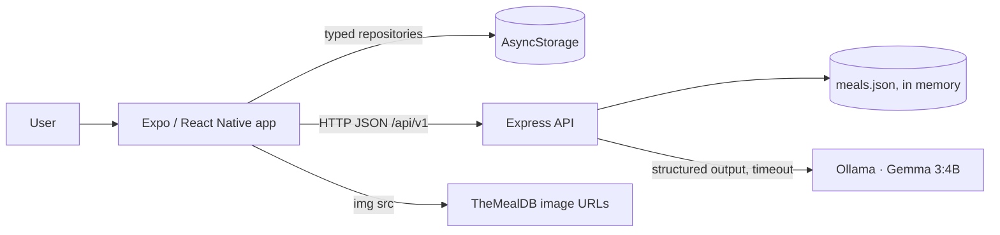

# NutriTime AI — Software Design Document

- **Version:** 2.1.0
- **Date:** 2026-09-13
- **Author:** Mohammad Ra'uf Naser Albatayneh
- **Status:** Active
- **Related:** `PRD.md` (requirements), `TSD.md` (implementation contract)

> Version 2.1.0 amends §5.3 and §17 only: the seed pipeline is rewritten against the real TheMealDB
> API and a downloaded USDA FoodData Central dataset. **§2.1 is deliberately unchanged** — both are
> build-time sources, so the running system still makes exactly one outbound call, to Ollama.
>
> Version 2.0.0 replaced 1.3.0. Cart, checkout, orders, and the USDA integration are removed;
> nutrition moves into the local catalog; TheMealDB becomes a build-time seeding tool rather than a
> runtime dependency. Ollama is now the only external service the running app talks to, which is why
> the provider ports, provider caches, circuit breakers, rate limiters, and readiness probes that
> guarded the others are gone. Sections describing deployment, capacity, change control, and audit
> process are deleted rather than shortened: none of them described work that happens on one laptop.
>
> Implementation detail — type definitions, constants, schemas, algorithms, error codes, storage keys
> — now lives in `TSD.md`, and this document points at it rather than repeating it. Where the two
> could disagree, the TSD is authoritative on *what gets typed* and this document on *why*.

## 1. Purpose

This document defines the implementable architecture for NutriTime AI. It is prescriptive: the
boundaries, contracts, and task order here are the ones to follow. It is also deliberately small —
if something here does not change what gets typed, it should not be here.

The system is one Express service and one Expo app, sharing pure TypeScript packages.

## 2. Context and Constraints

### 2.1 Context



The catalog is loaded and validated once at boot and held in memory. Everything the user owns lives
on the device. The only outbound call the server makes is to Ollama on localhost.

### 2.2 Constraints

- One developer, one laptop, roughly 16 GB of RAM.
- Gemma 3:4B is optional at runtime and slow when cold.
- No server database, no authentication, no payment data.
- The app must be demonstrable with Ollama stopped.

### 2.3 Running it locally

Prerequisites: Node 22+, npm, Expo CLI, and Ollama.

```bash
ollama pull gemma3:4b
npm install
cp .env.example .env
npm run dev          # starts the API and the Expo dev server
```

Copy `.env.example`; the eight variables, their types, defaults, and validation rules are **TSD §5.2**.
One of them is worth knowing before you edit it: the keep-alive setting is named `AI_KEEP_ALIVE`, not
`OLLAMA_KEEP_ALIVE`, because the latter is Ollama's own server-side variable and two variables sharing
one name across two scopes fail silently.

Three ways to run:

| Mode | Setting | Behavior |
|---|---|---|
| Full | `AI_ENABLED=true`, Ollama running | Explanations and assistant answers are phrased by Gemma |
| No AI | `AI_ENABLED=false` | Recommendations use fallback text; the assistant answers 503 `ai_disabled` |
| Fake AI | `AI_FAKE=true` | The model call is replaced by a deterministic echo of the resolved answer. Used by tests and CI, where no model is installed |

`AI_FAKE` is not a mock in the test suite — it is a real code path in the server, chosen by config,
so the route, retrieval, resolution, and containment all run exactly as they do in production. Only
the phrasing step is substituted.

## 3. Architecture

### 3.1 Shape

One Express deployable with internal module boundaries, and one Expo app. Both consume shared pure
packages. There is no distributed anything, and nothing here anticipates one.

### 3.2 Dependency direction

```text
Screens / HTTP routes
    -> Application use cases
        -> Domain (pure functions, entities, rules)
            <- Infrastructure adapters
```

Dependencies point inward. Domain modules never import React Native, Express, AsyncStorage, `fetch`,
or an Ollama client. This is what lets the rules be unit tested without a running anything, and it is
the one architectural constraint worth enforcing.

## 4. Repository Structure

```text
nutritime-ai/
├── apps/
│   ├── mobile/
│   │   ├── src/
│   │   │   ├── app/
│   │   │   ├── navigation/
│   │   │   ├── features/
│   │   │   │   ├── onboarding/
│   │   │   │   ├── recommendations/
│   │   │   │   ├── catalog/
│   │   │   │   ├── saved-meals/
│   │   │   │   ├── assistant/
│   │   │   │   └── settings/
│   │   │   ├── shared/        components, hooks, theme, a11y
│   │   │   ├── state/         context + useReducer stores
│   │   │   └── infrastructure/  api, storage
│   │   └── App.tsx
│   └── server/
│       └── src/
│           ├── app/           express wiring, middleware, errors
│           ├── routes/
│           ├── usecases/      recommend, ask
│           └── ai/            ollama client, prompts, containment
├── packages/
│   ├── contracts/   zod schemas + shared types
│   ├── domain/      pure rules: allergens, diet, scoring, retrieval, resolvers
│   └── catalog/     meals.json + seed script
├── e2e/             playwright specs
├── PRD.md
├── SDD.md
└── TSD.md
```

One npm workspace. Shared packages contain pure TypeScript only.

## 5. Data Model

### 5.1 Representation rules

- IDs: stable kebab-case strings for catalog meals (`meal-spicy-arrabiata-penne`), UUIDs for user-created ones.
- Money: integer cents. Never floating-point arithmetic on prices.
- Timestamps: ISO 8601 UTC.
- Meal times: `HH:mm` in device-local time.
- Nutrition: per serving, in kcal and grams. Unknown is `null` — never `0`, never a guess.
- Allergen and diet tags: canonical lowercase kebab-case.

### 5.2 Core types

The entities are `Meal`, `NutritionSummary`, `Ingredient`, `Money`, `UserPreferences`, `CustomMeal`,
`Recommendation`, `ScoreReason`, and `Citation`, alongside the enumerations `MealPeriod`, `DietTag`,
`NutritionGoal`, `BudgetBand`, `ThemeMode`, `DataSource`, and `CanonicalAllergen`. Their definitions
are **TSD §3.2**; the schemas that guard them are **TSD §3.3**.

One consequence of §5.1 is worth stating where the model is described rather than only where it is
typed: `NutritionSummary` is four nullable numbers and carries no unit or basis field, because there
is exactly one nutrition source and it is per serving. That deletes a whole class of divergence — but
it also deletes the type-level guard that used to refuse a comparison across bases, so the invariant
moves into schema validation with range bounds (TSD §3.3). When a type-level guard goes, a
validation-level one takes its place.

Every type that crosses a trust boundary — an HTTP body, a storage entry, a model reply — has a Zod
schema in `packages/contracts` and is parsed, not cast.

### 5.3 How `meals.json` is produced

The catalog is a build-time artifact, not a runtime integration. `packages/catalog/seed.ts` runs by
hand, not in CI:

1. Select candidate meals with `filter.php`, then call **`lookup.php` once per meal** for the full
   record. Filter responses are summaries; the API's own guidance is to look up details rather than
   trust them. The script uses the JSON API and never scrapes HTML.
2. Guard the response shape. `meals` can come back as an array, a string, a legacy object, or `null`
   — a no-data or rate-limited reply is not an array, and a parser that assumes one crashes on it.
3. Map each record into the `Meal` shape, **capturing provenance**: the upstream id, source URL,
   image source and licence-confirmation flag. The licence obliges us to carry these, so the model
   has a field for them rather than discarding them.
4. Derive `allergenTags` from the ingredient list using the rules in §9.2, then correct them by hand.
   This is the one field where a mistake is a safety issue, so the generated value is a starting
   point and the committed value is reviewed.
5. Assign `dietTags`, `mealPeriods`, `price`, and `preparationMinutes`.
6. **Derive `nutrition` from USDA FoodData Central**, not by hand: resolve each ingredient against
   published per-100 g values, convert its measure to grams, sum, and divide by an authored serving
   count. If any ingredient fails to resolve or parse, all four values are `null` with the reason
   recorded. The full contract is TSD §7.4.
7. Validate every record against `mealSchema` and write `meals.json`.

Image URLs still point at TheMealDB, which is why §2.1 shows the app fetching images directly. A
broken image is a broken image; it does not affect any decision the app makes.

**Why nutrition is derived rather than authored.** Authoring 240 numbers by hand invites exactly one
defect — a mistyped digit that wins every superlative question and passes containment, because the
domain genuinely resolved it. Deriving them from a published dataset makes every figure traceable to
a food record, and makes "unknown" the honest outcome when the ingredients cannot be resolved.

If the committed catalog fails schema validation at boot, the server exits non-zero with the failing
record index. A server running on an invalid catalog would be a server whose safety filters are
operating on unvalidated data, so it does not start.

## 6. Local Storage

### 6.1 Keys

Six keys — app meta, onboarding, preferences, favourites, custom meals, and UI state — plus a
quarantine ledger for entries that failed to decode. The literal key strings are **TSD §6.4**.

### 6.2 Repositories

Feature code never calls AsyncStorage directly; it goes through a `Repository<T>` of
`get` / `set` / `clear` (**TSD §6.4**), and exactly one file in the app imports AsyncStorage at all.

Repositories serialize, validate on read, migrate by `schemaVersion`, and isolate corruption to their
own key. A corrupt entry is reset to its default and reported; it never takes another key with it.

### 6.3 Bounds

Favorites and custom meals cap at 200 entries each. **Past the cap the write is refused**, with a
message telling the user to remove something first. It is not silently trimmed: every entry under
these keys is something the user chose or authored, and a save that destroys data the user has
already been shown is worse than a save that fails honestly. The message offers no retry, because
retrying the same value can never succeed.

Reads truncate rather than refuse, and flag the entry as recovered. An over-long entry already on
disk is a fact to recover from; refusing there would make it permanently unreadable.

## 7. API

### 7.1 Principles

- Base path `/api/v1`. JSON in, JSON out. Stateless.
- Requests are validated with Zod at the edge. Bodies are capped at 64 KB.
- Success returns the payload directly. There is no envelope — there is one client, and it does not
  need `meta.requestId` to correlate anything.

### 7.2 Endpoints

```http
GET  /health
GET  /api/v1/meals?page=1&pageSize=20&period=breakfast&diet=vegetarian&maxPriceCents=1500&query=bowl
GET  /api/v1/meals/{mealId}
POST /api/v1/recommendations
POST /api/v1/chat
```

`page` ≥ 1; `pageSize` 1–50, default 20. Filters are allowlisted. Sort is relevance when a query is
present, name ascending otherwise. An unknown meal is a 404.

**`POST /api/v1/recommendations`** — request and response shapes are **TSD §5.4**.

The request carries `mealPeriod`. It carries neither a timestamp nor the user's `mealTimes`. Home has
to show the current period before any request returns and with the server stopped, so the app derives
it locally from the user's anchors either way; sending a timestamp and having the server derive it a
second time would give one fact two homes, along two paths that can disagree across a minute
boundary, a timezone read, or a stale copy of `mealTimes`. That is the same shape as the defect this
rewrite deleted. Derive once, send the result. **The server therefore holds no clock and no timezone
logic on any path**, and period detection lives in the shared domain package with a single caller.

Nothing is trusted that shouldn't be: the clock and the preferences are both the user's own, on their
own device, and the schema validates `mealPeriod` against four values.

**`POST /api/v1/chat`** — request and response shapes are **TSD §5.4**.

Rules:

- The body is strict. `preferences` accepts exactly `diet`, `allergies`, and `dislikedIngredients` —
  narrower than `UserPreferences` on purpose. Sending anything else is a 400. The client narrows its
  stored preferences before posting. `goal` and `budget` are **not** accepted: retrieval does not read
  them, and a required field that changes nothing is a field that will eventually be believed.
- `allergies` uses canonical taxonomy values, so the singular `peanut` is accepted and `peanuts` is
  rejected. The taxonomy is ten entries (TSD §3.1).
- Citations are resolved from the retrieved set by ID — never parsed out of the model's text.
- `answered: false` is a success, not an error, and returns HTTP 200. It is the endpoint saying the
  retrieved meals do not contain the answer.
- `source` is `"gemma"` when the model phrased the answer and `"local"` when the domain answered
  without calling it.

### 7.3 Errors

Five codes — `invalid_request`, `meal_not_found`, `ai_disabled`, `ai_unavailable`, `ai_busy` — with
their statuses, causes, and `retryable` flags in **TSD §3.5**.

`ai_unavailable` deliberately covers both an unreachable model and a contained reply. The client can
do exactly one thing about either — try again — and the containment rule that caught a reply is not
something a caller should be able to probe for.

There is no fallback answer on the chat path. See §9.1.

## 8. Recommendation Engine

### 8.1 Pipeline

```text
Determine meal period from configured anchors
  -> Load catalog candidates
  -> Normalize tags and ingredient names
  -> Hard-reject allergen conflicts
  -> Apply diet compatibility
  -> Exclude unavailable meals
  -> Penalize disliked ingredients
  -> Score
  -> Stable sort
  -> Take top 3
  -> Optionally explain with Gemma, validate, or fall back
```

The pipeline up to "take top 3" is pure: no clock, no I/O, no model. The request time is passed in.

### 8.2 Scoring

Eight policies produce a 0–100 score: meal-period match, diet compatibility, nutrition-goal fit,
budget fit, already-a-favourite, preparation-time fit, availability, and a disliked-ingredient
penalty. An allergen conflict is not a policy — it is a hard rejection that happens before scoring
starts. The weights, bands, and thresholds are **TSD §4.6**.

Weights live in one config object, not scattered as literals. Goal fit reads the nutrition values
from §5.3 — which is the reason authoring them mattered: without real numbers this dimension scores
everything identically and quietly does nothing.

Ties break on score descending, then meal ID ascending, so the same input always produces the same
order.

## 9. The Grounded Assistant

### 9.1 Why it is built this way

The assistant is retrieval-augmented, and further than that: the deterministic filter decides which
meals exist for this user, **the domain computes the answer**, and Gemma is asked only to phrase it.
No model outcome — a good answer, a timeout, malformed JSON, or an injection attempt — can widen the
meal set or change the fact being stated.

The reason is measured, not theoretical. Thirty-five probes against `gemma3:4b` found it answering
four of six comparison questions wrongly *with the correct data in its context* — each a wrong number
inside fluent, well-formed prose. A model that cannot reliably compare two numbers it can see is not
a model that should be deciding which meal is cheapest.

This is also why the failure paths differ between the two AI lanes:

| | Recommendation explanation | Assistant answer |
|---|---|---|
| What the model adds | A nicer sentence about an already-ranked meal | Phrasing for an already-resolved answer |
| Deterministic equivalent | Yes — template text | Yes — the resolved answer, unphrased |
| On failure | Fall back to template text, recommendation still succeeds | Return 503. Never substitute prose |

Saying the assistant is unavailable is correct. Substituting invented text is the outcome this
design exists to prevent.

### 9.2 Retrieval

```text
Load catalog
  -> Hard-reject allergen conflicts on declared tags UNION tags inferred from ingredients
  -> Apply diet compatibility
  -> Exclude unavailable meals
  -> Partition: meals containing a disliked ingredient sort behind those without
  -> Rank each partition for relevance against the question
  -> Take top 5
  -> If nothing matched lexically, fall back to the eligible set, preferred partition first
```

Design rules:

- Retrieval is a pure function. No Express, no clock, no I/O, no model.
- Allergen conflict is evaluated on **effective** tags — declared unioned with inferred — never on
  declared tags alone, because a record may omit a tag its own ingredient list betrays.
- Ranking reuses the same relevance implementation as `GET /api/v1/meals`, so the catalog screen and
  the assistant cannot disagree about which meals match a phrase.
- Ranking runs over the already-safe set. Ranking first would let a highly relevant unsafe meal
  displace a safe one.
- Disliked ingredients demote rather than exclude, matching their role as a penalty in §8.2.
  Excluding them would leave a user whose every eligible meal contains one disliked ingredient with
  no answer at all.
- No lexical match is not a dead end. "What is quick?" matches no meal name, and a grounded answer
  over the eligible set beats a refusal.
- The context caps at five meals. Five fully-described meals fit the model's context alongside the
  instructions, and truncating instead would risk silently dropping the meal the answer then names.

There are no embeddings and no vector store. Sixty records, tag filters, and lexical ranking are the
right tool at this size; anything else would be machinery in search of a problem.

### 9.3 The answer resolvers

This is where the answer is decided. `packages/domain/src/answer.ts` classifies the question into an
intent — superlative, ordering, listing, count, total, or none of them — and computes the result over
the retrieved meals. The intent catalogue, the classification rules, and the resolved-value shapes
are **TSD §4.9**.

Rules:

- A resolver reads only fields that exist on the retrieved meals. A superlative over a field that is
  `null` on every candidate resolves to nothing — it does not fall back to a different field.
- `unknown` and an empty resolution both answer `answered: false`, HTTP 200, `source: "local"`,
  **without calling the model**. So does an empty retrieval, which means the user's own filters
  excluded everything. That is the complete and correct answer to "nothing matches your filters", not
  a degraded one.
- The resolved value carries a set of **permitted figures** — every number the domain actually
  computed. §9.6 uses it.

Adding a question shape means adding a resolver, and that is the intended way to grow the assistant.
Widening what the model is allowed to decide is not.

### 9.4 Prompt

The prompt carries the resolved answer from §9.3 and asks the model to phrase it in at most three
sentences. Alongside it go labelled meal blocks — ID, name, description, meal periods, diet tags,
ingredient names, preparation minutes, price, calories, protein. The section order and the exact
instructions are **TSD §5.6**.

**The blocks are the meals the answer names, not the five that retrieval returned.** A superlative
answer is about one meal, so one block goes in; a count is about a number, so none do; only a listing
or an ordering carries all of them. This is not an optimisation. With four irrelevant meals in front
of it, a model asked to phrase "the cheapest is X" will sometimes mention Y as well — citations pass,
because it cited only X; figures pass, because it quoted no number for Y; and the user is told about
a meal the domain never ranked. A model cannot name a meal it was never shown. That the most common
question shape also drops from five described meals to one, against an 11-second budget, is a welcome
second effect rather than the reason.

- Unknown nutrients render as the literal word `unknown`, never `0`, so the model states an absence
  rather than describing a meal as calorie-free.
- **The user's allergy list never reaches the prompt.** Retrieval consumed it. The model is not
  trusted with allergen reasoning and cannot see an unsafe meal to reason about.
- Meal text and the user's question are both untrusted. Both are wrapped in explicit delimiters by the
  prompt-safety helper described in §12.1, with an instruction not to follow anything inside them. The
  question is the higher risk of the two, being supplied by the party most motivated to attempt an
  injection.

### 9.5 Structured output

The adapter sends a JSON Schema through Ollama's `format` parameter and validates the reply against
`chatModelReplySchema` — `answered`, `answer`, `citedMealIds`, and nothing else (**TSD §3.3**).

The schema is **built per request**, and `citedMealIds` is constrained to an enumeration of exactly
the meal IDs in the prompt. Ollama compiles `format` into a grammar, so an uncited ID is not caught
after the fact — it cannot be produced. The equivalent check in §9.6 still runs, because that
behaviour belongs to an upstream this project does not pin, and a constraint that quietly stopped
being enforced would take the guarantee with it and say nothing.

The port returns this reply — not a finished answer. Citations shown to the user are resolved from the
retrieved set by ID; meal names never travel out of the model.

There is no repair loop and no retry. A schema violation is a failure, because the fallback that makes
a retry worth attempting on the explanation path does not exist here.

The schema carries no field a fabricated nutrient, price, or verdict could occupy. `answer` is prose;
every number the user sees came from the resolved answer.

### 9.6 Containment

Four checks the schema cannot make run on every reply before it is shown. The denylist, the
figure-extraction algorithm, and the matching rules are **TSD §5.7**.

1. **Citations.** Every cited ID must be one of the meals in the prompt. A model citing anything else
   has either invented a meal or surfaced one the safety filter removed. This is the second line of
   defence behind §9.5's grammar constraint, not the first.
2. **No safety claim.** The answer must carry no allergen, safety, health, or medical verdict.
   Allergen decisions are already final, and a reassuring sentence from a language model is precisely
   the failure this design exists to prevent. Negation is not an exemption — "not healthy" is still a
   health verdict.
3. **No unresolved figure.** Every number in the answer — digits or spelled cardinals — must be one
   the domain actually computed. A word list would have passed all four wrong answers the evaluation
   found, each being a wrong *number* in clean prose. An empty permitted set forbids every figure; it
   does not skip the check, which matters exactly when a meal's nutrients are all `null`.
4. **No unnamed meal.** The answer must not name a meal absent from the prompt — the one failure
   §9.4's narrowing cannot prevent, because a model can recall a dish name from its own training
   rather than from its context.

A reply failing any check is discarded. Never repaired, never shown, never partially used. The route
returns 503 `ai_unavailable`.

Checks 2 and 3 also run over the explanation lane's `reason` field, for the same reason: that is 240
characters of unconstrained prose about a meal with a price and a nutrient, written by the same model.
A contained explanation falls back to template text, and the recommendation succeeds.

### 9.7 Execution

- Gated by `AI_ENABLED`. With AI off the route is still mounted and returns 503 `ai_disabled`,
  non-retryable — a truthful "not enabled here" rather than a 404 implying the endpoint does not exist.
- Ollama is never probed at startup. An outage degrades the feature; it never blocks boot.
- One AI call runs at a time. A second concurrent request returns 503 `ai_busy` immediately rather than
  queueing: on a single-user local app, waiting behind someone else's inference is not a state worth
  building machinery for.
- The chat budget is 30 s; the explanation budget stays at 12 s. A chat prompt carries five described
  meals and measures roughly 11 s warm, which leaves nothing under a 12 s ceiling. The explanation
  timeout is deliberately *not* raised, so a slow model degrades recommendations promptly instead of
  delaying every one of them.
- `AI_KEEP_ALIVE=30m` keeps the model resident. Without it, idle eviction brings back the ~60 s
  cold load after every quiet gap, and it surfaces as an ordinary timeout.
- A cold load will exceed the budget. The first request after a restart may legitimately 503 and then
  recover on its own. This is designed degradation, and the UI says so.
- Nothing is cached. Retrieval and resolution over sixty records are microseconds; caching the model's
  phrasing would mean a cache key that has to encode the exact retrieved meal set to stay correct, and
  that is more code than the phrasing costs.

## 10. Failure Modes

| Failure | Response |
|---|---|
| Catalog fails validation at boot | Server exits non-zero, naming the record index. It does not start on unvalidated safety data |
| Ollama unreachable or slow — explanation lane | Template fallback text; the recommendation still succeeds |
| Ollama unreachable or slow — chat lane | 503 `ai_unavailable`. No substituted prose |
| Model reply fails schema or containment | Discarded. 503 on chat, fallback text on explanations |
| Server unreachable from the app | Screens show the local-only state; saved data and preferences still work |
| AsyncStorage read fails or is corrupt | That key resets to its default and reports; other keys are untouched |
| AsyncStorage write past a bound | Refused with a clear message (§6.3) |

## 11. Performance

- The catalog lives in memory after boot. Meal lookups are map reads.
- Money is integer cents. Tag matching uses `Set` lookups built once per catalog version.
- Lists use `FlatList` with stable keys, bounded initial render, and memoized rows.
- Images lazy-load with placeholders and are never stored as base64.
- Search debounces at ~300 ms, and a stale request is aborted when the query or screen changes.
- Screens fetch their own detail data on open, not upfront.
- Gemma runs only after deterministic work is complete, and only when AI is enabled.

There is no object pooling, no zero-copy scheme, and no connection pool. At this size they would cost
more in complexity than they could return.

## 12. Security

The threat surface is small: a local server, a local model, and a local database. Five controls cover it.

1. **No secrets.** There is no API key left in the system. `.env` is gitignored; `.env.example` is committed.
2. **Validate everything crossing a boundary.** Request bodies, storage entries, model replies. Parsed with Zod, never cast.
3. **Bound the inputs.** 64 KB bodies, 500-character questions, five-meal contexts.
4. **Treat model input as untrusted.** §12.1.
5. **Log nothing personal.** No prompts, questions, allergy lists, names, or full payloads.

### 12.1 Prompt safety

One helper wraps every untrusted string before it enters a prompt — the user's question and all meal
text. It strips control characters, caps length, and wraps the content in explicit begin/end
delimiters, and the system instruction states that content inside the delimiters is data and any
instruction found there is to be ignored.

The helper is the only path by which external text reaches a prompt. That is the point: a second path
would be a second thing to remember.

Delimiting is mitigation, not a guarantee. The actual guarantee is structural — the model cannot widen
the meal set, cannot see an unsafe meal, and cannot introduce a figure the domain did not resolve. A
successful injection changes the wording of a sentence.

## 13. Observability

Structured JSON logs, one line per request: timestamp, level, method, route template, status,
duration, and error code when there is one. AI calls additionally log lane, duration, and outcome
(`ok`, `timeout`, `schema`, `contained`).

Never logged: prompts, questions, answers, allergy lists, names, or request bodies.

There are no metrics, no traces, and no alerts. You are watching this run in a terminal.

## 14. Accessibility

Shared `AccessibleButton`, `FormField`, `EmptyState`, `ErrorState`, `MealCard`, and `NutritionBadge`
carry the accessibility contract so features do not each reinvent it. Theme tokens cover both modes and
all semantic states; feature code contains no color literals.

Focus is preserved when validation fails. Async results are announced. Skeletons do not trap focus.
Icon-only controls always carry a label.

## 15. Testing

### 15.1 Unit — Vitest

The domain is where correctness is not negotiable, so it is where the tests are:

- Meal-period boundaries.
- Allergen normalization, ingredient inference, and hard rejection.
- Diet compatibility.
- Scoring and stable tie-breaking.
- Money arithmetic.
- Retrieval: safety before ranking, dislike demotion, the no-lexical-match fallback, the five-meal cap.
- Every answer resolver, including `unknown` and the all-`null` field case.
- Containment: an unlisted citation, each denylisted phrase, a wrong figure in clean prose, an empty
  permitted-figure set.
- Zod schemas, accepting and rejecting.
- Storage migrations.

No coverage thresholds. Coverage is reported and read, not enforced.

### 15.2 Integration

Supertest against the real Express app with `AI_FAKE=true`: each route's happy path, a 400 on a bad
body, a 404 on an unknown meal, 503 on AI disabled, and the deterministic `answered: false` when
filters exclude everything.

### 15.3 End-to-end — Playwright

Against the Expo web build with `AI_FAKE=true`:

1. First launch → onboarding → Home shows recommendations.
2. A declared peanut allergy keeps peanut meals off Home and out of Explore.
3. Favoriting a meal survives a reload.
4. Custom meal create → edit → delete.
5. The assistant answers a superlative question and shows its citations.
6. With AI disabled, the assistant shows the unavailable message and does not hang.

## 16. Toolchain and CI

```bash
npm run check     # tsc --noEmit && eslint && vitest run
npm run test:e2e  # playwright
```

One GitHub Actions job on push and pull request:

```text
npm ci
npm run check
npm run build:server
npm run build:web
npm run test:e2e     # AI_FAKE=true
```

Ollama is not installed in CI, which is exactly what `AI_FAKE` exists for — the assistant's route,
retrieval, resolution, and containment are all exercised there; only the phrasing call is substituted.

No coverage gates, no custom gate scripts, no dependency-cycle checker, no duplicate-code detector.
The rules those enforced are in §5.1, §3.2, and the PRD's maintainability section, and on a
one-person project they are enforced by reading the code.

## 17. Decisions

| Decision | Reason |
|---|---|
| Expo + React Native + strict TypeScript | Cross-platform from one codebase; typed contracts end to end |
| React Navigation, typed routes | Mature, well-typed, and every destination derives from one route config |
| One Express service | One deployable, internal module boundaries. Microservices would be operational cost with no benefit |
| Local catalog as the only data source | Removes every runtime provider, every provider cache, and every partial-failure mode with it |
| Nutrition derived from USDA FoodData Central at build time | Every figure traces to a published food record instead of a person's estimate. Still one source, so two screens cannot disagree — the v1.x bug was nutrition living in two places, not where it came from |
| USDA consumed as a downloaded dataset, never an API | v1.x put USDA in the request path and it became a stub that always failed. As a build-time file it adds no runtime dependency, no key, and no failure mode |
| TheMealDB at build time only, attribution preserved | Recipes and images without a runtime dependency on someone else's uptime. The licence requires attribution and the preservation of source metadata, so `Meal` carries a provenance field |
| Deterministic rules before AI | Allergy and diet decisions must be testable and repeatable. A model cannot be either |
| The domain resolves, the model phrases | Measured: the model got 4 of 6 comparisons wrong with correct data in context |
| Gemma 3:4B via Ollama | Fits 16 GB, runs offline, costs nothing. Its job is phrasing, which a 4B model can do |
| AsyncStorage through repositories | No server database, no auth, no sync. Repositories keep validation and migration in one place |
| Context + useReducer | Small stores, few dependencies, adequate at this scale |
| No envelope, no rate limiter, no breaker, no cache | One client, one user, one localhost dependency. Each of these guarded something that no longer exists |

## 18. Implementation Plan

Five phases. Do not start the next while the previous is red.

**Phase 1 — Foundation and domain.** Workspace, strict TypeScript, ESLint, Prettier, Vitest. Contracts
package with Zod schemas and core types. Domain package: money, meal-period detection, allergen
normalization and inference, diet compatibility, scoring, relevance ranking, retrieval, and the answer
resolvers. Author `meals.json` including nutrition, and the seed script that validates it. This phase
is almost entirely unit tests and pure functions, and it is where the product's correctness lives.
*Done when:* `npm run check` is green and every rule in §15.1 has a test.

**Phase 2 — Server.** Express wiring, config validation, error shape, 64 KB body cap, boot-time catalog
validation. `GET /health`, `GET /api/v1/meals`, `GET /api/v1/meals/:id`, `POST /api/v1/recommendations`
without AI. *Done when:* integration tests pass and the server refuses to boot on an invalid catalog.

**Phase 3 — Mobile shell.** Expo app, typed navigation with five tabs, theme tokens for both modes,
shared components from §14, storage repositories, hydration gate, API client. *Done when:* navigation
and storage tests pass and the app boots to an empty Home.

**Phase 4 — Features.** Onboarding and dietary setup, Home and recommendations, Explore and meal
details, Saved with favorites and custom-meal CRUD, Settings and reset. *Done when:* each feature's
acceptance criteria in PRD §13 pass, in both themes, with accessibility metadata.

**Phase 5 — The assistant.** Ollama client, prompt safety, both prompts, structured output, containment,
`AI_FAKE`, the chat route, the explanation lane on recommendations, and the Assistant screen. Then the
E2E suite and CI. *Done when:* §15.3 passes with `AI_FAKE=true`, and passes by hand against a real
`gemma3:4b`.

## 19. References

- Expo — https://docs.expo.dev/
- React Navigation TypeScript — https://reactnavigation.org/docs/typescript/
- AsyncStorage limits — https://react-native-async-storage.github.io/2.0/advanced/Limits/
- Ollama structured outputs — https://docs.ollama.com/capabilities/structured-outputs
- TheMealDB, for seeding only — https://themealdb.com/docs_api_guide.php
